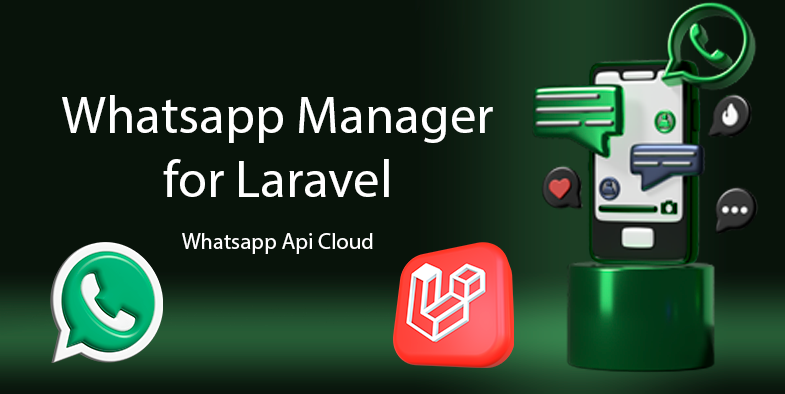

[](https://deepwiki.com/djdang3r/whatsapp-api-manager)



# WhatsApp Business API Manager for Laravel

LARAVEL WHatsapp Manager

<p align="center">
<a href="https://packagist.org/packages/scriptdevelop/whatsapp-manager"></a>
<a href="https://php.net/"></a>
<a href="https://laravel.com/"></a>
<a href="https://packagist.org/packages/scriptdevelop/whatsapp-manager"></a>
<a href="https://packagist.org/packages/scriptdevelop/whatsapp-manager"></a>
</p>

---

### 🌐 Language / Idioma

<a href="#english"></a> [🇺🇸 English](#-english) | [🇪🇸 Español](#-español) <a href="#espanol"></a>


#### 🇪🇸 Español

---

# scriptdevelop/whatsapp-api-manager

## Introducción

`@djdang3r/whatsapp-api-manager` es un paquete diseñado para facilitar la integración y gestión de la API de WhatsApp en tus proyectos. Su objetivo es simplificar la comunicación, el envío y la recepción de mensajes, así como la administración de sesiones y contactos a través de una interfaz intuitiva y fácil de usar.

## Descripción

Con este paquete podrás:

- Conectarte fácilmente a la API de WhatsApp.
- Enviar y recibir mensajes de texto, multimedia y archivos.
- Gestionar múltiples sesiones de WhatsApp simultáneamente.
- Administrar contactos, plantillas y mensajes.
- Integrar tu aplicación o servicio con flujos automatizados de mensajes.
- Recibir eventos en tiempo real para reaccionar ante mensajes, cambios de estado y notificaciones.

`@djdang3r/whatsapp-api-manager` está pensado para desarrolladores que buscan una solución robusta y flexible para interactuar con WhatsApp de manera eficiente, segura y escalable.

> ## 📢 Políticas de WhatsApp
>
> 🚫 **Importante:** 🚫
> - Asegúrate de cumplir siempre con las [Políticas de WhatsApp](https://www.whatsapp.com/legal/business-policy/) y sus términos de uso al utilizar este paquete.  
> - El uso indebido puede resultar en la suspensión de tu cuenta o acciones legales por parte de WhatsApp.
> - Revisa periódicamente las actualizaciones de las políticas para evitar inconvenientes.


> ## ⚠️ **Advertencia:**  ⚠️
> - Este paquete se encuentra actualmente en versión **alpha**. Esto significa que está en desarrollo activo, puede contener errores y su API está sujeta a cambios importantes.  
> - Próximamente se lanzará la versión **beta**. Se recomienda no usarlo en entornos de producción por el momento.

---

## Documentación

- [Introducción](#introducción)
  - [Qué es el paquete](#introducción)
  - [Objetivos principales](#introducción)
- [Descripción](#descripción)
  - [Funcionalidades clave](#-características-principales)
- [Instalación](#-instalación)
  - [Prerequisitos (cuenta WhatsApp API Cloud)](#necesitaras-una-cuenta-de-whatsapp-api-cloud)
- [Pasos básicos](#🚀-instalación)
  - [Configuración inicial](#configuración-inicial)
  - [Migraciones y seeders](#migraciones)
  - [Directorios multimedia](#publicar-directorios-multimedia-para-whatsapp)
  - [Configuración de webhooks en Meta](#configuración-de-webhooks-en-meta)
- [Estructura del Paquete](#🧩-estructura-del-paquete)
  - [Diagrama de directorios](#🧩-estructura-del-paquete)
  - [Componentes principales](#🧩-estructura-del-paquete)
- [Guía de Usuario](#📖-guía-de-usuario)
  - [Gestión de cuentas](#gestión-de-cuentas)
    - [Registro de cuentas de negocio](#registro-de-cuentas-de-negocio)
    - [Obtener detalles de números](#obtener-detalles-de-números-de-teléfono)
    - [Obtener cuentas de negocio](#obtener-cuentas-de-negocio)
  - [Envío de mensajes](#envío-de-mensajes)
    - [Texto simple](#texto-simple)
    - [Texto con enlaces](#texto-con-enlaces)
    - [Respuestas a mensajes](#respuestas-a-mensajes)
    - [Reacciones](#reacciones)
    - [Multimedia (imágenes, stickers, audio, documentos)](#multimedia-imágenes-stickers-audio-documentos)
    - [Ubicación](#ubicación)
    - [Botones interactivos](#botones-interactivos)
    - [Listas desplegables](#listas-desplegables)
  - [Plantillas](#plantillas)
    - [Obtener plantillas](#obtener-plantillas)
    - [Eliminar plantillas](#eliminar-plantillas)
    - [Editar plantillas](#editar-plantillas)
    - [Crear plantillas (utilidad, marketing, con imágenes, con botones)](#crear-las-plantillas-en-una-cuenta-de-whatsapp)
    - [Enviar mensajes con plantillas](#enviar-mensajes-a-partir-de-plantilla-creada)
- [Eventos](#📡-eventos-del-paquete)
  - [Configuración](#📡-eventos-del-paquete)
  - [Eventos disponibles](#📡-eventos-del-paquete)
  - [Pruebas](#🧪-prueba-de-eventos)
- [Bots (próximamente en paquete separado)](#bots-próximamente-en-paquete-separado)
- [Laravel Reverb](#📦-instalación-de-laravel-reverb)
  - [Instalación](#📦-instalación-de-laravel-reverb)
  - [Configuración](#📦-instalación-de-laravel-reverb)
  - [Uso con eventos](#📦-instalación-de-laravel-reverb)
- [Contribución](#🤝-contribuir)
  - [Cómo colaborar](#🤝-contribuir)
  - [Guía de estilo](#💡-sugerencias-para-contribuir)
- [Soporte y Contacto](#👨‍💻-soporte-y-contacto)
  - [Canales de soporte](#👨‍💻-soporte-y-contacto)
  - [Información de desarrollo](#👨‍💻-soporte-y-contacto)
- [Licencia](#📄-licencia)


---

## ❤️Apóyanos con una donación en GitHub Sponsors

Me puedes apoyar como desarrollador open source en GitHub Sponsors:
- Si este proyecto te ha sido útil, puedes apoyarlo con una donación a través de
[](https://github.com/sponsors/djdang3r)

- O tambien por Mercadopago Colombia.
[](https://mpago.li/2qe5G7E)
Gracias por tu apoyo 💙

---
>## 🚀 Características Principales
>
>- **Envía mensajes** de texto, multimedia, interactivos y de plantilla.
>- **Gestion de Templates** para Crear, Listar, Eliminar y Probar plantillas.
>- **Webhooks integrados** para recibir mensajes y actualizaciones.
>- **Gestión de conversaciones** con métricas de cobro.
>- **Bots conversacionales** con flujos dinámicos.
>- **Sincronización automática** de números telefónicos y perfiles.
>- **Soporte para campañas** masivas programadas.
>- 100% compatible con **Laravel Echo y Reverb** para notificaciones en tiempo real.
> 
---

## 🚀 Instalación

## Necesitaras una cuenta de Whatsapp API CLoud

Si quieres saber como obtener una completamente GRATIS mira estos dos videos:

- https://www.youtube.com/watch?v=of6dEsKSh-0&ab_channel=AdBoostPro

- https://www.youtube.com/watch?v=gdD_0ernIqM&ab_channel=BismarckArag%C3%B3n

---

1. **Instala el paquete vía Composer**:
    ```bash
    composer require scriptdevelop/whatsapp-manager
    ```

2. **Publica la configuración (opcional)**:
    ```bash
    php artisan vendor:publish --tag=whatsapp-config
    ```

2. **Configuración**

   - Configuración principal (config/whatsapp.php):
      
   - Configuración de logs (config/logging.php):

   - Configuración principal del paquete:
   
        Añadir el canal whatsapp.

        ```php
        'channels' => [
            'whatsapp' => [
                'driver' => 'daily',
                'path' => storage_path('logs/whatsapp.log'),
                'level' => 'debug',
                'days' => 7,
                'tap' => [\ScriptDevelop\WhatsappManager\Logging\CustomizeFormatter::class],
            ],
        ],
        ```

3. **Publica las migraciones (opcional)**:
    Este comando publicará las migraciones del paquete en tu directorio `database/migrations`. Puedes personalizarlas según tus necesidades antes de ejecutarlas.
    ```bash
    php artisan vendor:publish --tag=whatsapp-migrations
    ```
    


4. **Publica las rutas (OBLIGATORIO)**:
   - Se necesita para el webhook.

        ```bash
        php artisan vendor:publish --tag=whatsapp-routes
        ```

    - Excluir rutas del webhook de CSRF:

        Al publicar las rutas es importante anexar las rutas del webhook a las excepciones del CSRF.
        En bootstrap/app.php:

        ```php
        ->withMiddleware(function (Middleware $middleware) {
                $middleware->validateCsrfTokens(except: [
                    '/whatsapp-webhook',
                ]);
            })
        ```

5. **Configura tus credenciales en .env**:
    Variables de configuracion necesarias en el archivo `.env`
    ```bash
    WHATSAPP_API_URL=https://graph.facebook.com
    WHATSAPP_API_VERSION=v21.0
    WHATSAPP_VERIFY_TOKEN=your-verify-token
    WHATSAPP_USER_MODEL=App\Models\User
    WHATSAPP_BROADCAST_CHANNEL_TYPE=private
    ```

6.  **Migraciones**
    - Ejecuta las migraciones para crear las tablas necesarias:
        ```bash
        php artisan migrate
        ```

    - Esto ejecutará las migraciones necesarias para crear las tablas requeridas por el paquete en tu base de datos.

7.  **Seeder de idiomas para plantillas**
    Puedes publicar el seeder que incluye todos los idiomas compatibles con plantillas de WhatsApp con el siguiente comando:

    ```bash
        php artisan vendor:publish --tag=whatsapp-seeders
    ```

    > ⚠️ **¡Advertencia!**  ⚠️
    > Los seeders son necesarios para trabajar con plantillas. Debes tomarlo en cuenta. 
    > Luego de publicarlo, puedes ejecutarlo con:
    ```bash
        php artisan db:seed --class=WhatsappTemplateLanguageSeeder
    ```

8.  **Publicar directorios multimedia para WhatsApp.**
    Para almacenar mensajes multimedia entrantes (audios, imágenes, documentos, etc.) necesitas crear los siguientes directorios en storage/app/public/whatsapp:

    ```bash
    storage/app/public/whatsapp/
    ├── audios/
    ├── documents/
    ├── images/
    ├── stickers/
    └── videos/
    ```

    - Puedes crearlos automáticamente ejecutando:

    ```bash
    php artisan vendor:publish --tag=whatsapp-media
    ```

    - O, si no se crean automáticamente, puedes hacerlo manualmente:
    ```bash
    mkdir -p storage/app/public/whatsapp/{audio,documents,images,stickers,videos}
    ```

9.  **Crear enlace simbólico del storage.**
    Para que los archivos sean accesibles públicamente, ejecuta:

    ```bash
    php artisan storage:link
    ```

    Esto crea el enlace public/storage apuntando a storage/app/public, requerido por Laravel para servir archivos correctamente.


# **Configuración de Webhooks en Meta**

Para que tu aplicación reciba notificaciones en tiempo real de WhatsApp (mensajes entrantes, cambios de estado, etc.), debes configurar correctamente el webhook en la plataforma de Meta Developers. Sigue estos pasos:

### a) Accede a Meta Developers

1. Ingresa a [Meta for Developers](https://developers.facebook.com/).
2. Selecciona tu aplicación o crea una nueva si aún no la tienes.

### b) Configura el Webhook

3. Ve al menú **Productos** y selecciona **WhatsApp** > **Configuración**.
4. Busca la sección **Webhooks** y haz clic en **Configurar** o **Editar**.

### c) Define la URL del Webhook

- La URL debe apuntar a la ruta publicada por el paquete, por ejemplo:
    ```
    https://tudominio.com/whatsapp-webhook
    ```
- Asegúrate de que esta ruta sea accesible públicamente (puedes usar [ngrok](https://ngrok.com/) para pruebas locales).

### d) Establece el Token de Verificación

- El **Token** debe coincidir exactamente con el valor de la variable `WHATSAPP_VERIFY_TOKEN` que definiste en tu archivo `.env`.
- Ejemplo:
    ```
    WHATSAPP_VERIFY_TOKEN=EL_TOKEN_DE_TU_.ENV
    ```

### e) Selecciona los Eventos a Suscribir

- Marca los siguientes eventos para recibir notificaciones relevantes:
    - `messages`
    - `message_statuses`
- Puedes agregar otros eventos según tus necesidades (por ejemplo, `message_template_status_update`).

### f) Guarda y Verifica

- Al guardar, Meta enviará una solicitud de verificación a tu endpoint. El paquete responderá automáticamente si la configuración es correcta.
- Si usas HTTPS, asegúrate de que tu certificado SSL sea válido.

---

**Resumen de configuración:**

| Parámetro         | Valor recomendado                                  |
|-------------------|---------------------------------------------------|
| URL del Webhook   | `https://tudominio.com/whatsapp-webhook`          |
| Token             | El valor de `WHATSAPP_VERIFY_TOKEN` en tu `.env`  |
| Eventos           | `messages`, `message_statuses`                    |

---

> **Tip:** Si desarrollas localmente, puedes exponer tu servidor con ngrok:
> ```bash
> ngrok http http://localhost:8000
> ```
> Usa la URL pública generada por ngrok como URL del webhook en Meta.


---

# NROCK

[ngrok](https://ngrok.com/) es una utilidad que te permite exponer tu servidor local a Internet de forma segura mediante túneles. Es ideal para pruebas, desarrollo y para compartir tu aplicación local con servicios externos (por ejemplo, para recibir webhooks de WhatsApp o Meta).

**Cómo usar ngrok:**

1. Descarga ngrok desde [https://ngrok.com/](https://ngrok.com/).
2. Instálalo siguiendo las instrucciones de la página oficial.
3. Ejecuta el siguiente comando para exponer tu servidor local (por ejemplo, en el puerto 8000):

    ```bash
    ngrok http http://localhost:8000
    ```

Esto generará una URL pública que podrás compartir para acceder a tu aplicación local desde cualquier lugar, útil para pruebas de webhooks y desarrollo remoto.


## 🧩 Estructura del Paquete

```bash
    whatsapp-manager/
    ├── .env.testing              # Archivo de configuración para pruebas
    ├── composer.json             # Configuración de dependencias del paquete
    ├── composer.lock             # Archivo de bloqueo de dependencias
    ├── LICENSE                   # Licencia del paquete
    ├── phpunit.xml               # Configuración de PHPUnit para pruebas
    ├── README.md                 # Documentación principal del paquete
    ├── .vscode/
    │   └── settings.json         # Configuración específica para Visual Studio Code
    ├── assets/                   # Archivos de recursos
    │   ├── 2394384167581644.ogg  # Archivo de audio de ejemplo
    │   ├── LARAVEL WHATSAPP MANEGER.pdf # Documento PDF de ejemplo
    │   └── laravel-whatsapp-manager.png # Imagen de ejemplo
    ├── src/                      # Código fuente principal del paquete
    │   ├── Config/               # Archivos de configuración
    │   │   ├── logging.php
    │   │   ├── whatsapp.php
    │   ├── Console/              # Comandos Artisan personalizados
    │   │   ├── CheckUserModel.php
    │   │   ├── MergeLoggingConfig.php
    │   ├── Database/             # Migraciones y seeders
    │   │   ├── Migrations/       # Migraciones de base de datos
    │   │   └── Seeders/          # Seeders opcionales
    │   ├── Enums/                # Enumeraciones del sistema
    │   │   ├── MessageStatus.php
    │   ├── Exceptions/           # Excepciones personalizadas
    │   │   ├── InvalidApiResponseException.php
    │   │   ├── WhatsappApiException.php
    │   ├── Facades/              # Facades del paquete
    │   │   ├── whatsapp.php
    │   ├── Helpers/              # Funciones y utilidades auxiliares   
    │   │   ├── CountryCodes.php
    │   ├── Http/                 # Lógica HTTP
    │   │   ├── Controllers/      # Controladores HTTP y Webhook
    │   │   │   ├── WhatsappWebhookController.php
    │   │   └── Middleware/       # Middleware personalizados
    │   ├── Logging/              # Personalización de logs  
    │   │   ├── CustomizeFormatter.php
    │   ├── Models/               # Modelos Eloquent
    │   ├── Providers/            # Proveedores de servicios del paquete  
    │   │   ├── WhatsappServiceProvider.php
    │   ├── Repositories/         # Repositorios para acceso a datos
    │   │   ├── WhatsappBusinessAccountRepository.php
    │   ├── routes/               # Rutas del paquete
    │   │   ├── whatsapp_webhook.php
    │   ├── Services/             # Lógica de negocio y API
    │   │   ├── AccountRegistrationService.php
    │   │   ├── MessageDispatcherService.php
    │   │   ├── TemplateBuilder.php
    │   │   ├── TemplateMessageBuilder.php
    │   │   ├── TemplateService.php
    │   │   ├── WhatsappManager.php
    │   │   ├── WhatsappService.php
    │   ├── Traits/               # Traits reutilizables
    │   │   ├── GeneratesUlid.php
    │   └── WhatsappApi/          # Cliente API y endpoints
    │   │   ├── DataTransferObjects/
    │   │   │   ├── ApiErrorResponse.php
    │   │   │   ├── BusinessAccountResponse.php
    │   │   │   ├── MessageResponse.php
    │   │   ├── Exceptions/
    │   │   │   ├── BusinessProfileValidator.php
    │   │   ├── ApiClient.php
    │   │   ├── Endpoints.php     
    ├── tests/                    # Pruebas del paquete
    │   ├── TestCase.php          # Clase base para pruebas
    │   ├── Feature/              # Pruebas funcionales
    │   └── Unit/                 # Pruebas unitarias
    └── vendor/                   # Dependencias instaladas por Composer
```

---

## ❤️Apóyanos con una donación en GitHub Sponsors

Me puedes apoyar como desarrollador open source en GitHub Sponsors:
- Si este proyecto te ha sido útil, puedes apoyarlo con una donación a través de
[](https://github.com/sponsors/djdang3r)

- O tambien por Mercadopago Colombia.
[](https://mpago.li/2qe5G7E)
Gracias por tu apoyo 💙

---

# Guía de Usuario
---
## 1. Registro de Cuentas de Negocios.

- **Registra una cuenta de negocios en WhatsApp Business API.**
    Registra y sincroniza cuentas empresariales de WhatsApp con sus números de teléfono asociados.
    - Se hace la peticion a la API de whatsapp, se obtienen los datos de la cuenta y se almacenan en la base de datos. Este metodo obtiene los datos de la cuenta, los telefonos de whatsapp asociados a la cuenta y el perfil de cada numero de telefono.
    - Se usa para Obtener los datos desde la API y alojarlos en la base de datos.
  > **Observations:**
  > - Requires a valid access token with `whatsapp_business_management` permissions.
  > - The `business_id` must be the numeric ID of your WhatsApp Business Account.

  ```php
  use ScriptDevelop\WhatsappManager\Facades\Whatsapp;

  $account = Whatsapp::account()->register([
      'api_token' => '***********************',
      'business_id' => '1243432234423'
  ]);
  ```

## 2. Obtener Detalles de Números de Teléfono
**Obtén información detallada sobre un número de teléfono registrado.**

- Se hace la peticion a la API de whatsapp para obtener detalles del numero de whatsapp y se almacenan en la base de datos, si el numero ya existe actualiza la informacion.

    Obtén y administra los números de teléfono asociados a una cuenta de WhatsApp Business.
    ```php
    use ScriptDevelop\WhatsappManager\Facades\Whatsapp;

    // Obtener todos los números asociados a una cuenta empresarial (por Business ID)
    $phones = Whatsapp::phone()
        ->forAccount('4621942164157') // Business ID
        ->getPhoneNumbers('4621942164157');

    $phoneDetails = Whatsapp::phone()->getPhoneNumberDetails('564565346546');
    ```
    > **Notas:**
    > - Utiliza siempre el **Phone Number ID** para realizar operaciones sobre números de teléfono.
    > - El **Business ID** se emplea únicamente para identificar la cuenta empresarial.

## 3. Obtener Cuentas de Negocios
Obtén información sobre una cuenta de negocios específica.
Se hace la peticion a la API de whatsapp para obtener informacion sobre una cuenta en especifico, se almacenan los datos en la base de datos.

```php
use ScriptDevelop\WhatsappManager\Facades\Whatsapp;

$account = Whatsapp::phone()->getBusinessAccount('356456456456');
```

## Configuración de Webhooks
Configura los webhooks para recibir notificaciones en tu servidor.
```php
use ScriptDevelop\WhatsappManager\Facades\Whatsapp;

$response = Whatsapp::phone()->configureWebhook(
    '123456789012345', // Phone Number ID
    'https://tudominio.com/webhook',
    'mi_token_secreto'
);
```

### ✅ Requisitos para el Webhook
Ejemplo de handler de verificación en Laravel:
```php
use ScriptDevelop\WhatsappManager\Facades\Whatsapp;

$account = WhatsappBusinessAccount::first();
$phone = $account->phoneNumbers->first();

$response = Whatsapp::phone()->configureWebhook(
    $phone->phone_number_id, // Phone Number ID
        'https://tudominio.com/whatsapp-webhook', //URL Routes whatsapp_webhook use domain or nrock url
        env('WHATSAPP_VERIFY_TOKEN') // Token from your .env
);
```

## 4. Enviar Mensajes.
- **Envía mensajes de texto simples.**

    ```php
    use ScriptDevelop\WhatsappManager\Facades\Whatsapp;
    use ScriptDevelop\WhatsappManager\Models\WhatsappBusinessAccount;
    use ScriptDevelop\WhatsappManager\Models\WhatsappPhoneNumber;

    $account = WhatsappBusinessAccount::first();
    $phone = $account->phoneNumbers->first();

    $message = Whatsapp::message()->sendTextMessage(
        $phone->phone_number_id, // ID del número de teléfono
        '57',                        // Código de país
        '3237121901',                // Número de teléfono
        'Hola, este es un mensaje de prueba.' // Contenido del mensaje
    );
    ```

- **Enviar Mensajes de Texto con Enlaces**
    Envía mensajes de texto simples con link o enlace.

    ```php
    use ScriptDevelop\WhatsappManager\Facades\Whatsapp;
    use ScriptDevelop\WhatsappManager\Models\WhatsappBusinessAccount;
    use ScriptDevelop\WhatsappManager\Models\WhatsappPhoneNumber;

    $account = WhatsappBusinessAccount::first();
    $phone = $account->phoneNumbers->first();

    $message = Whatsapp::message()->sendTextMessage(
        $phone->phone_number_id, // ID del número de teléfono
        '57',                        // Código de país
        '3237121901',                // Número de teléfono
        'Visítanos en YouTube: http://youtube.com', // Enlace
        true // Habilitar vista previa de enlaces
    );
    ```


- **Enviar Respuestas a Mensajes**
    Responde a un mensaje existente.

    ```php
    use ScriptDevelop\WhatsappManager\Facades\Whatsapp;
    use ScriptDevelop\WhatsappManager\Models\WhatsappBusinessAccount;
    use ScriptDevelop\WhatsappManager\Models\WhatsappPhoneNumber;

    $account = WhatsappBusinessAccount::first();
    $phone = $account->phoneNumbers->first();

    $message = Whatsapp::message()->sendReplyTextMessage(
        $phone->phone_number_id, // ID del número de teléfono
        '57',                        // Código de país
        '3237121901',                // Número de teléfono
        'wamid.HBgMNTczMTM3MTgxOTA4FQIAEhggNzVCNUQzRDMxRjhEMUJEM0JERjAzNkZCNDk5RDcyQjQA', // ID del mensaje de contexto
        'Esta es una respuesta al mensaje anterior.' // Mensaje
    );
    ```


- **Enviar Reacciones a Mensajes**
    Envía una reacción a un mensaje existente.

    **Sintaxis Unicode requerida** 
    - Usa la codificación \u{código_hex} para emojis:

    ```php
    use ScriptDevelop\WhatsappManager\Facades\Whatsapp;
    use ScriptDevelop\WhatsappManager\Models\WhatsappBusinessAccount;
    use ScriptDevelop\WhatsappManager\Models\WhatsappPhoneNumber;

    $account = WhatsappBusinessAccount::first();
    $phone = $account->phoneNumbers->first();

    // Reacción con corazón rojo ❤️
    $message = Whatsapp::message()->sendReplyReactionMessage(
        $phone->phone_number_id, // ID del número de teléfono
        '57',                        // Código de país
        '3237121901',                // Número de teléfono
        'wamid.HBgMNTczMTM3MTgxOTA4FQIAEhggNzZENDMzMEI0MDRFQzg0OUUwRTI1M0JBQjEzMUZFRUYA', // ID del mensaje de contexto
        "\u{2764}\u{FE0F}" // Emoji de reacción
    );


    "\u{1F44D}" // 👍 (Me gusta)
    "\u{1F44E}" // 👎 (No me gusta)
    "\u{1F525}" // 🔥 
    "\u{1F60D}" // 😍
    "\u{1F622}" // 😢
    "\u{1F389}" // 🎉
    "\u{1F680}" // 🚀
    "\u{2705}" // ✅
    "\u{274C}" // ❌
    ```


- **Enviar Mensajes Multimedia**
    Enviar mensajes con Imágenes

    > ⚠️ **Advertencia:** Asegúrate de que la imagen que envíes cumpla con los requisitos de WhatsApp:  
    > - Formato soportado: JPEG, PNG  
    > - Tamaño máximo recomendado: 5 MB  
    > - Dimensiones recomendadas: al menos 640x640 px  
    > Si la imagen no cumple con estos requisitos, el envío puede fallar.

    ```php
    use ScriptDevelop\WhatsappManager\Facades\Whatsapp;
    use ScriptDevelop\WhatsappManager\Models\WhatsappBusinessAccount;
    use ScriptDevelop\WhatsappManager\Models\WhatsappPhoneNumber;

    $account = WhatsappBusinessAccount::first();
    $phone = $account->phoneNumbers->first();

    $filePath = storage_path('app/public/laravel-whatsapp-manager.png');
    $file = new \SplFileInfo($filePath);

    $message = Whatsapp::message()->sendImageMessage(
        $phone->phone_number_id, // ID del número de teléfono
        '57',                        // Código de país
        '3237121901',                // Número de teléfono
        $file                       // Archivo de imagen.
    );
    ```

- **Enviar Imágenes por URL**
    Enviar mensaaje con url de imagen.

    ```php
    use ScriptDevelop\WhatsappManager\Facades\Whatsapp;
    use ScriptDevelop\WhatsappManager\Models\WhatsappBusinessAccount;
    use ScriptDevelop\WhatsappManager\Models\WhatsappPhoneNumber;

    $account = WhatsappBusinessAccount::first();
    $phone = $account->phoneNumbers->first();

    $message = Whatsapp::message()->sendImageMessageByUrl(
        $phone->phone_number_id, // ID del número de teléfono
        '57',                        // Código de país
        '3237121901',                // Número de teléfono
        'https://example.com/image.png' // Enlace de imagen
    );
    ```

- **Enviar Sticker**
    Enviar mensajes con sticker.

    > ⚠️ **Advertencia:** Asegúrate de que el sticker que envíes cumpla con los requisitos de WhatsApp:  
    > - Formato soportado: WEBP  
    > - Tamaño máximo recomendado: 100 KB  
    > Si el sticker no cumple con estos requisitos, el envío puede fallar.

    ```php
    use ScriptDevelop\WhatsappManager\Facades\Whatsapp;
    use ScriptDevelop\WhatsappManager\Models\WhatsappBusinessAccount;
    use ScriptDevelop\WhatsappManager\Models\WhatsappPhoneNumber;

    $account = WhatsappBusinessAccount::first();
    $phone = $account->phoneNumbers->first();

    $filePath = storage_path('app/public/laravel-whatsapp-manager.png');
    $file = new \SplFileInfo($filePath);

    $message = Whatsapp::message()->sendStickerMessage(
        $phone->phone_number_id, // ID del número de teléfono
        '57',                        // Código de país
        '3237121901',                // Número de teléfono
        $file                       // Archivo de stiker
    );
    ```

- **Enviar Audio**
    Enviar mensajes con archivo de audio.

    > ⚠️ **Advertencia:** Asegúrate de que el archivo de audio que envíes cumpla con los requisitos de WhatsApp:  
    > - Formato soportado: AAC, MP4, MPEG, AMR, OGG.  
    > - Tamaño máximo recomendado: 16 MB  
    > Si el archivo de audio no cumple con estos requisitos, el envío puede fallar.
    
    ```php
    use ScriptDevelop\WhatsappManager\Facades\Whatsapp;
    use ScriptDevelop\WhatsappManager\Models\WhatsappBusinessAccount;
    use ScriptDevelop\WhatsappManager\Models\WhatsappPhoneNumber;

    $account = WhatsappBusinessAccount::first();
    $phone = $account->phoneNumbers->first();

    $filePath = storage_path('app/public/audio.ogg');
    $file = new \SplFileInfo($filePath);

    $message = Whatsapp::message()->sendAudioMessage(
        $phone->phone_number_id, // ID del número de teléfono
        '57',                        // Código de país
        '3237121901',                // Número de teléfono
        $file                       // Archivo de Audio
    );
    ```

- **Enviar Audio por URL**
    Enviar mensaje con Enlace de audio

    ```php
    use ScriptDevelop\WhatsappManager\Facades\Whatsapp;
    use ScriptDevelop\WhatsappManager\Models\WhatsappBusinessAccount;
    use ScriptDevelop\WhatsappManager\Models\WhatsappPhoneNumber;

    $account = WhatsappBusinessAccount::first();
    $phone = $account->phoneNumbers->first();

    $message = Whatsapp::message()->sendAudioMessageByUrl(
        $phone->phone_number_id, // ID del número de teléfono
        '57',                        // Código de país
        '3237121901',                // Número de teléfono
        'https://example.com/audio.ogg' // URL o Enlace
    );
    ```

- **Enviar Documentos**
    Enviar mensaje con Documento

    > ⚠️ **Advertencia:** Asegúrate de que el archivo de documento que envíes cumpla con los requisitos de WhatsApp:  
    > - Formatos soportados: PDF, DOC, DOCX, XLS, XLSX, PPT, PPTX, TXT, CSV, ZIP, RAR, entre otros.  
    > - Tamaño máximo recomendado: 100 MB  
    > Si el archivo no cumple con estos requisitos, el envío puede fallar.

    ```php
    use ScriptDevelop\WhatsappManager\Facades\Whatsapp;
    use ScriptDevelop\WhatsappManager\Models\WhatsappBusinessAccount;
    use ScriptDevelop\WhatsappManager\Models\WhatsappPhoneNumber;

    $account = WhatsappBusinessAccount::first();
    $phone = $account->phoneNumbers->first();

    $filePath = storage_path('app/public/document.pdf');
    $file = new \SplFileInfo($filePath);

    $message = Whatsapp::message()->sendDocumentMessage(
        $phone->phone_number_id, // ID del número de teléfono
        '57',                        // Código de país
        '3237121901',                // Número de teléfono
        $file                       // Archivo del documento
    );
    ```

- **Enviar Documentos por URL**
    Enviar mensaje de enlace de documento.

    ```php
    use ScriptDevelop\WhatsappManager\Facades\Whatsapp;
    use ScriptDevelop\WhatsappManager\Models\WhatsappBusinessAccount;
    use ScriptDevelop\WhatsappManager\Models\WhatsappPhoneNumber;

    $account = WhatsappBusinessAccount::first();
    $phone = $account->phoneNumbers->first();

    $message = Whatsapp::message()->sendDocumentMessageByUrl(
        $phone->phone_number_id, // ID del número de teléfono
        '57',                        // Código de país
        '3237121901',                // Número de teléfono
        'https://example.com/document.pdf' // URL o Enlace de documento
    );
    ```

- **Enviar Mensajes de Ubicación**
    Envía un mensaje con coordenadas de ubicación.

    ```php
    use ScriptDevelop\WhatsappManager\Facades\Whatsapp;
    use ScriptDevelop\WhatsappManager\Models\WhatsappBusinessAccount;
    use ScriptDevelop\WhatsappManager\Models\WhatsappPhoneNumber;

    $account = WhatsappBusinessAccount::first();
    $phone = $account->phoneNumbers->first();

    // Ejemplo 1
    $message = Whatsapp::message()->sendLocationMessage(
        $phone->phone_number_id, // ID del número de teléfono
        '57',                        // Código de país
        '3237121901',                // Número de teléfono
        4.7110,                     // Latitud
        -74.0721,                   // Longitud
        'Bogotá',                   // Nombre del lugar
        'Colombia'                  // Dirección
    );

    // Ejemplo 2
    $message = Whatsapp::message()->sendLocationMessage(
        phoneNumberId: $phone->phone_number_id,
        countryCode: '57',                  // Código de país
        phoneNumber: '3137183308',          // Número de teléfono
        latitude: 19.4326077,               // Latitud
        longitude: -99.133208,              // Longitud
        name: 'Ciudad de México',           // Nombre del lugar
        address: 'Plaza de la Constitución' // Dirección
    );
    ```

- **Mensajes con Botones Interactivos**
    Enviar mensajes con botones interactivos:

    ```php
    use ScriptDevelop\WhatsappManager\Facades\Whatsapp;
    use ScriptDevelop\WhatsappManager\Models\WhatsappBusinessAccount;
    use ScriptDevelop\WhatsappManager\Models\WhatsappPhoneNumber;

    $account = WhatsappBusinessAccount::first();
    $phone = $account->phoneNumbers->first();

    //EJEMPLO 1
    $buttonResponse = Whatsapp::sendButtonMessage($phone->phone_number_id)
        ->to('57', '31371235638')
        ->withBody('¿Confirmas tu cita para mañana a las 3 PM?')
        ->addButton('confirmar', '✅ Confirmar')
        ->addButton('reagendar', '🔄 Reagendar')
        ->withFooter('Por favor selecciona una opción')
        ->send();
    
    //EJEMPLO 2
    $buttonResponse = Whatsapp::sendButtonMessage($phone->phone_number_id)
        ->to('57', '31371235638')
        ->withBody('¿Cómo calificarías nuestro servicio?')
        ->addButton('excelente', '⭐️⭐️⭐️⭐️⭐️ Excelente')
        ->addButton('bueno', '⭐️⭐️⭐️⭐️ Bueno')
        ->addButton('regular', '⭐️⭐️⭐️ Regular')
        ->withFooter('Tu opinión nos ayuda a mejorar')
        ->send();

    //EJEMPLO 3
    // Obtener ID de un mensaje anterior (debes tener uno real)
    $contextMessage = \ScriptDevelop\WhatsappManager\Models\Message::first();
    $contextId = $contextMessage->wa_id;

    $buttonResponse = Whatsapp::sendButtonMessage($phone->phone_number_id)
        ->to('57', '31371235638')
        ->withBody('Selecciona el tipo de soporte que necesitas:')
        ->addButton('soporte-tecnico', '🛠️ Soporte Técnico')
        ->addButton('facturacion', '🧾 Facturación')
        ->addButton('quejas', '📣 Quejas y Reclamos')
        ->withFooter('Horario de atención: L-V 8am-6pm')
        ->inReplyTo($contextId)  // Aquí especificas el mensaje al que respondes
        ->send();
    ```

- **Listas Desplegables Interactivas**
    Enveria mensajes con Listas desplegables interactivas:

    ```php
    use ScriptDevelop\WhatsappManager\Facades\Whatsapp;
    use ScriptDevelop\WhatsappManager\Models\WhatsappBusinessAccount;
    use ScriptDevelop\WhatsappManager\Models\WhatsappPhoneNumber;

    $account = WhatsappBusinessAccount::first();
    $phone = $account->phoneNumbers->first();

    // EJEMLPO 1
    $listBuilder = Whatsapp::sendListMessage($phone->phone_number_id)
        ->to('57', '31371235638')
        ->withButtonText('Ver Productos')
        ->withBody('Nuestros productos destacados:')
        ->withHeader('Catálogo Digital')
        ->withFooter('Desliza para ver más opciones');

    $listBuilder->startSection('Laptops')
        ->addRow('laptop-pro', 'MacBook Pro', '16" - 32GB RAM - 1TB SSD')
        ->addRow('laptop-air', 'MacBook Air', '13" - M2 Chip - 8GB RAM')
        ->endSection();

    $listBuilder->startSection('Smartphones')
        ->addRow('iphone-15', 'iPhone 15 Pro', 'Cámara 48MP - 5G')
        ->addRow('samsung-s23', 'Samsung S23', 'Pantalla AMOLED 120Hz')
        ->endSection();

    $response = $listBuilder->send();

    // EJEMLPO 2
    $listBuilder = Whatsapp::sendListMessage($phone->phone_number_id)
        ->to('57', '31371235638')
        ->withButtonText('Ver Servicios')
        ->withBody('Selecciona el servicio que deseas agendar:')
        ->withFooter('Desliza para ver todas las opciones');

    $listBuilder->startSection('Cortes de Cabello')
        ->addRow('corte-mujer', 'Corte Mujer', 'Estilo profesional')
        ->addRow('corte-hombre', 'Corte Hombre', 'Técnicas modernas')
        ->addRow('corte-niños', 'Corte Niños', 'Diseños infantiles')
        ->endSection();

    $listBuilder->startSection('Tratamientos')
        ->addRow('keratina', 'Keratina', 'Tratamiento reparador')
        ->addRow('coloracion', 'Coloración', 'Tintes profesionales')
        ->addRow('mascarilla', 'Mascarilla', 'Hidratación profunda')
        ->endSection();

    $response = $listBuilder->send();


    // EJEMLPO 3
    // Obtener ID de un mensaje anterior (debes tener uno real)
    $contextMessage = \ScriptDevelop\WhatsappManager\Models\Message::first();
    $contextId = $contextMessage->wa_id;

    $listBuilder = Whatsapp::sendListMessage($phone->phone_number_id)
        ->to('57', '31371235638')
        ->withButtonText('Seleccionar Servicio')
        ->withBody('Para el tipo de cita que mencionaste, tenemos estas opciones:')
        ->inReplyTo($contextId); // Aquí especificas el mensaje al que respondes

    $listBuilder->startSection('Consultas')
        ->addRow('consulta-general', 'Consulta General', '30 min - $50.000')
        ->addRow('consulta-especial', 'Consulta Especializada', '60 min - $90.000')
        ->endSection();

    $listBuilder->startSection('Tratamientos')
        ->addRow('tratamiento-basico', 'Tratamiento Básico', 'Sesión individual')
        ->addRow('tratamiento-premium', 'Tratamiento Premium', 'Incluye seguimiento')
        ->endSection();

    $response = $listBuilder->send();
    ```


- **Mensaje de Producto Individual**
    Enviar mensaje de Producto Simple.

    ```php
    use ScriptDevelop\WhatsappManager\Facades\Whatsapp;
    use ScriptDevelop\WhatsappManager\Models\WhatsappBusinessAccount;
    use ScriptDevelop\WhatsappManager\Models\WhatsappPhoneNumber;

    $account = WhatsappBusinessAccount::first();
    $phone = $account->phoneNumbers->first();

    $productId = 'PROD-12345'; // ID del producto en tu catálogo

    // Enviar un solo producto con texto descriptivo
    WhatsappManager::message()->sendSingleProductMessage(
        $phone->phone_number_id,
        '52',         // Código de país (México)
        '5512345678', // Número de destino
        $productId,
        '¡Mira este increíble producto que tenemos para ti!'
    );
    ```

- **Mensaje con Múltiples Productos**
    Enviar mensaje de Multiples Productos.

    ```php
    use ScriptDevelop\WhatsappManager\Facades\Whatsapp;
    use ScriptDevelop\WhatsappManager\Models\WhatsappBusinessAccount;
    use ScriptDevelop\WhatsappManager\Models\WhatsappPhoneNumber;
    use ScriptDevelop\WhatsappManager\Services\CatalogProductBuilder;

    $account = WhatsappBusinessAccount::first();
    $phone = $account->phoneNumbers->first();

    $builder = new CatalogProductBuilder(
        WhatsappManager::getDispatcher(), 
        $phone->phone_number_id,
    );

    $builder->to('52', '5512345678')
        ->withBody('Productos recomendados para ti:')
        ->withHeader('Ofertas Especiales')
        ->withFooter('Válido hasta el 30 de Junio')
        
        // Sección 1
        ->startSection('Productos Destacados')
            ->addProduct('PROD-12345')
            ->addProduct('PROD-67890')
        ->endSection()
        
        // Sección 2
        ->startSection('Nuevos Lanzamientos')
            ->addProduct('PROD-54321')
            ->addProduct('PROD-09876')
        ->endSection()
        
        ->send();
    ```

- **Mensaje de Catálogo Completo**
    Enviar mensaje de Catalogo completo.

    ```php
    use ScriptDevelop\WhatsappManager\Facades\Whatsapp;
    use ScriptDevelop\WhatsappManager\Models\WhatsappBusinessAccount;
    use ScriptDevelop\WhatsappManager\Models\WhatsappPhoneNumber;
    use ScriptDevelop\WhatsappManager\Services\CatalogProductBuilder;

    $account = WhatsappBusinessAccount::first();
    $phone = $account->phoneNumbers->first();

    WhatsappManager::message()->sendFullCatalogMessage(
        $phone->phone_number_id,
        '52',
        '5512345678',
        'Ver Catálogo',      // Texto del botón
        'Explora nuestro catálogo completo de productos',
        '¡Envíanos un mensaje para más información!' // Footer
    );
    ```

- **Mensaje de Producto como Respuesta o Replica**
    Enviar mensaje de Producto simple con replica o contecto.

    ```php
    use ScriptDevelop\WhatsappManager\Facades\Whatsapp;
    use ScriptDevelop\WhatsappManager\Models\WhatsappBusinessAccount;
    use ScriptDevelop\WhatsappManager\Models\WhatsappPhoneNumber;
    use ScriptDevelop\WhatsappManager\Services\CatalogProductBuilder;

    $account = WhatsappBusinessAccount::first();
    $phone = $account->phoneNumbers->first();

    // Responder a un mensaje específico con un producto
    $contextMessageId = 'wamid.XXXXXX'; // ID del mensaje original

    WhatsappManager::message()->sendSingleProductMessage(
        $phone->phone_number_id,
        '52',
        '5512345678',
        'PROD-12345',
        'Este es el producto que mencionaste:',
        $contextMessageId
    );
    ```

- **Mensaje Interactivo con Productos (Avanzado)**
    Enviar mensaje de Productos Interactivos Avanzados y con Replica o contexto.

    ```php
    use ScriptDevelop\WhatsappManager\Facades\Whatsapp;
    use ScriptDevelop\WhatsappManager\Models\WhatsappBusinessAccount;
    use ScriptDevelop\WhatsappManager\Models\WhatsappPhoneNumber;
    use ScriptDevelop\WhatsappManager\Services\CatalogProductBuilder;

    $account = WhatsappBusinessAccount::first();
    $phone = $account->phoneNumbers->first();

    WhatsappManager::message()->sendMultiProductMessage(
        $phone->phone_number_id,
        '52',
        '5512345678',
        [
            [
                'title' => 'Ofertas',
                'product_items' => [
                    ['product_retailer_id' => 'PROD-123'],
                    ['product_retailer_id' => 'PROD-456']
                ]
            ],
            [
                'title' => 'Nuevos',
                'product_items' => [
                    ['product_retailer_id' => 'PROD-789']
                ]
            ]
        ],
        '¡Estos productos podrían interesarte!',
        'Descuentos Especiales', // Header
        null, // Footer
        $contextMessageId // Respuesta a mensaje
    );
    ```


## 5. Marcar mensaje como leido
Se encarga de marcar el mensaje recibido como leido, con los dos checks azules.

```php
    $message = Whatsapp::message()->markMessageAsRead('01JW939646VBZTS7JEJN21FGVE'); // ID del Mensaje a marcar como leidoo
```

---
> ## ❤️Apóyanos con una donación en GitHub Sponsors
>
>Me puedes apoyar como desarrollador open source en GitHub Sponsors:
>- Si este proyecto te ha sido útil, puedes apoyarlo con una donación a través de
>[](https://github.com/sponsors/djdang3r)
>
>- O tambien por Mercadopago Colombia.
>[](https://mpago.li/2qe5G7E)
>Gracias por tu apoyo 💙
---

## 6. Administracion de Plantillas

- **Obtener todas las plantillas de una cuenta de whatsapp**
    Se obtienen todas las plantillas de una cuenta de whatsapp y se almacenan en la base de datos.
    Se hace la peticion a la API de whatsapp para obtener todas las plantillas que estan asociadas a la cuenta de whatsapp.

    ```php
    use ScriptDevelop\WhatsappManager\Facades\Whatsapp;
    use ScriptDevelop\WhatsappManager\Models\WhatsappBusinessAccount;

    // Obtener una instancia de WhatsApp Business Account
    $account = WhatsappBusinessAccount::find($accountId);

    // Obtener todas las plantillas de la cuenta
    Whatsapp::template()->getTemplates($account);
    ```

- **Obtener una plantilla por el nombre.**
    Se hace la peticion a la API de whatsapp para obtener una plantilla por el nombre y se almacena en la base de datos.

    ```php
    use ScriptDevelop\WhatsappManager\Facades\Whatsapp;
    use ScriptDevelop\WhatsappManager\Models\WhatsappBusinessAccount;

    // Obtener una instancia de WhatsApp Business Account
    $account = WhatsappBusinessAccount::find($accountId);

    // Obtener plantilla por su nombre
    $template = Whatsapp::template()->getTemplateByName($account, 'order_confirmation');
    ```


- **Obtener una plantilla por el ID.**
    Se hace la peticion a la API de whatsapp para obtener una plantilla por el ID y se almacena en la base de datos.

    ```php
    use ScriptDevelop\WhatsappManager\Facades\Whatsapp;
    use ScriptDevelop\WhatsappManager\Models\WhatsappBusinessAccount;

    // Obtener una instancia de WhatsApp Business Account
    $account = WhatsappBusinessAccount::find($accountId);

    // Obtener plantilla por su ID
    $template = Whatsapp::template()->getTemplateById($account, '559947779843204');
    ```

- **Eliminar plantilla de la API y de la base de datos al mismo tiempo.**
    Se hace la peticion a la API de whatsapp para obtener una plantilla por el ID y se elimina la plantilla seleccionada, Existen dos maneras de eliminar Soft Delete y Hard Delete.

    ```php
    use ScriptDevelop\WhatsappManager\Facades\Whatsapp;
    use ScriptDevelop\WhatsappManager\Models\WhatsappBusinessAccount;

    // Obtener una instancia de WhatsApp Business Account
    $account = WhatsappBusinessAccount::find($accountId);

    // Soft delete
    // Eliminar plantilla por su ID
    $template = Whatsapp::template()->gdeleteTemplateById($account, $templateId);

    // Eliminar plantilla por su Nombre
    $template = Whatsapp::template()->deleteTemplateByName($account, 'order_confirmation');


    // Hard delete
    // Eliminar plantilla por su ID
    $template = Whatsapp::template()->gdeleteTemplateById($account, $templateId, true);

    // Eliminar plantilla por su Nombre
    $template = Whatsapp::template()->deleteTemplateByName($account, 'order_confirmation', true);
    ```


- **Editar plantilla de la API y de la base de datos al mismo tiempo.**
    Se hace la peticion a la API de whatsapp para editar la plantilla seleccionada.

    ```php
    use ScriptDevelop\WhatsappManager\Models\Template;
    use ScriptDevelop\WhatsappManager\Exceptions\TemplateComponentException;
    use ScriptDevelop\WhatsappManager\Exceptions\TemplateUpdateException;

    $template = Template::find('template-id');

    try {
        $updatedTemplate = $template->edit()
            ->setName('nuevo-nombre-plantilla')
            ->changeBody('Nuevo contenido del cuerpo {{1}}', [['Ejemplo nuevo']])
            ->removeHeader()
            ->addFooter('Nuevo texto de pie de página')
            ->removeAllButtons()
            ->addButton('URL', 'Visitar sitio', 'https://mpago.li/2qe5G7E')
            ->addButton('QUICK_REPLY', 'Confirmar')
            ->update();
        
        return response()->json($updatedTemplate);
        
    } catch (TemplateComponentException $e) {
        // Manejar error de componente
        return response()->json(['error' => $e->getMessage()], 400);
        
    } catch (TemplateUpdateException $e) {
        // Manejar error de actualización
        return response()->json(['error' => $e->getMessage()], 500);
    }
    ```

    **Agregar componentes a plantillas que no lo tenian:**

    ```php
    $template->edit()
        ->addHeader('TEXT', 'Encabezado agregado')
        ->addFooter('Pie de página nuevo')
        ->addButton('PHONE_NUMBER', 'Llamar', '+1234567890')
        ->update();
    ```

    **Eliminar componentes existentes:**
    
    ```php
    $template->edit()
        ->removeFooter()
        ->removeAllButtons()
        ->update();
    ```

    **Trabajar con componentes específicos:**
    
    ```php
    $editor = $template->edit();

    // Verificar y modificar header
    if ($editor->hasHeader()) {
        $headerData = $editor->getHeader();
        if ($headerData['format'] === 'TEXT') {
            $editor->changeHeader('TEXT', 'Encabezado actualizado');
        }
    } else {
        $editor->addHeader('TEXT', 'Nuevo encabezado');
    }

    // Modificar botones
    $buttons = $editor->getButtons();
    foreach ($buttons as $index => $button) {
        if ($button['type'] === 'URL' && str_contains($button['url'], 'old-domain.com')) {
            $newUrl = str_replace('old-domain.com', 'new-domain.com', $button['url']);
            $editor->removeButtonAt($index);
            $editor->addButton('URL', $button['text'], $newUrl);
        }
    }

    $editor->update();
    ```

## Características Clave del Edit Template

    1.- Gestión completa de componentes:
        - Métodos add, change, remove para cada tipo de componente
        - Métodos has para verificar existencia
        - Métodos get para obtener datos

    2.- Validaciones robustas:
        - Unicidad de componentes (solo un HEADER, BODY, etc.)
        - Componentes obligatorios (BODY siempre requerido)
        - Límites de botones (máximo 10)
        - Restricciones de modificación (no cambiar categoría, no modificar aprobadas)

    3.- Operaciones atómicas:
        - removeButtonAt: Elimina un botón específico
        - removeAllButtons: Elimina todos los botones
        - getButtons: Obtiene todos los botones actuales

    4.- Manejo de errores:
        - Excepciones específicas para problemas de componentes
        - Excepciones para fallos en la actualización
        - Mensajes de error claros y descriptivos

    5.- Flujo intuitivo:
        - $template->edit() inicia la edición
        - Encadenamiento de métodos para modificaciones
        - update() aplica los cambios

## ❤️Apóyanos con una donación en GitHub Sponsors

Me puedes apoyar como desarrollador open source en GitHub Sponsors:
- Si este proyecto te ha sido útil, puedes apoyarlo con una donación a través de
[](https://github.com/sponsors/djdang3r)

- O tambien por Mercadopago Colombia.
[](https://mpago.li/2qe5G7E)
Gracias por tu apoyo 💙
---

## Crear las plantillas en una cuenta de whatsapp
- ### Crear Plantillas de Utilidad

    Las plantillas transaccionales son ideales para notificaciones como confirmaciones de pedidos, actualizaciones de envío, etc.

    

    ```php
    use ScriptDevelop\WhatsappManager\Facades\Whatsapp;
    use ScriptDevelop\WhatsappManager\Models\WhatsappBusinessAccount;

    // Obtener la cuenta empresarial
    $account = WhatsappBusinessAccount::first();

    // Crear una plantilla transaccional
    $template = Whatsapp::template()
        ->createUtilityTemplate($account)
        ->setName('order_confirmation_3')
        ->setLanguage('en_US')
        ->addHeader('TEXT', 'Order Confirmation')
        ->addBody('Your order {{1}} has been confirmed.', ['12345'])
        ->addFooter('Thank you for shopping with us!')
        ->addButton('QUICK_REPLY', 'Track Order')
        ->addButton('QUICK_REPLY', 'Contact Support')
        ->save();
    ```
---

  - ### Crear Plantillas de Marketing

    Las plantillas de marketing son útiles para promociones, descuentos y campañas masivas.

    

    ```php
    use ScriptDevelop\WhatsappManager\Facades\Whatsapp;
    use ScriptDevelop\WhatsappManager\Models\WhatsappBusinessAccount;

    // Obtener la cuenta empresarial
    $account = WhatsappBusinessAccount::first();

    // Crear una plantilla de marketing con texto
    $template = Whatsapp::template()
        ->createMarketingTemplate($account)
        ->setName('personal_promotion_text_only')
        ->setLanguage('en')
        ->addHeader('TEXT', 'Our {{1}} is on!', ['Summer Sale'])
        ->addBody(
            'Shop now through {{1}} and use code {{2}} to get {{3}} off of all merchandise.',
            ['the end of August', '25OFF', '25%']
        )
        ->addFooter('Use the buttons below to manage your marketing subscriptions')
        ->addButton('QUICK_REPLY', 'Unsubscribe from Promos')
        ->addButton('QUICK_REPLY', 'Unsubscribe from All')
        ->save();
    ```

---

  - ### Crear Plantillas de Marketing con Imágenes

    Las plantillas de marketing también pueden incluir imágenes en el encabezado para hacerlas más atractivas.

    

    ```php
    use ScriptDevelop\WhatsappManager\Facades\Whatsapp;
    use ScriptDevelop\WhatsappManager\Models\WhatsappBusinessAccount;

    // Obtener la cuenta empresarial
    $account = WhatsappBusinessAccount::first();

    // Ruta de la imagen
    $imagePath = storage_path('app/public/laravel-whatsapp-manager.png');

    // Crear una plantilla de marketing con imagen
    $template = Whatsapp::template()
        ->createMarketingTemplate($account)
        ->setName('image_template_test')
        ->setLanguage('en_US')
        ->setCategory('MARKETING')
        ->addHeader('IMAGE', $imagePath)
        ->addBody('Hi {{1}}, your order {{2}} has been shipped!', ['John', '12345'])
        ->addFooter('Thank you for your purchase!')
        ->save();
    ```

---

- ### Crear Plantillas de Marketing con Botones de URL

    Puedes agregar botones de URL personalizados para redirigir a los usuarios a páginas específicas.

    

    ```php
    use ScriptDevelop\WhatsappManager\Facades\Whatsapp;
    use ScriptDevelop\WhatsappManager\Models\WhatsappBusinessAccount;

    // Obtener la cuenta empresarial
    $account = WhatsappBusinessAccount::first();

    // Ruta de la imagen
    $imagePath = storage_path('app/public/laravel-whatsapp-manager.png');

    // Crear una plantilla de marketing con imagen y botones de URL
    $template = Whatsapp::template()
        ->createMarketingTemplate($account)
        ->setName('image_template_test_2')
        ->setLanguage('en_US')
        ->setCategory('MARKETING')
        ->addHeader('IMAGE', $imagePath)
        ->addBody('Hi {{1}}, your order {{2}} has been shipped!', ['John', '12345'])
        ->addFooter('Thank you for your purchase!')
        ->addButton('PHONE_NUMBER', 'Call Us', '+573234255686')
        ->addButton('URL', 'Track Order', 'https://mpago.li/{{1}}', ['2qe5G7E'])
        ->save();
    ```
---

- ### Crear Variaciones de Plantillas de Marketing

    Puedes crear múltiples variaciones de plantillas para diferentes propósitos.

    

    ```php
        use ScriptDevelop\WhatsappManager\Facades\Whatsapp;
        use ScriptDevelop\WhatsappManager\Models\WhatsappBusinessAccount;

        // Obtener la cuenta empresarial
        $account = WhatsappBusinessAccount::first();

        // Crear una variación de plantilla de marketing
        $template = Whatsapp::template()
            ->createMarketingTemplate($account)
            ->setName('personal_promotion_text_only_22')
            ->setLanguage('en')
            ->addHeader('TEXT', 'Our {{1}} is on!', ['Summer Sale'])
            ->addBody(
                'Shop now through {{1}} and use code {{2}} to get {{3}} off of all merchandise.',
                ['the end of August', '25OFF', '25%']
            )
            ->addFooter('Use the buttons below to manage your marketing subscriptions')
            ->addButton('QUICK_REPLY', 'Unsubscribe from Promos')
            ->addButton('QUICK_REPLY', 'Unsubscribe from All')
            ->save();
    ```
    # Notas

    - Verifica que las imágenes usadas en las plantillas cumplan con los requisitos de la API de WhatsApp: formato (JPEG, PNG), tamaño máximo permitido y dimensiones recomendadas.
    - Los botones de tipo URL pueden aceptar parámetros dinámicos mediante variables de plantilla (`{{1}}`, `{{2}}`, etc.), lo que permite personalizar los enlaces para cada destinatario.
    - Si experimentas problemas al crear plantillas, consulta los archivos de log para obtener información detallada sobre posibles errores y su solución.


---
## ❤️Apóyanos con una donación en GitHub Sponsors

Me puedes apoyar como desarrollador open source en GitHub Sponsors:
- Si este proyecto te ha sido útil, puedes apoyarlo con una donación a través de
[](https://github.com/sponsors/djdang3r)

- O tambien por Mercadopago Colombia.
[](https://mpago.li/2qe5G7E)
Gracias por tu apoyo 💙
---

## Enviar Mensajes a partir de Plantilla creada.
  - ### Enviar mensajes de plantillas

    Puedes enviar diferentes mensajes de plantillas segun la estructura de la plantilla.

    ```php
    use ScriptDevelop\WhatsappManager\Facades\Whatsapp;
    use ScriptDevelop\WhatsappManager\Models\WhatsappBusinessAccount;
    use ScriptDevelop\WhatsappManager\Models\WhatsappPhoneNumber;

    // Obtener la cuenta empresarial
    $account = WhatsappBusinessAccount::first();
    $phone = WhatsappPhoneNumber::first();

    // Enviar plantilla 1
    $message = Whatsapp::template()
        ->sendTemplateMessage($phone)
        ->to('57', '3137555908')
        ->usingTemplate('order_confirmation_4')
        ->addBody(['12345'])
        ->send();

    // Enviar plantilla 2

    $message = Whatsapp::template()
        ->sendTemplateMessage($phone)
        ->to('57', '3135666627')
        ->usingTemplate('link_de_pago')
        ->addHeader('TEXT', '123456')
        ->addBody(['20000'])
        ->addButton('URL', 'Pagar', '1QFwRV', ['[https://mpago.li/1QFwRV]'])
        ->send();

    $message = Whatsapp::template()
        ->sendTemplateMessage($phone)
        ->to('57', '3135666627')
        ->usingTemplate('link_de_pago')
        ->addHeader('TEXT', '123456')
        ->addBody(['20000'])
        ->addButton(
            'URL', // Tipo de boton
            'Pagar', // Texto del boton
            '1QFwRV', // Variable del boton 'Solo Tipo URL'
            ['[https://mpago.li/1QFwRV]'] // URL de ejemplo 'No se envia solo se toma de ejemplo'
        )
        ->send();
    ```

## ❤️Apóyanos con una donación en GitHub Sponsors

Me puedes apoyar como desarrollador open source en GitHub Sponsors:
- Si este proyecto te ha sido útil, puedes apoyarlo con una donación a través de
[](https://github.com/sponsors/djdang3r)

- O tambien por Mercadopago Colombia.
[](https://mpago.li/2qe5G7E)
Gracias por tu apoyo 💙

---


# 📦 Instalación de Laravel Reverb
## 1. Instala Laravel Reverb vía Composer
En una nueva terminal, ejecuta el siguiente comando:
```php
composer require laravel/reverb
```

## 2. Publica los archivos de configuración de Reverb

```php
php artisan reverb:install
```
Esto generará el archivo config/reverb.php y ajustará tu broadcasting.php para incluir el driver reverb.


## 3. Configura tu archivo .env
Agrega o ajusta las siguientes variables:
```bash
BROADCAST_CONNECTION=reverb
REVERB_APP_ID=whatsapp-app
REVERB_APP_KEY=whatsapp-key
REVERB_APP_SECRET=whatsapp-secret
REVERB_HOST=127.0.0.1
REVERB_PORT=8080
```
⚠️ Estos valores deben coincidir con los definidos en config/reverb.php.


## 4. Configura config/broadcasting.php
Asegúrate de que el driver predeterminado sea reverb:
```php
'default' => env('BROADCAST_CONNECTION', 'null'),
```

Y dentro del array connections, asegúrate de tener esto:
```php
'reverb' => [
    'driver' => 'reverb',
    'key' => env('REVERB_APP_KEY'),
    'secret' => env('REVERB_APP_SECRET'),
    'app_id' => env('REVERB_APP_ID'),
    'options' => [
        'host' => env('REVERB_HOST'),
        'port' => env('REVERB_PORT', 443),
        'scheme' => env('REVERB_SCHEME', 'https'),
        'useTLS' => env('REVERB_SCHEME', 'https') === 'https',
    ],
    'client_options' => [
        // Guzzle client options: https://docs.guzzlephp.org/en/stable/request-options.html
    ],
],
```

# 🚀 Levantar el servidor Reverb
En una nueva terminal, ejecuta el siguiente comando:
```php
php artisan reverb:start
```

Deberías ver algo como:
```php
Reverb server started on 127.0.0.1:8080
```

El servidor WebSocket quedará activo en 127.0.0.1:8080.


# 🌐 Configurar Laravel Echo (Frontend)
## 1. Instala las dependencias de frontend:
Instalar Laravel Echo y PusherJS
```bash
npm install --save laravel-echo pusher-js
```

## 2. Configura Echo en resources/js/bootstrap.js o donde inicialices tu JS:

```js
import Echo from 'laravel-echo';

window.Pusher = require('pusher-js');

window.Echo = new Echo({
    broadcaster: 'reverb',
    key: import.meta.env.VITE_REVERB_APP_KEY,
    wsHost: import.meta.env.VITE_REVERB_HOST,
    wsPort: import.meta.env.VITE_REVERB_PORT || 8080,
    forceTLS: false,
    enabledTransports: ['ws'],
});
```

## 3. Asegúrate de tener las variables necesarias en tu .env frontend (Vite):

```bash
VITE_REVERB_APP_KEY=whatsapp-key
VITE_REVERB_HOST=127.0.0.1
VITE_REVERB_PORT=8080
```


# 📡 Escuchar eventos (ejemplo en JS)

```js
window.Echo.private('whatsapp-messages')
    .listen('.MessageReceived', (e) => {
        console.log('Nuevo mensaje recibido:', e);
    });
```


# 📁 Configuración en el paquete
En tu archivo config/whatsapp.php asegúrate de tener:
```php
return [
    'broadcast_channel_type' => env('WHATSAPP_BROADCAST_TYPE', 'private'),
];
```

Y en tu .env:
```bash
WHATSAPP_BROADCAST_TYPE=private
```

Recuerde que si decide utilizar canales privados debe utilizar los caneles en routes-channel.php
```php
Broadcast::channel('whatsapp-messages', function ($user) {
    // Puedes personalizar la lógica de acceso aquí
    return $user !== null;
});
```

# 🧪 Prueba de Eventos
Puedes emitir manualmente un evento de prueba con:
```bash
    php artisan tinker
```

```php
    event(new \Scriptdevelop\WhatsappManager\Events\MessageReceived([
        'from' => '51987654321',
        'message' => 'Hola desde Reverb'
    ]));
```

# 🖥️ Escuchar desde el frontend
Canal Privado
```js
    window.Echo.private('whatsapp-messages')
        .listen('.MessageReceived', (e) => {
            console.log('Nuevo mensaje recibido:', e);
        });
```

Canal publico
```js
    window.Echo.channel('whatsapp-messages')
        .listen('.MessageReceived', (e) => {
            console.log('Nuevo mensaje recibido:', e);
        });
```
---

### 📡 **Eventos del Paquete**

El paquete incluye una serie de eventos que se disparan automáticamente en diferentes situaciones. Estos eventos son compatibles con **Laravel Echo** y **Laravel Reverb**, lo que permite escuchar y reaccionar a ellos en tiempo real desde el frontend.

---

#### **Configuración de Eventos**

1. **Configurar el tipo de canal de transmisión:**
   En el archivo whatsapp.php, asegúrate de definir el tipo de canal (`public` o `private`):

   ```php
   return [
       'broadcast_channel_type' => env('WHATSAPP_BROADCAST_CHANNEL_TYPE', 'private'),
   ];
   ```

   En tu archivo `.env`:
   ```bash
   WHATSAPP_BROADCAST_CHANNEL_TYPE=private
   ```

2. **Configurar Laravel Echo o Laravel Reverb:**
   - Instala Laravel Echo y PusherJS:
     ```bash
     npm install --save laravel-echo pusher-js
     ```

   - Configura Echo en `resources/js/bootstrap.js`:
     ```js
     import Echo from 'laravel-echo';

     window.Pusher = require('pusher-js');

     window.Echo = new Echo({
         broadcaster: 'reverb',
         key: import.meta.env.VITE_REVERB_APP_KEY,
         wsHost: import.meta.env.VITE_REVERB_HOST,
         wsPort: import.meta.env.VITE_REVERB_PORT || 8080,
         forceTLS: false,
         enabledTransports: ['ws'],
     });
     ```

   - Asegúrate de tener las variables necesarias en tu `.env` frontend:
     ```bash
     VITE_REVERB_APP_KEY=whatsapp-key
     VITE_REVERB_HOST=127.0.0.1
     VITE_REVERB_PORT=8080
     ```

---

#### **Eventos Disponibles**

A continuación, se describen los eventos disponibles en el paquete, cómo se configuran y cómo escucharlos desde el frontend.

| Evento                       | Canal                | Alias                      |
|------------------------------|----------------------|----------------------------|
| BusinessSettingsUpdated      | whatsapp.business    | business.settings.updated  |
| MessageReceived              | whatsapp.messages    | message.received           |
| MessageDelivered             | whatsapp.status      | message.delivered          |
| MessageRead                  | whatsapp.status      | message.read               |
| TemplateCreated              | whatsapp.templates   | template.created           |
| TemplateApproved             | whatsapp.templates   | template.approved          |
| TemplateRejected             | whatsapp.templates   | template.rejected          |
| InteractiveMessageReceived   | whatsapp.messages    | interactive.received       |
| MediaMessageReceived         | whatsapp.messages    | media.received             |

---

##### **1. `BusinessSettingsUpdated`**

- **Descripción:** Se dispara cuando se actualizan los ajustes de la cuenta empresarial.
- **Canal:** `whatsapp.business`
- **Alias:** `business.settings.updated`

**Ejemplo de uso en el frontend:**
```js
window.Echo.private('whatsapp.business')
    .listen('.business.settings.updated', (e) => {
        console.log('Ajustes empresariales actualizados:', e.data);
    });
```

---

##### **2. `MessageReceived`**

- **Descripción:** Se dispara cuando se recibe un mensaje de texto.
- **Canal:** `whatsapp.messages`
- **Alias:** `message.received`

**Ejemplo de uso en el frontend:**
```js
window.Echo.private('whatsapp.messages')
    .listen('.message.received', (e) => {
        console.log('Nuevo mensaje recibido:', e.data);
    });
```

---

##### **3. `MessageDelivered`**

- **Descripción:** Se dispara cuando un mensaje es entregado.
- **Canal:** `whatsapp.status`
- **Alias:** `message.delivered`

**Ejemplo de uso en el frontend:**
```js
window.Echo.private('whatsapp.status')
    .listen('.message.delivered', (e) => {
        console.log('Mensaje entregado:', e.data);
    });
```

---

##### **4. `MessageRead`**

- **Descripción:** Se dispara cuando un mensaje es leído.
- **Canal:** `whatsapp.status`
- **Alias:** `message.read`

**Ejemplo de uso en el frontend:**
```js
window.Echo.private('whatsapp.status')
    .listen('.message.read', (e) => {
        console.log('Mensaje leído:', e.data);
    });
```

---

##### **5. `TemplateCreated`**

- **Descripción:** Se dispara cuando se crea una plantilla.
- **Canal:** `whatsapp.templates`
- **Alias:** `template.created`

**Ejemplo de uso en el frontend:**
```js
window.Echo.private('whatsapp.templates')
    .listen('.template.created', (e) => {
        console.log('Plantilla creada:', e.data);
    });
```

---

##### **6. `TemplateApproved`**

- **Descripción:** Se dispara cuando una plantilla es aprobada.
- **Canal:** `whatsapp.templates`
- **Alias:** `template.approved`

**Ejemplo de uso en el frontend:**
```js
window.Echo.private('whatsapp.templates')
    .listen('.template.approved', (e) => {
        console.log('Plantilla aprobada:', e.data);
    });
```

---

##### **7. `TemplateRejected`**

- **Descripción:** Se dispara cuando una plantilla es rechazada.
- **Canal:** `whatsapp.templates`
- **Alias:** `template.rejected`

**Ejemplo de uso en el frontend:**
```js
window.Echo.private('whatsapp.templates')
    .listen('.template.rejected', (e) => {
        console.log('Plantilla rechazada:', e.data);
    });
```

---

##### **8. `InteractiveMessageReceived`**

- **Descripción:** Se dispara cuando se recibe un mensaje interactivo (botones o listas).
- **Canal:** `whatsapp.messages`
- **Alias:** `interactive.received`

**Ejemplo de uso en el frontend:**
```js
window.Echo.private('whatsapp.messages')
    .listen('.interactive.received', (e) => {
        console.log('Mensaje interactivo recibido:', e.data);
    });
```

---

##### **9. `MediaMessageReceived`**

- **Descripción:** Se dispara cuando se recibe un mensaje multimedia (imagen, video, audio, documento, sticker).
- **Canal:** `whatsapp.messages`
- **Alias:** `media.received`

**Ejemplo de uso en el frontend:**
```js
window.Echo.private('whatsapp.messages')
    .listen('.media.received', (e) => {
        console.log('Mensaje multimedia recibido:', e.data);
    });
```

---

#### **Prueba de Eventos**

Puedes emitir manualmente un evento de prueba con Laravel Tinker:

```bash
php artisan tinker
```

```php
event(new \Scriptdevelop\WhatsappManager\Events\MessageReceived([
    'from' => '51987654321',
    'message' => 'Hola desde Reverb'
]));
```

---

Con esta configuración, puedes escuchar y reaccionar a los eventos del paquete desde tu frontend utilizando Laravel Echo o Laravel Reverb. Esto te permite implementar funcionalidades en tiempo real como notificaciones, actualizaciones de estado y más.

## Configuración de Eventos
Configurar el tipo de canal de transmisión: En el archivo whatsapp.php, asegúrate de definir el tipo de canal (public o private):

```php
return [
    'broadcast_channel_type' => env('WHATSAPP_BROADCAST_CHANNEL_TYPE', 'private'),
];
```
En tu archivo .env:
```bash
WHATSAPP_BROADCAST_CHANNEL_TYPE=private
```
Configurar Laravel Echo o Laravel Reverb:

Instala Laravel Echo y PusherJS:
```bash
npm install --save laravel-echo pusher-js
```

Configura Echo en resources/js/bootstrap.js:

```js
import Echo from 'laravel-echo';

window.Pusher = require('pusher-js');

window.Echo = new Echo({
    broadcaster: 'reverb',
    key: import.meta.env.VITE_REVERB_APP_KEY,
    wsHost: import.meta.env.VITE_REVERB_HOST,
    wsPort: import.meta.env.VITE_REVERB_PORT || 8080,
    forceTLS: false,
    enabledTransports: ['ws'],
});

```
Asegúrate de tener las variables necesarias en tu .env frontend:

```bash
VITE_REVERB_APP_KEY=whatsapp-key
VITE_REVERB_HOST=127.0.0.1
VITE_REVERB_PORT=8080
```


# Eventos Disponibles
A continuación, se describen los eventos disponibles en el paquete, cómo se configuran y cómo escucharlos desde el frontend.


1. BusinessSettingsUpdated
Descripción: Se dispara cuando se actualizan los ajustes de la cuenta empresarial.
Canal: whatsapp.business
Alias: business.settings.updated
Ejemplo de uso en el frontend:
```js
window.Echo.private('whatsapp.business')
    .listen('.business.settings.updated', (e) => {
        console.log('Ajustes empresariales actualizados:', e.data);
    });
```

2. MessageReceived
Descripción: Se dispara cuando se recibe un mensaje de texto.
Canal: whatsapp.messages
Alias: message.received
Ejemplo de uso en el frontend:
```js
window.Echo.private('whatsapp.messages')
    .listen('.message.received', (e) => {
        console.log('Nuevo mensaje recibido:', e.data);
    });
```


3. MessageDelivered
Descripción: Se dispara cuando un mensaje es entregado.
Canal: whatsapp.status
Alias: message.delivered
Ejemplo de uso en el frontend:
```js
window.Echo.private('whatsapp.status')
    .listen('.message.delivered', (e) => {
        console.log('Mensaje entregado:', e.data);
    });
```


4. MessageRead
Descripción: Se dispara cuando un mensaje es leído.
Canal: whatsapp.status
Alias: message.read
Ejemplo de uso en el frontend:
```js
window.Echo.private('whatsapp.status')
    .listen('.message.read', (e) => {
        console.log('Mensaje leído:', e.data);
    });
```


5. TemplateCreated
Descripción: Se dispara cuando se crea una plantilla.
Canal: whatsapp.templates
Alias: template.created
Ejemplo de uso en el frontend:

```js
window.Echo.private('whatsapp.templates')
    .listen('.template.created', (e) => {
        console.log('Plantilla creada:', e.data);
    });
```


6. TemplateApproved
Descripción: Se dispara cuando una plantilla es aprobada.
Canal: whatsapp.templates
Alias: template.approved
Ejemplo de uso en el frontend:
```js
window.Echo.private('whatsapp.templates')
    .listen('.template.approved', (e) => {
        console.log('Plantilla aprobada:', e.data);
    });
```


7. TemplateRejected
Descripción: Se dispara cuando una plantilla es rechazada.
Canal: whatsapp.templates
Alias: template.rejected
Ejemplo de uso en el frontend:

```js
window.Echo.private('whatsapp.templates')
    .listen('.template.rejected', (e) => {
        console.log('Plantilla rechazada:', e.data);
    });
```


8. InteractiveMessageReceived
Descripción: Se dispara cuando se recibe un mensaje interactivo (botones o listas).
Canal: whatsapp.messages
Alias: interactive.received
Ejemplo de uso en el frontend:

```js
window.Echo.private('whatsapp.messages')
    .listen('.interactive.received', (e) => {
        console.log('Mensaje interactivo recibido:', e.data);
    });
```

9. MediaMessageReceived
Descripción: Se dispara cuando se recibe un mensaje multimedia (imagen, video, audio, documento, sticker).
Canal: whatsapp.messages
Alias: media.received
Ejemplo de uso en el frontend:

```js
window.Echo.private('whatsapp.messages')
    .listen('.media.received', (e) => {
        console.log('Mensaje multimedia recibido:', e.data);
    });
```

Prueba de Eventos
Puedes emitir manualmente un evento de prueba con Laravel Tinker:
```bash
php artisan tinker
```

```php
event(new \Scriptdevelop\WhatsappManager\Events\MessageReceived([
    'from' => '51987654321',
    'message' => 'Hola desde Reverb'
]));
```

---

---
---


> ## ⚠️ Importante: Cambios en el Bot Builder
>
> El módulo de creación de bots (Bot Builder) será migrado a un nuevo paquete independiente:  
> [`whatsapp-bot`](https://github.com/djdang3r/whatsapp-bot) _(aún en desarrollo)_.
>
> **¿Qué significa esto?**
>
> - Las funcionalidades relacionadas con la creación y gestión de bots serán eliminadas de este paquete.
> - Para crear bots y flujos automatizados, deberás instalar y utilizar el nuevo paquete cuando esté disponible.
>
> **Mantente atento a futuras actualizaciones y revisa el repositorio del nuevo paquete para más información.**

Puedes diferentes tipos de Bots para whatsapp.


```php
    use ScriptDevelop\WhatsappManager\Facades\Whatsapp;
    use ScriptDevelop\WhatsappManager\Models\WhatsappBusinessAccount;
    use ScriptDevelop\WhatsappManager\Models\WhatsappPhoneNumber;

    // Obtener la cuenta empresarial
    $account = WhatsappBusinessAccount::first();
    $phone = WhatsappPhoneNumber::first();

    // Crear Bot de whatsapp
    $bot = Whatsapp::bot()
        ->createBot(
            [
                'name' => 'Soporte Técnico',
                'phone_number_id' => $phone->phone_number_id,
                'trigger_keywords' => ['soporte', 'ayuda'],
            ]);

    // Ver detalle de un Bot de whatsapp
    $botDetail = Whatsapp::bot()->getById($bot->whatsapp_bot_id);

```

### Bot con flujo de conversacion y pasos de pruebas

```php
    use ScriptDevelop\WhatsappManager\Facades\Whatsapp;
    use ScriptDevelop\WhatsappManager\Models\WhatsappBusinessAccount;
    use ScriptDevelop\WhatsappManager\Models\WhatsappPhoneNumber;

    // 1. Seleccionar cuenta y numero para el bot
    // Cuenta de whatsapp
    $account = WhatsappBusinessAccount::find(214545545097167);

    // Numerod e whatsapp
    $phone = $account->phoneNumbers->first();

    // 2. Crear bot
    $bot = Whatsapp::bot()->createBot([
        'name' => 'Bot Bienvenida',
        'phone_number_id' => $phone->phone_number_id,
        'description' => 'Bot de Bienvenida',
        'on_failure_action' => 'assign_agent',
        'failure_message' => 'Transferiendo a agente...'
    ]);

    // 3. Crear flujo
    $flow = Whatsapp::flow()->createFlow([
        'name' => 'Flujo de pruebas',
        'description' => 'Flujo que funciona para realizar pruebas',
        'type' => 'inbound',
        'trigger_mode' => 'any',
        'is_default' => false
    ]);
    $flow->addKeywordTrigger(['Hola', 'Buenos dias'], false, 'contains');
    $flow = $flow->build();
    $bot->flows()->attach($flow->flow_id);

    // 4. Crear servicio de pasos
    $stepService = Whatsapp::step($flow);
    use ScriptDevelop\WhatsappManager\Enums\StepType;

    // Paso 1: Bienvenida
    $step1 = $stepService->createStep('Bienvenida', StepType::MESSAGE_SEQUENCE)
        ->addTextMessage("¡Hola! Este flujo es de pruebas.", 1, 0)
        ->build();

    // Paso 2: Pregunta edad
    $step2 = $stepService->createStep('Pregunta Edad', StepType::OPEN_QUESTION)
        ->addTextMessage("¿Cuántos años tienes?", 1, 0)
        ->addVariable('edad', 'number', 'global', ['required','numeric','min:1'])
        ->setValidationRules(['edad' => 'required|numeric|min:1'], 2, "Edad inválida")
        ->build();

    // Paso 3: Condicional
    $step3 = $stepService->createStep('Mayor de edad', StepType::MESSAGE_SEQUENCE)
        ->addTextMessage("Eres mayor de edad", 1, 0)
        ->build();

    $step4 = $stepService->createStep('Menor de edad', StepType::MESSAGE_SEQUENCE)
        ->addTextMessage("Eres menor de edad", 1, 0)
        ->build();

    // Paso 5: Despedida
    $step5 = $stepService->createStep('Despedida', StepType::TERMINAL)
        ->addTextMessage("¡Gracias por participar!", 1, 0)
        ->build();

    // 6. Crear transiciones (compatibles con la prueba)
    $step1->transitions()->create([
        'to_step_id' => $step2->step_id,
        'condition_type' => 'always',
        'priority' => 1
    ]);

    $step2->transitions()->create([
        'to_step_id' => $step3->step_id,
        'condition_type' => 'variable_value',
        'condition_config' => ['variable' => 'edad', 'operator' => '>=', 'value' => 18],
        'priority' => 2
    ]);

    $step2->transitions()->create([
        'to_step_id' => $step4->step_id,
        'condition_type' => 'variable_value',
        'condition_config' => ['variable' => 'edad', 'operator' => '<', 'value' => 18],
        'priority' => 1
    ]);

    $step3->transitions()->create([
        'to_step_id' => $step5->step_id,
        'condition_type' => 'always',
        'priority' => 1
    ]);

    $step4->transitions()->create([
        'to_step_id' => $step5->step_id,
        'condition_type' => 'always',
        'priority' => 1
    ]);

    // 7. Establecer paso inicial
    $flow->update(['entry_point_id' => $step1->step_id]);
```


# 🤝 ¡Contribuye con el Proyecto!

¿Te gustaría mejorar este paquete? ¡Tu colaboración es fundamental para seguir creciendo!

---

## 🚀 ¿Cómo contribuir?

1. **Haz un Fork**
    - Haz clic en el botón `Fork` en la parte superior derecha de este repositorio para crear tu propia copia.

2. **Crea una Rama para tu Funcionalidad**
    ```bash
    git checkout -b feature/mi-nueva-funcionalidad
    ```

3. **Realiza tus Cambios y Haz Commit**
    ```bash
    git commit -m "Agrega mi nueva funcionalidad"
    ```

4. **Haz Push a tu Rama**
    ```bash
    git push origin feature/mi-nueva-funcionalidad
    ```

5. **Abre un Pull Request**
    - Ve a la pestaña `Pull Requests` y haz clic en `New Pull Request`.
    - Describe brevemente tu aporte y por qué es útil.

---

## 💡 Sugerencias para contribuir

- Sigue la [guía de estilo de código de Laravel](https://laravel.com/docs/contributions#coding-style).
- Escribe comentarios claros y útiles.
- Incluye pruebas si es posible.
- Si encuentras un bug, abre un [Issue](https://github.com/djdang3r/whatsapp-api-manager/issues) antes de enviar el PR.

---

## 🙌 ¡Gracias por tu apoyo!

Cada contribución, por pequeña que sea, ayuda a mejorar el proyecto y a la comunidad.  
¡No dudes en participar, proponer ideas o reportar problemas!


---

## Descargo de responsabilidad

Este paquete es un proyecto independiente y **no está afiliado, respaldado ni soportado por Meta Platforms, Inc.**  
Todas las marcas registradas, marcas de servicio y logotipos utilizados en esta documentación, incluidos "WhatsApp" y "Facebook", son propiedad de Meta Platforms, Inc.

---

## 📄 Licencia

Este proyecto está bajo la licencia **MIT**. Consulta el archivo [LICENSE](LICENSE) para más detalles.


# 👨‍💻 Soporte y Contacto

¿Tienes dudas, problemas o sugerencias?  
¡Estamos aquí para ayudarte!

- 📧 **Email:**  
    [wilfredoperilla@gmail.com](mailto:wilfredoperilla@gmail.com)  
    [soporte@scriptdevelop.com](mailto:soporte@scriptdevelop.com)

- 🐞 **Reporta un Issue:**  
    [Abrir un Issue en GitHub](https://github.com/djdang3r/whatsapp-api-manager/issues)

- 💬 **¿Ideas o mejoras?**  
    ¡Tus comentarios y sugerencias son bienvenidos para seguir mejorando este proyecto!

---

<div align="center">

# 🚀 Desarrollado con ❤️ por [ScriptDevelop](https://scriptdevelop.com)

## ✨ Potenciando tu conexión con WhatsApp Business API

---

### 🔥 Con el apoyo de:

**[@vientoquesurcalosmares](https://github.com/vientoquesurcalosmares)**

</div>

---

## ❤️Apóyanos con una donación en GitHub Sponsors

Me puedes apoyar como desarrollador open source en GitHub Sponsors:
- Si este proyecto te ha sido útil, puedes apoyarlo con una donación a través de
[](https://github.com/sponsors/djdang3r)

- O tambien por Mercadopago Colombia.
[](https://mpago.li/2qe5G7E)
Gracias por tu apoyo 💙
---
[](https://deepwiki.com/djdang3r/whatsapp-api-manager)


# WhatsApp Business API Manager for Laravel

LARAVEL WHatsapp Manager

## 🇺🇸 English


[](https://deepwiki.com/djdang3r/whatsapp-api-manager)

# WhatsApp Business API Manager for Laravel

LARAVEL WHATSAPP MANAGER

[](https://packagist.org/packages/scriptdevelop/whatsapp-manager) 
[](https://php.net/) 
[](https://laravel.com)

---

### 🇺🇸 English

---

# scriptdevelop/whatsapp-api-manager

## Introduction

`@djdang3r/whatsapp-api-manager` is a package designed to facilitate the integration and management of the WhatsApp API in your projects. Its goal is to simplify communication, sending and receiving messages, as well as managing sessions and contacts through an intuitive and easy-to-use interface.

## Description

With this package you can:

- Easily connect to the WhatsApp API
- Send and receive text, multimedia, and file messages
- Manage multiple WhatsApp sessions simultaneously
- Manage contacts, templates, and messages
- Integrate your application or service with automated message flows
- Receive real-time events to react to messages, status changes, and notifications

`@djdang3r/whatsapp-api-manager` is designed for developers looking for a robust and flexible solution to interact with WhatsApp efficiently, securely, and scalably.

> ## 📢 WhatsApp Policies
>
> 🚫 **Important:** 🚫
> - Always ensure compliance with [WhatsApp Business Policy](https://www.whatsapp.com/legal/business-policy/) and their terms of use when using this package.
> - Misuse may result in suspension of your account or legal action by WhatsApp.
> - Periodically review policy updates to avoid issues.

> ## ⚠️ **Warning:** ⚠️
> - This package is currently in **alpha** version. This means it's under active development, may contain bugs, and its API is subject to significant changes.
> - The **beta** version will be released soon. It is not recommended for production environments at this time.

---

## Documentation

- [Introduction](#introduction)
  - [What the package is](#introduction)
  - [Main objectives](#introduction)
- [Description](#description)
  - [Key features](#🚀-key-features)
  - [Warnings (alpha version)](#⚠️-warning)
  - [WhatsApp policies](#📢-whatsapp-policies)
- [Installation](#🚀-installation)
  - [Prerequisites (WhatsApp API Cloud account)](#you-will-need-a-whatsapp-api-cloud-account)
  - [Basic steps](#🚀-installation)
  - [Initial configuration](#⚙️-configuration)
  - [Migrations and seeders](#run-migrations)
  - [Media directories](#create-whatsapp-media-directories)
  - [Webhook setup on Meta](#configure-webhooks-on-meta)
- [Package Structure](#🧩-package-structure)
  - [Directory diagram](#🧩-package-structure)
  - [Core components](#🧩-package-structure)
- [User Guide](#📖-user-guide)
  - [Account management](#1-business-account-registration)
    - [Business account registration](#1-business-account-registration)
    - [Get phone number details](#2-get-phone-number-details)
    - [Get business accounts](#3-get-phone-number-details)
  - [Sending messages](#4-send-messages)
    - [Simple text](#4-send-messages)
    - [Text with links](#4-send-messages)
    - [Message replies](#4-send-messages)
    - [Reactions](#4-send-messages)
    - [Media (images, stickers, audio, documents)](#4-send-messages)
    - [Location](#4-send-messages)
    - [Interactive buttons](#4-send-messages)
    - [Interactive lists](#4-send-messages)
  - [Templates](#6-template-management)
    - [Get templates](#6-template-management)
    - [Delete templates](#6-template-management)
    - [Edit templates](#6-template-management)
    - [Create templates (utility, marketing, with images, with buttons)](#create-templates)
    - [Send template messages](#send-template-messages)
- [Events](#📡-package-events)
  - [Configuration](#📡-package-events)
  - [Available events](#📡-package-events)
  - [Testing](#🧪-event-testing)
- [Bots (coming soon in separate package)](#bots-coming-soon-in-separate-package)
- [Laravel Reverb](#📦-laravel-reverb-installation)
  - [Installation](#📦-laravel-reverb-installation)
  - [Configuration](#📦-laravel-reverb-installation)
  - [Usage with events](#📦-laravel-reverb-installation)
- [Contribution](#🤝-contribute-to-the-project)
  - [How to collaborate](#🤝-contribute-to-the-project)
  - [Style guide](#💡-contribution-tips)
- [Support & Contact](#👨‍💻-support-contact)
  - [Support channels](#👨‍💻-support-contact)
  - [Development information](#👨‍💻-support-contact)
- [License](#📄-license)

---

## ❤️ Support Us with a GitHub Sponsors Donation

You can support me as an open source developer on GitHub Sponsors:
- If this project has been useful to you, you can support it with a donation through:
[](https://github.com/sponsors/djdang3r)

- Or via Mercadopago Colombia:
[](https://mpago.li/2qe5G7E)
Thank you for your support 💙

---

> ## 🚀 Key Features
>
> - **Send messages**: text, media, interactive, and templates
> - **Template management**: Create, List, Delete and Test templates
> - **Integrated webhooks**: for receiving messages and updates
> - **Conversation management**: with billing metrics
> - **Conversational bots**: with dynamic flows
> - **Automatic synchronization**: of phone numbers and profiles
> - **Campaign support**: scheduled mass campaigns
> - 100% compatible with **Laravel Echo and Reverb** for real-time notifications

---

## 🚀 Installation

### You will need a WhatsApp API Cloud Account

If you want to know how to get one completely FREE, watch these two videos:

- https://www.youtube.com/watch?v=of6dEsKSh-0&ab_channel=AdBoostPro
- https://www.youtube.com/watch?v=gdD_0ernIqM&ab_channel=BismarckArag%C3%B3n

---

1. **Install the package via Composer**:
    ```bash
    composer require scriptdevelop/whatsapp-manager
    ```

2. **Publish configuration (optional)**:
    ```bash
    php artisan vendor:publish --tag=whatsapp-config
    ```

3. **Configuration**

   - Main configuration (config/whatsapp.php):
      
   - Log configuration (config/logging.php):

        Add the whatsapp channel:
        ```php
        'channels' => [
            'whatsapp' => [
                'driver' => 'daily',
                'path' => storage_path('logs/whatsapp.log'),
                'level' => 'debug',
                'days' => 7,
                'tap' => [\ScriptDevelop\WhatsappManager\Logging\CustomizeFormatter::class],
            ],
        ],
        ```

4. **Publish migrations (optional)**:
    ```bash
    php artisan vendor:publish --tag=whatsapp-migrations
    ```

5. **Publish routes (REQUIRED)**:
    ```bash
    php artisan vendor:publish --tag=whatsapp-routes
    ```

    - Exclude webhook routes from CSRF:

        In bootstrap/app.php:
        ```php
        ->withMiddleware(function (Middleware $middleware) {
                $middleware->validateCsrfTokens(except: [
                    '/whatsapp-webhook',
                ]);
            })
        ```

6. **Configure credentials in .env**:
    ```bash
    WHATSAPP_API_URL=https://graph.facebook.com
    WHATSAPP_API_VERSION=v21.0
    WHATSAPP_VERIFY_TOKEN=your-verify-token
    WHATSAPP_USER_MODEL=App\Models\User
    WHATSAPP_BROADCAST_CHANNEL_TYPE=private
    ```

7. **Run Migrations**:
    ```bash
    php artisan migrate
    ```

8. **Template Language Seeder**:
    ```bash
    php artisan vendor:publish --tag=whatsapp-seeders
    ```
    Then run:
    ```bash
    php artisan db:seed --class=WhatsappTemplateLanguageSeeder
    ```

9. **Create WhatsApp media directories**:
    ```bash
    mkdir -p storage/app/public/whatsapp/{audios,documents,images,stickers,videos}
    ```

10. **Create storage link**:
    ```bash
    php artisan storage:link
    ```

11. **Configure Webhooks on Meta**:
    Go to Meta Developers Console
    
    Webhook URL: https://yourdomain.com/whatsapp-webhook
    
    Verify Token: YOUR_VERIFY_TOKEN_FROM_ENV
    
    Subscribe to: messages, message_statuses

---

## ❤️ Support Us with a GitHub Sponsors Donation

You can support me as an open source developer on GitHub Sponsors:
- If this project has been useful to you, you can support it with a donation through:
[](https://github.com/sponsors/djdang3r)

- Or via Mercadopago Colombia:
[](https://mpago.li/2qe5G7E)
Thank you for your support 💙

---

# User Guide
---
## 1. Business Account Registration

**Register a business account on WhatsApp Business API.**

```php
use ScriptDevelop\WhatsappManager\Facades\Whatsapp;

$account = Whatsapp::account()->register([
    'api_token' => '***********************',
    'business_id' => '1243432234423'
]);
```


## 2. Get Phone Number Details

```php
use ScriptDevelop\WhatsappManager\Facades\Whatsapp;

$phoneDetails = Whatsapp::phone()->getPhoneNumberDetails('564565346546');
```

## 3. Get Phone Number Details

```php
use ScriptDevelop\WhatsappManager\Facades\Whatsapp;

$account = Whatsapp::phone()->getBusinessAccount('356456456456');
```

## 4. Send Messages

- **Send simple text messages**
    ```php
    use ScriptDevelop\WhatsappManager\Facades\Whatsapp;
    use ScriptDevelop\WhatsappManager\Models\WhatsappBusinessAccount;
    use ScriptDevelop\WhatsappManager\Models\WhatsappPhoneNumber;

    $account = WhatsappBusinessAccount::first();
    $phone = $account->phoneNumbers->first();

    $message = Whatsapp::message()->sendTextMessage(
        $phone->phone_number_id, // Phone number ID
        '57',                    // Country code
        '3237121901',            // Phone number
        'Hello, this is a test message.' // Message content
    );
    ```

- **Send text messages with links**
    ```php
    $message = Whatsapp::message()->sendTextMessage(
        $phone->phone_number_id,
        '57',
        '3237121901',
        'Visit us on YouTube: http://youtube.com',
        true // Enable link preview
    );
    ```

- **Reply to messages**
    ```php
    $message = Whatsapp::message()->sendReplyTextMessage(
        $phone->phone_number_id,
        '57',
        '3237121901',
        'wamid.HBgMNTczMTM3MTgxOTA4FQIAEhggNzVCNUQzRDMxRjhEMUJEM0JERjAzNkZCNDk5RDcyQjQA', // Context message ID
        'This is a reply to the previous message.'
    );
    ```

- **Send reactions to messages**

    > **Note:** Use Unicode syntax for emojis, e.g. `\u{2764}\u{FE0F}` for ❤️

    ```php
    $message = Whatsapp::message()->sendReplyReactionMessage(
        $phone->phone_number_id,
        '57',
        '3237121901',
        'wamid.HBgMNTczMTM3MTgxOTA4FQIAEhggNzZENDMzMEI0MDRFQzg0OUUwRTI1M0JBQjEzMUZFRUYA', // Context message ID
        "\u{2764}\u{FE0F}" // Red heart emoji
    );

    // Other emoji examples:
    "\u{1F44D}" // 👍
    "\u{1F44E}" // 👎
    "\u{1F525}" // 🔥
    "\u{1F60D}" // 😍
    "\u{1F622}" // 😢
    "\u{1F389}" // 🎉
    "\u{1F680}" // 🚀
    "\u{2705}"  // ✅
    "\u{274C}"  // ❌
    ```

- **Send media messages (images)**

    > **Warning:** Make sure your image meets WhatsApp requirements:
    > - Supported formats: JPEG, PNG
    > - Max size: 5 MB
    > - Recommended dimensions: at least 640x640 px

    ```php
    $filePath = storage_path('app/public/laravel-whatsapp-manager.png');
    $file = new \SplFileInfo($filePath);

    $message = Whatsapp::message()->sendImageMessage(
        $phone->phone_number_id,
        '57',
        '3237121901',
        $file
    );
    ```

- **Send images by URL**
    ```php
    $message = Whatsapp::message()->sendImageMessageByUrl(
        $phone->phone_number_id,
        '57',
        '3237121901',
        'https://example.com/image.png'
    );
    ```

- **Send stickers**

    > **Warning:** Make sure your sticker meets WhatsApp requirements:
    > - Supported format: WEBP
    > - Max size: 100 KB

    ```php
    $filePath = storage_path('app/public/sticker.webp');
    $file = new \SplFileInfo($filePath);

    $message = Whatsapp::message()->sendStickerMessage(
        $phone->phone_number_id,
        '57',
        '3237121901',
        $file
    );
    ```

- **Send audio messages**

    > **Warning:** Make sure your audio file meets WhatsApp requirements:
    > - Supported formats: AAC, MP4, MPEG, AMR, OGG
    > - Max size: 16 MB

    ```php
    $filePath = storage_path('app/public/audio.ogg');
    $file = new \SplFileInfo($filePath);

    $message = Whatsapp::message()->sendAudioMessage(
        $phone->phone_number_id,
        '57',
        '3237121901',
        $file
    );
    ```

- **Send audio by URL**
    ```php
    $message = Whatsapp::message()->sendAudioMessageByUrl(
        $phone->phone_number_id,
        '57',
        '3237121901',
        'https://example.com/audio.ogg'
    );
    ```

- **Send documents**

    > **Warning:** Make sure your document meets WhatsApp requirements:
    > - Supported formats: PDF, DOC, DOCX, XLS, XLSX, PPT, PPTX, TXT, CSV, ZIP, RAR, etc.
    > - Max size: 100 MB

    ```php
    $filePath = storage_path('app/public/document.pdf');
    $file = new \SplFileInfo($filePath);

    $message = Whatsapp::message()->sendDocumentMessage(
        $phone->phone_number_id,
        '57',
        '3237121901',
        $file
    );
    ```

- **Send documents by URL**
    ```php
    $message = Whatsapp::message()->sendDocumentMessageByUrl(
        $phone->phone_number_id,
        '57',
        '3237121901',
        'https://example.com/document.pdf'
    );
    ```

- **Send location messages**
    ```php
    $message = Whatsapp::message()->sendLocationMessage(
        phoneNumberId: $phone->phone_number_id,
        countryCode: '57',
        phoneNumber: '3137183308',
        latitude: 19.4326077,
        longitude: -99.133208,
        name: 'Mexico City',
        address: 'Constitution Square'
    );
    ```

- **Send interactive button messages**
    ```php
    $message = Whatsapp::message()->sendInteractiveButtonsMessage(
        phoneNumberId: $phone->phone_number_id,
        '57',
        '3237121901',
        body: 'Select an option:',
        buttons: [
            ['id' => 'op1', 'title' => 'Option 1'],
            ['id' => 'op2', 'title' => 'Option 2']
        ],
        footer: 'Optional footer'
    );
    ```

- **Send interactive list messages**
    ```php
    $message = Whatsapp::message()->sendListMessage(
        phoneNumberId: $phone->phone_number_id,
        countryCode: '57',
        phoneNumber: '3137555558',
        buttonText: 'View options',
        sections: [
            [
                'title' => 'Section 1',
                'rows' => [
                    ['id' => 'row1', 'title' => 'Row 1'],
                    ['id' => 'row2', 'title' => 'Row 2']
                ]
            ]
        ],
        body: 'Select from the list:'
    );
    ```

## 5. Mark Message as Read
    ```php
    $message = Whatsapp::message()->markMessageAsRead('01JW939646VBZTS7JEJN21FGVE');
    ```

---

## ❤️ Support Us with a GitHub Sponsors Donation

You can support me as an open source developer on GitHub Sponsors:
- If this project has been useful to you, you can support it with a donation through:
[](https://github.com/sponsors/djdang3r)

- Or via Mercadopago Colombia:
[](https://mpago.li/2qe5G7E)
Thank you for your support 💙

---

# 6. Template Management

- **Get all templates for a WhatsApp business account:**
    ```php
    use ScriptDevelop\WhatsappManager\Facades\Whatsapp;
    use ScriptDevelop\WhatsappManager\Models\WhatsappBusinessAccount;

    $account = WhatsappBusinessAccount::find($accountId);
    Whatsapp::template()->getTemplates($account);
    ```

- **Get template by name:**
    ```php
    $template = Whatsapp::template()->getTemplateByName($account, 'order_confirmation');
    ```

- **Get template by ID:**
    ```php
    $template = Whatsapp::template()->getTemplateById($account, '559947779843204');
    ```

- **Delete template:**
    ```php
    // Soft delete
    $template = Whatsapp::template()->deleteTemplateById($account, $templateId);

    // Hard delete
    $template = Whatsapp::template()->deleteTemplateById($account, $templateId, true);
    ```

- **Edit template:**
    ```php
    use ScriptDevelop\WhatsappManager\Models\Template;
    use ScriptDevelop\WhatsappManager\Exceptions\TemplateComponentException;
    use ScriptDevelop\WhatsappManager\Exceptions\TemplateUpdateException;

    $template = Template::find('template-id');

    try {
        $updatedTemplate = $template->edit()
            ->setName('new-template-name')
            ->changeBody('New body content {{1}}', [['New example']])
            ->removeHeader()
            ->addFooter('New footer text')
            ->removeAllButtons()
            ->addButton('URL', 'Visit site', 'https://example.com')
            ->addButton('QUICK_REPLY', 'Confirm')
            ->update();

        return response()->json($updatedTemplate);

    } catch (TemplateComponentException $e) {
        return response()->json(['error' => $e->getMessage()], 400);
    } catch (TemplateUpdateException $e) {
        return response()->json(['error' => $e->getMessage()], 500);
    }
    ```

## Create Templates

- ### Create Utility Template

    Utility templates are ideal for notifications such as order confirmations, shipping updates, etc.

    

    ```php
    $template = Whatsapp::template()
        ->createUtilityTemplate($account)
        ->setName('order_confirmation_3')
        ->setLanguage('en_US')
        ->addHeader('TEXT', 'Order Confirmation')
        ->addBody('Your order {{1}} has been confirmed.', ['12345'])
        ->addFooter('Thank you for shopping with us!')
        ->addButton('QUICK_REPLY', 'Track Order')
        ->addButton('QUICK_REPLY', 'Contact Support')
        ->save();
    ```

- ### Create Marketing Template

    Marketing templates are useful for promotions, discounts, and mass campaigns.

    

    ```php
    $template = Whatsapp::template()
        ->createMarketingTemplate($account)
        ->setName('personal_promotion_text_only')
        ->setLanguage('en')
        ->addHeader('TEXT', 'Our {{1}} is on!', ['Summer Sale'])
        ->addBody(
            'Shop now through {{1}} and use code {{2}} to get {{3}} off of all merchandise.',
            ['the end of August', '25OFF', '25%']
        )
        ->addFooter('Use the buttons below to manage your marketing subscriptions')
        ->addButton('QUICK_REPLY', 'Unsubscribe from Promos')
        ->addButton('QUICK_REPLY', 'Unsubscribe from All')
        ->save();
    ```

- ### Create Marketing Template with Image

    Marketing templates can also include images in the header to make them more attractive.

    

    ```php
    $imagePath = storage_path('app/public/laravel-whatsapp-manager.png');

    $template = Whatsapp::template()
        ->createMarketingTemplate($account)
        ->setName('image_template_test')
        ->setLanguage('en_US')
        ->setCategory('MARKETING')
        ->addHeader('IMAGE', $imagePath)
        ->addBody('Hi {{1}}, your order {{2}} has been shipped!', ['John', '12345'])
        ->addFooter('Thank you for your purchase!')
        ->save();
    ```

---

## ❤️ Support Us with a GitHub Sponsors Donation

You can support me as an open source developer on GitHub Sponsors:
- If this project has been useful to you, you can support it with a donation through:
[](https://github.com/sponsors/djdang3r)

- Or via Mercadopago Colombia:
[](https://mpago.li/2qe5G7E)
Thank you for your support 💙

---

# 📦 Laravel Reverb Installation

## 1. Install Laravel Reverb via Composer
In a new terminal, run the following command:
```bash
composer require laravel/reverb
```

## 2. Publish Reverb Configuration Files

```bash
php artisan reverb:install
```
This will generate the `config/reverb.php` file and update your `broadcasting.php` to include the `reverb` driver.

## 3. Configure Your .env File
Add or update the following variables:
```bash
BROADCAST_CONNECTION=reverb
REVERB_APP_ID=whatsapp-app
REVERB_APP_KEY=whatsapp-key
REVERB_APP_SECRET=whatsapp-secret
REVERB_HOST=127.0.0.1
REVERB_PORT=8080
```
⚠️ These values must match those defined in `config/reverb.php`.

## 4. Configure `config/broadcasting.php`
Ensure the default driver is set to `reverb`:
```php
'default' => env('BROADCAST_CONNECTION', 'null'),
```

And within the `connections` array, make sure you have:
```php
'reverb' => [
    'driver' => 'reverb',
    'key' => env('REVERB_APP_KEY'),
    'secret' => env('REVERB_APP_SECRET'),
    'app_id' => env('REVERB_APP_ID'),
    'options' => [
        'host' => env('REVERB_HOST'),
        'port' => env('REVERB_PORT', 443),
        'scheme' => env('REVERB_SCHEME', 'https'),
        'useTLS' => env('REVERB_SCHEME', 'https') === 'https',
    ],
    'client_options' => [
        // Guzzle client options: https://docs.guzzlephp.org/en/stable/request-options.html
    ],
],
```

# 🚀 Start the Reverb Server
In a new terminal, run:
```bash
php artisan reverb:start
```

You should see something like:
```bash
Reverb server started on 127.0.0.1:8080
```

The WebSocket server will be active at 127.0.0.1:8080.

# 🌐 Configure Laravel Echo (Frontend)
## 1. Install Frontend Dependencies:
Install Laravel Echo and PusherJS
```bash
npm install --save laravel-echo pusher-js
```

## 2. Configure Echo in `resources/js/bootstrap.js` or wherever you initialize your JS:

```js
import Echo from 'laravel-echo';

window.Pusher = require('pusher-js');

window.Echo = new Echo({
    broadcaster: 'reverb',
    key: import.meta.env.VITE_REVERB_APP_KEY,
    wsHost: import.meta.env.VITE_REVERB_HOST,
    wsPort: import.meta.env.VITE_REVERB_PORT || 8080,
    forceTLS: false,
    enabledTransports: ['ws'],
});
```

## 3. Make sure you have the necessary variables in your frontend `.env` (Vite):

```bash
VITE_REVERB_APP_KEY=whatsapp-key
VITE_REVERB_HOST=127.0.0.1
VITE_REVERB_PORT=8080
```

# 📡 Listen to Events (Example in JS)

```js
window.Echo.private('whatsapp.messages')
    .listen('.message.received', (e) => {
        console.log('New message received:', e.data);
    });
```

# 📁 Package Configuration
In your `config/whatsapp.php` file, make sure you have:
```php
return [
    'broadcast_channel_type' => env('WHATSAPP_BROADCAST_TYPE', 'private'),
];
```

And in your `.env`:
```bash
WHATSAPP_BROADCAST_TYPE=private
```

---
# 🧪 Event Testing

You can manually trigger a test event with:
```bash
php artisan tinker
```

```php
event(new \Scriptdevelop\WhatsappManager\Events\MessageReceived([
    'from' => '51987654321',
    'message' => 'Hello from Reverb'
]));
```

# 🖥️ Listen from the Frontend

```js
window.Echo.private('whatsapp.messages')
    .listen('.message.received', (e) => {
        console.log('New message received:', e.data);
    });
```

---

### 📡 **Package Events**

The package includes a set of events that are automatically triggered in different situations. These events are compatible with **Laravel Echo** and **Laravel Reverb**, allowing you to listen and react to them in real time from the frontend.

---

#### **Event Configuration**

1. **Set the broadcast channel type:**  
   In your `whatsapp.php` config file, make sure to define the channel type (`public` or `private`):

   ```php
   return [
       'broadcast_channel_type' => env('WHATSAPP_BROADCAST_CHANNEL_TYPE', 'private'),
   ];
   ```

   In your `.env` file:
   ```bash
   WHATSAPP_BROADCAST_CHANNEL_TYPE=private
   ```

2. **Configure Laravel Echo or Laravel Reverb:**
   - Install Laravel Echo and PusherJS:
     ```bash
     npm install --save laravel-echo pusher-js
     ```

   - Configure Echo in `resources/js/bootstrap.js`:
     ```js
     import Echo from 'laravel-echo';

     window.Pusher = require('pusher-js');

     window.Echo = new Echo({
         broadcaster: 'reverb',
         key: import.meta.env.VITE_REVERB_APP_KEY,
         wsHost: import.meta.env.VITE_REVERB_HOST,
         wsPort: import.meta.env.VITE_REVERB_PORT || 8080,
         forceTLS: false,
         enabledTransports: ['ws'],
     });
     ```

   - Make sure you have the necessary variables in your frontend `.env`:
     ```bash
     VITE_REVERB_APP_KEY=whatsapp-key
     VITE_REVERB_HOST=127.0.0.1
     VITE_REVERB_PORT=8080
     ```

---

#### **Available Events**

Below are the available events in the package, how they are configured, and how to listen for them from the frontend.

| Event                        | Channel              | Alias                     |
|------------------------------|----------------------|---------------------------|
| BusinessSettingsUpdated      | whatsapp.business    | business.settings.updated |
| MessageReceived              | whatsapp.messages    | message.received          |
| MessageDelivered             | whatsapp.status      | message.delivered         |
| MessageRead                  | whatsapp.status      | message.read              |
| TemplateCreated              | whatsapp.templates   | template.created          |
| TemplateApproved             | whatsapp.templates   | template.approved         |
| TemplateRejected             | whatsapp.templates   | template.rejected         |
| InteractiveMessageReceived   | whatsapp.messages    | interactive.received      |
| MediaMessageReceived         | whatsapp.messages    | media.received            |

---

##### **1. `BusinessSettingsUpdated`**

- **Description:** Triggered when the business account settings are updated.
- **Channel:** `whatsapp.business`
- **Alias:** `business.settings.updated`

**Frontend Example:**
```js
window.Echo.private('whatsapp.business')
    .listen('.business.settings.updated', (e) => {
        console.log('Business settings updated:', e.data);
    });
```

---

##### **2. `MessageReceived`**

- **Description:** Triggered when a text message is received.
- **Channel:** `whatsapp.messages`
- **Alias:** `message.received`

**Frontend Example:**
```js
window.Echo.private('whatsapp.messages')
    .listen('.message.received', (e) => {
        console.log('New message received:', e.data);
    });
```

---

##### **3. `MessageDelivered`**

- **Description:** Triggered when a message is delivered.
- **Channel:** `whatsapp.status`
- **Alias:** `message.delivered`

**Frontend Example:**
```js
window.Echo.private('whatsapp.status')
    .listen('.message.delivered', (e) => {
        console.log('Message delivered:', e.data);
    });
```

---

##### **4. `MessageRead`**

- **Description:** Triggered when a message is read.
- **Channel:** `whatsapp.status`
- **Alias:** `message.read`

**Frontend Example:**
```js
window.Echo.private('whatsapp.status')
    .listen('.message.read', (e) => {
        console.log('Message read:', e.data);
    });
```

---

##### **5. `TemplateCreated`**

- **Description:** Triggered when a template is created.
- **Channel:** `whatsapp.templates`
- **Alias:** `template.created`

**Frontend Example:**
```js
window.Echo.private('whatsapp.templates')
    .listen('.template.created', (e) => {
        console.log('Template created:', e.data);
    });
```

---

##### **6. `TemplateApproved`**

- **Description:** Triggered when a template is approved.
- **Channel:** `whatsapp.templates`
- **Alias:** `template.approved`

**Frontend Example:**
```js
window.Echo.private('whatsapp.templates')
    .listen('.template.approved', (e) => {
        console.log('Template approved:', e.data);
    });
```

---

##### **7. `TemplateRejected`**

- **Description:** Triggered when a template is rejected.
- **Channel:** `whatsapp.templates`
- **Alias:** `template.rejected`

**Frontend Example:**
```js
window.Echo.private('whatsapp.templates')
    .listen('.template.rejected', (e) => {
        console.log('Template rejected:', e.data);
    });
```

##### **8. `InteractiveMessageReceived`**

- **Description:** Triggered when an interactive message (buttons or lists) is received.
- **Channel:** `whatsapp.messages`
- **Alias:** `interactive.received`

**Frontend Example:**
```js
window.Echo.private('whatsapp.messages')
    .listen('.interactive.received', (e) => {
        console.log('Interactive message received:', e.data);
    });
```

---

##### **9. `MediaMessageReceived`**

- **Description:** Triggered when a media message (image, video, audio, document, sticker) is received.
- **Channel:** `whatsapp.messages`
- **Alias:** `media.received`

**Frontend Example:**
```js
window.Echo.private('whatsapp.messages')
    .listen('.media.received', (e) => {
        console.log('Media message received:', e.data);
    });
```

---

# 🧪 Event Testing

You can manually emit a test event using Laravel Tinker:
```bash
php artisan tinker
```

```php
event(new \Scriptdevelop\WhatsappManager\Events\MessageReceived([
    'from' => '51987654321',
    'message' => 'Hello from Reverb'
]));
```


# 🤝 Contribute to the Project!

Would you like to help improve this package? Your collaboration is essential for continued growth!

---

## 🚀 How to Contribute?

1. **Fork the Repository**
    - Click the `Fork` button at the top right of this repository to create your own copy.

2. **Create a Branch for Your Feature**
    ```bash
    git checkout -b feature/my-new-feature
    ```

3. **Make Your Changes and Commit**
    ```bash
    git commit -m "Add my new feature"
    ```

4. **Push Your Branch**
    ```bash
    git push origin feature/my-new-feature
    ```

5. **Open a Pull Request**
    - Go to the `Pull Requests` tab and click `New Pull Request`.
    - Briefly describe your contribution and why it is useful.

---

## 💡 Contribution Tips

- Follow the [Laravel code style guide](https://laravel.com/docs/contributions#coding-style).
- Write clear and helpful comments.
- Include tests if possible.
- If you find a bug, open an [Issue](https://github.com/djdang3r/whatsapp-api-manager/issues) before submitting a PR.

---

## 🙌 Thank You for Your Support!

Every contribution, no matter how small, helps improve the project and the community.  
Don’t hesitate to participate, propose ideas, or report issues!

---
## Disclaimer

This package is an independent project and is **not affiliated with, endorsed, or supported by Meta Platforms, Inc.**  
All trademarks, service marks, and logos used in this documentation, including "WhatsApp" and "Facebook," are the property of Meta Platforms, Inc.

---

## 📄 License

This project is licensed under the **MIT** license. See the [LICENSE](LICENSE) file for more details.

# 👨‍💻 Support & Contact

Do you have questions, problems, or suggestions?  
We’re here to help!

- 📧 **Email:**  
    [wilfredoperilla@gmail.com](mailto:wilfredoperilla@gmail.com)  
    [soporte@scriptdevelop.com](mailto:soporte@scriptdevelop.com)

- 🐞 **Report an Issue:**  
    [Open an Issue on GitHub](https://github.com/djdang3r/whatsapp-api-manager/issues)

- 💬 **Ideas or Improvements?**  
    Your feedback and suggestions are welcome to help make this project even better!

---

<div align="center">

# 🚀 Developed with ❤️ by [ScriptDevelop](https://scriptdevelop.com)

## ✨ Empowering your connection with the WhatsApp Business API

---

### 🔥 With the support of:

**[@vientoquesurcalosmares](https://github.com/vientoquesurcalosmares)**

</div>

---

## ❤️ Support Us with a Donation on GitHub Sponsors

You can support me as an open source developer on GitHub Sponsors:
- If this project has been useful to you, you can support it with a donation through:
[](https://github.com/sponsors/djdang3r)

- Or also via Mercadopago Colombia.
[](https://mpago.li/2qe5G7E)

Thank you for your support 💙
---

[](https://deepwiki.com/djdang3r/whatsapp-api-manager)


# WhatsApp Business API Manager for Laravel

LARAVEL WHatsapp Manager
