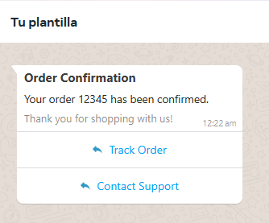
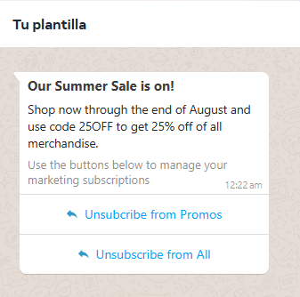
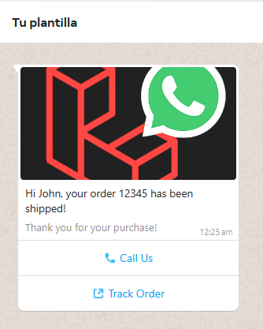

# 📱 WhatsApp Business API Manager for Laravel

LARAVEL WHatsapp Manager

**Un paquete elegante y potente para integrar WhatsApp Business API en tus aplicaciones Laravel 12+.**  
✨ Gestión de mensajes, plantillas, campañas, flujos conversacionales, métricas y más.

# Este paquete esta en version ALPHA.
## Las migraciones y codigo estan en constante cambio hasta lograr la Version Estable

---

## 🚀 Características Principales

- **Envía mensajes** de texto, multimedia, interactivos y de plantilla.
- **Gestion de Templates** para Crear, Listar, Eliminar y Probar plantillas.
- **Webhooks integrados** para recibir mensajes y actualizaciones.
- **Gestión de conversaciones** con métricas de cobro. 💰
- **Bots conversacionales** con flujos dinámicos. 🤖
- **Sincronización automática** de números telefónicos y perfiles.
- **Soporte para campañas** masivas programadas. 📅
- 100% compatible con **Laravel Echo y Reverb** para notificaciones en tiempo real.

---

---

## 🚀 Instalación

1. **Instala el paquete vía Composer**:
   ```bash
   composer require scriptdevelop/whatsapp-manager
   ```

2. **Publica la configuración (opcional)**:
   ```bash
   php artisan vendor:publish --tag=whatsapp-config
   ```

   ⚙️ Configuración

   Configuración principal (config/whatsapp.php):
      
   Configuración de logs (config/logging.php):

   Configuración principal del paquete:
   Añadir el canal whatsapp.

      ```php
      'channels' => [
         'whatsapp' => [
               'driver' => 'daily',
               'path' => storage_path('logs/whatsapp.log'),
               'level' => 'debug',
               'days' => 7,
               'tap' => [\ScriptDevelop\WhatsappManager\Logging\CustomizeFormatter::class],
         ],
      ],
      ```

3. **Publica las migraciones (opcional)**:
   ```bash
   php artisan vendor:publish --tag=whatsapp-migrations

4. **Publica las rutas (OBLIGATORIO)**:
   Se necesita para el webhook.

   ```bash
   php artisan vendor:publish --tag=whatsapp-routes
   ```

   Excluir rutas del webhook de CSRF:

   Al publicar las rutas es importante anexar las rutas del webhook a las excepciones del CSRF.
   En bootstrap/app.php:

   ```php
   ->withMiddleware(function (Middleware $middleware) {
        $middleware->validateCsrfTokens(except: [
            '/whatsapp-webhook',
        ]);
    })
   ```

5. **Configura tus credenciales en .env**:
   ```bash
   WHATSAPP_API_URL=https://graph.facebook.com
   WHATSAPP_API_VERSION=v21.0
   WHATSAPP_VERIFY_TOKEN=your-verify-token
   WHATSAPP_USER_MODEL=App\Models\User


🔄 Personalizar el Modelo User

Si usas un modelo User personalizado:

   Si estás utilizando un modelo User personalizado, asegúrate de especificarlo en tu archivo `.env`:

   ```bash
   WHATSAPP_USER_MODEL=App\Models\YourCustomUserModel
   ```

Además, verifica que el modelo implementa las interfaces necesarias o extiende el modelo base esperado por el paquete. Por ejemplo:

```php
namespace App\Modules\Auth\Models;

use Illuminate\Foundation\Auth\User as Authenticatable;

class Admin extends Authenticatable
{
   // Tu lógica personalizada aquí
}
```


6.  🗃️ Migraciones

🔍 Verificar configuración del User Model

**Verifica el modelo de usuario configurado**:

Ejecuta el siguiente comando para asegurarte de que el modelo de usuario está correctamente configurado:

```bash
php artisan whatsapp:check-user-model
```

Este comando validará que el modelo especificado en el archivo `.env` cumple con los requisitos del paquete.

Salida esperada (ejemplo):
```plaintext
✅ Modelo User configurado: App\Models\User
```

Si hay algún problema, revisa la configuración en tu archivo `.env` y asegúrate de que el modelo implementa las interfaces necesarias.


Ejecuta las migraciones para crear las tablas necesarias:
   
```bash
php artisan migrate
```

Esto ejecutará las migraciones necesarias para crear las tablas requeridas por el paquete en tu base de datos.

Tablas incluidas:

- whatsapp_business_accounts 📇  
- whatsapp_phone_numbers ☎️  
- campaigns 📢  
- chat_sessions 💬  
- message_templates 📝  
- messages 📩  
- message_logs 📜  
- contacts 📋  
- contact_groups 👥  
- group_contacts 🔗  
- scheduled_messages ⏰  
- message_attachments 📎  
- api_tokens 🔑  
- webhook_events 🌐  
- conversation_flows 🔄  
- flow_steps 🛠️  
- flow_conditions ⚙️  


Este comando publicará las migraciones del paquete en tu directorio `database/migrations`. Puedes personalizarlas según tus necesidades antes de ejecutarlas.

📡 Configuración de Webhooks en Meta
Ir a Meta Developers

Configurar Webhook:
- Define la URL del webhook en la consola de Meta Developers.
- La URL debe apuntar a la ruta publicada por el paquete, por ejemplo

URL: https://tudominio.com/whatsapp-webhook

Token: EL_TOKEN_DE_TU_.ENV

Eventos a suscribir: messages, message_statuses

Tambien puedes usar la herramienta nrock
🧩 Estructura del Paquete

```bash
whatsapp-manager/
├── .env.testing              # Archivo de configuración para pruebas
├── composer.json             # Configuración de dependencias del paquete
├── composer.lock             # Archivo de bloqueo de dependencias
├── LICENSE                   # Licencia del paquete
├── phpunit.xml               # Configuración de PHPUnit para pruebas
├── README.md                 # Documentación principal del paquete
├── .vscode/
│   └── settings.json         # Configuración específica para Visual Studio Code
├── assets/                   # Archivos de recursos
│   ├── 2394384167581644.ogg  # Archivo de audio de ejemplo
│   ├── LARAVEL WHATSAPP MANEGER.pdf # Documento PDF de ejemplo
│   └── laravel-whatsapp-manager.png # Imagen de ejemplo
├── src/                      # Código fuente principal del paquete
│   ├── Config/               # Archivos de configuración
│   │   ├── logging.php
│   │   ├── whatsapp.php
│   ├── Console/              # Comandos Artisan personalizados
│   │   ├── CheckUserModel.php
│   │   ├── MergeLoggingConfig.php
│   ├── Database/             # Migraciones y seeders
│   │   ├── Migrations/       # Migraciones de base de datos
│   │   └── Seeders/          # Seeders opcionales
│   ├── Enums/                # Enumeraciones del sistema
│   │   ├── MessageStatus.php
│   ├── Exceptions/           # Excepciones personalizadas
│   │   ├── InvalidApiResponseException.php
│   │   ├── WhatsappApiException.php
│   ├── Facades/              # Facades del paquete
│   │   ├── whatsapp.php
│   ├── Helpers/              # Funciones y utilidades auxiliares   
│   │   ├── CountryCodes.php
│   ├── Http/                 # Lógica HTTP
│   │   ├── Controllers/      # Controladores HTTP y Webhook
│   │   │   ├── WhatsappWebhookController.php
│   │   └── Middleware/       # Middleware personalizados
│   ├── Logging/              # Personalización de logs  
│   │   ├── CustomizeFormatter.php
│   ├── Models/               # Modelos Eloquent
│   ├── Providers/            # Proveedores de servicios del paquete  
│   │   ├── WhatsappServiceProvider.php
│   ├── Repositories/         # Repositorios para acceso a datos
│   │   ├── WhatsappBusinessAccountRepository.php
│   ├── routes/               # Rutas del paquete
│   │   ├── whatsapp_webhook.php
│   ├── Services/             # Lógica de negocio y API
│   │   ├── AccountRegistrationService.php
│   │   ├── MessageDispatcherService.php
│   │   ├── TemplateBuilder.php
│   │   ├── TemplateMessageBuilder.php
│   │   ├── TemplateService.php
│   │   ├── WhatsappManager.php
│   │   ├── WhatsappService.php
│   ├── Traits/               # Traits reutilizables
│   │   ├── GeneratesUlid.php
│   └── WhatsappApi/          # Cliente API y endpoints
│   │   ├── DataTransferObjects/
│   │   │   ├── ApiErrorResponse.php
│   │   │   ├── BusinessAccountResponse.php
│   │   │   ├── MessageResponse.php
│   │   ├── Exceptions/
│   │   │   ├── BusinessProfileValidator.php
│   │   ├── ApiClient.php
│   │   ├── Endpoints.php     
├── tests/                    # Pruebas del paquete
│   ├── TestCase.php          # Clase base para pruebas
│   ├── Feature/              # Pruebas funcionales
│   └── Unit/                 # Pruebas unitarias
└── vendor/                   # Dependencias instaladas por Composer
```


📖 Guía de Usuario

## 1. Registro de Cuentas de Negocios
Registra una cuenta de negocios en WhatsApp Business API.
Se hace la peticion a la API de whatsapp, se obtienen los datos de la cuenta y se almacenan en la base de datos. Este metodo obtiene los datos de la cuenta, los telefonos de whatsapp asociados a la cuenta y el perfil de cada numero de telefono.
- Se usa para Obtener los datos desde la API y alojarlos en la base de datos.

```php
use ScriptDevelop\WhatsappManager\Facades\Whatsapp;

$account = Whatsapp::account()->register([
   'api_token' => '***********************',
   'business_id' => '1243432234423'
]);
```


## 2. Obtener Detalles de Números de Teléfono
Obtén información detallada sobre un número de teléfono registrado.
Se hace la peticion a la API de whatsapp para obtener detalles del numero de whatsapp y se almacenan en la base de datos, si el numero ya existe actualiza la informacion.

```php
use ScriptDevelop\WhatsappManager\Facades\Whatsapp;

$phoneDetails = Whatsapp::phone()->getPhoneNumberDetails('564565346546');
```


## 3. Obtener Cuentas de Negocios
Obtén información sobre una cuenta de negocios específica.
Se hace la peticion a la API de whatsapp para obtener informacion sobre una cuenta en especifico, se almacenan los datos en la base de datos.

```php
use ScriptDevelop\WhatsappManager\Facades\Whatsapp;

$account = Whatsapp::phone()->getBusinessAccount('356456456456');
```


## 4. Enviar Mensajes de Texto
Envía mensajes de texto simples.

```php
use ScriptDevelop\WhatsappManager\Facades\Whatsapp;

$message = Whatsapp::message()->sendTextMessage(
    '01JTKF55PCNNWTNEKCGMJAZV93', // ID del número de teléfono
    '57',                        // Código de país
    '3237121901',                // Número de teléfono
    'Hola, este es un mensaje de prueba.' // Contenido del mensaje
);
```


Enviar Mensajes de Texto con Enlaces
Envía mensajes de texto simples.

```php
$message = Whatsapp::message()->sendTextMessage(
    '01JTKF55PCNNWTNEKCGMJAZV93',
    '57',
    '3237121901',
    'Visítanos en YouTube: http://youtube.com',
    true // Habilitar vista previa de enlaces
);
```

## Marcar mensaje como leido
Se encarga de marcar el mensaje recibido como leido, con los dos checks azules.

```php
$message = Whatsapp::message()->markMessageAsRead('01JW939646VBZTS7JEJN21FGVE');
```

## 5. Enviar Respuestas a Mensajes
Responde a un mensaje existente.

```php
$message = Whatsapp::message()->sendReplyTextMessage(
    '01JTKF55PCNNWTNEKCGMJAZV93',
    '57',
    '3237121901',
    'wamid.HBgMNTczMTM3MTgxOTA4FQIAEhggNzVCNUQzRDMxRjhEMUJEM0JERjAzNkZCNDk5RDcyQjQA', // ID del mensaje de contexto
    'Esta es una respuesta al mensaje anterior.'
);
```


## 6. Reacciones a Mensajes
Envía una reacción a un mensaje existente.

### Sintaxis Unicode requerida - Usa la codificación \u{código_hex} para emojis:

```php
// Reacción con corazón rojo ❤️
$message = Whatsapp::message()->sendReplyReactionMessage(
    '01JTKF55PCNNWTNEKCGMJAZV93',
    '57',
    '3237121901',
    'wamid.HBgMNTczMTM3MTgxOTA4FQIAEhggNzZENDMzMEI0MDRFQzg0OUUwRTI1M0JBQjEzMUZFRUYA', // ID del mensaje de contexto
    "\u{2764}\u{FE0F}" // Emoji de reacción
);


"\u{1F44D}" // 👍 (Me gusta)
"\u{1F44E}" // 👎 (No me gusta)
"\u{1F525}" // 🔥 
"\u{1F60D}" // 😍
"\u{1F622}" // 😢
"\u{1F389}" // 🎉
"\u{1F680}" // 🚀
"\u{2705}" // ✅
"\u{274C}" // ❌
```


## 7. Enviar Mensajes Multimedia
### Enviar Imágenes

```php
$filePath = storage_path('app/public/laravel-whatsapp-manager.png');
$file = new \SplFileInfo($filePath);

$message = Whatsapp::message()->sendImageMessage(
    '01JTKF55PCNNWTNEKCGMJAZV93',
    '57',
    '3237121901',
    $file
);
```

### Enviar Imágenes por URL

```php
$message = Whatsapp::message()->sendImageMessageByUrl(
    '01JTKF55PCNNWTNEKCGMJAZV93',
    '57',
    '3237121901',
    'https://example.com/image.png'
);
```

### Enviar Audio

```php
$filePath = storage_path('app/public/audio.ogg');
$file = new \SplFileInfo($filePath);

$message = Whatsapp::message()->sendAudioMessage(
    '01JTKF55PCNNWTNEKCGMJAZV93',
    '57',
    '3237121901',
    $file
);
```

### Enviar Audio por URL

```php
$message = Whatsapp::message()->sendAudioMessageByUrl(
    '01JTKF55PCNNWTNEKCGMJAZV93',
    '57',
    '3237121901',
    'https://example.com/audio.ogg'
);
```

### Enviar Documentos

```php
$filePath = storage_path('app/public/document.pdf');
$file = new \SplFileInfo($filePath);

$message = Whatsapp::message()->sendDocumentMessage(
    '01JTKF55PCNNWTNEKCGMJAZV93',
    '57',
    '3237121901',
    $file
);
```

### Enviar Documentos por URL

```php
$message = Whatsapp::message()->sendDocumentMessageByUrl(
    '01JTKF55PCNNWTNEKCGMJAZV93',
    '57',
    '3237121901',
    'https://example.com/document.pdf'
);
```

## 8. Enviar Mensajes de Ubicación
### Envía un mensaje con coordenadas de ubicación.

```php
$message = Whatsapp::message()->sendLocationMessage(
    '01JTKF55PCNNWTNEKCGMJAZV93',
    '57',
    '3237121901',
    4.7110, // Latitud
    -74.0721, // Longitud
    'Bogotá', // Nombre del lugar
    'Colombia' // Dirección
);

$message = Whatsapp::message()->sendLocationMessage(
    phoneNumberId: $phone->phone_number_id,
    countryCode: '57',
    phoneNumber: '3137183308',
    latitude: 19.4326077,  // Latitud
    longitude: -99.133208, // Longitud
    name: 'Ciudad de México',
    address: 'Plaza de la Constitución'
);
```

## 9. Mensajes con Botones Interactivos

```php
$message = Whatsapp::message()->sendInteractiveButtonsMessage(
    phoneNumberId: $phone->phone_number_id,
    countryCode: '57',
    phoneNumber: '3136133508',
    body: 'Selecciona una opción:',
    buttons: [
        ['id' => 'op1', 'title' => 'Opción 1'], // Máximo 3 botones
        ['id' => 'op2', 'title' => 'Opción 2']
    ],
    footer: 'Footer opcional' // Texto secundario
);
```

## 10. Listas Desplegables Interactivas

```php
$message = Whatsapp::message()->sendListMessage(
    phoneNumberId: $phone->phone_number_id,
    countryCode: '57',
    phoneNumber: '3137555558',
    buttonText: 'Ver opciones', // Máximo 20 caracteres
    sections: [
        [
            'title' => 'Sección 1', // Encabezado de sección
            'rows' => [
                ['id' => 'row1', 'title' => 'Fila 1'], // Hasta 10 filas
                ['id' => 'row2', 'title' => 'Fila 2']
            ]
        ]
    ],
    body: 'Selecciona de la lista:' // Texto principal
);
```


## 11. Obtener todas las plantillas de una cuenta de whatsapp
Se obtienen todas las plantillas de una cuenta de whatsapp y se almacenan en la base de datos.
Se hace la peticion a la API de whatsapp para obtener todas las plantillas que estan asociadas a la cuenta de whatsapp.

```php
use ScriptDevelop\WhatsappManager\Facades\Whatsapp;
use ScriptDevelop\WhatsappManager\Models\WhatsappBusinessAccount;

// Obtener una instancia de WhatsApp Business Account
$account = WhatsappBusinessAccount::find($accountId);

// Obtener todas las plantillas de la cuenta
Whatsapp::template()->getTemplates($account);
```

- ### Obtener una plantilla por el nombre.
  Se hace la peticion a la API de whatsapp para obtener una plantilla por el nombre y se almacena en la base de datos.

   ```php
   use ScriptDevelop\WhatsappManager\Facades\Whatsapp;
   use ScriptDevelop\WhatsappManager\Models\WhatsappBusinessAccount;

   // Obtener una instancia de WhatsApp Business Account
   $account = WhatsappBusinessAccount::find($accountId);

   // Obtener plantilla por su nombre
   $template = Whatsapp::template()->getTemplateByName($account, 'order_confirmation');
   ```


- ### Obtener una plantilla por el ID.
  Se hace la peticion a la API de whatsapp para obtener una plantilla por el ID y se almacena en la base de datos.

   ```php
   use ScriptDevelop\WhatsappManager\Facades\Whatsapp;
   use ScriptDevelop\WhatsappManager\Models\WhatsappBusinessAccount;

   // Obtener una instancia de WhatsApp Business Account
   $account = WhatsappBusinessAccount::find($accountId);

   // Obtener plantilla por su ID
   $template = Whatsapp::template()->getTemplateById($account, '559947779843204');
   ```

- ### Eliminar plantilla de la API y de la base de datos al mismo tiempo.
  Se hace la peticion a la API de whatsapp para obtener una plantilla por el ID y se elimina la plantilla seleccionada, Existen dos maneras de eliminar Soft Delete y Hard Delete.

   ```php
   use ScriptDevelop\WhatsappManager\Facades\Whatsapp;
   use ScriptDevelop\WhatsappManager\Models\WhatsappBusinessAccount;

   // Obtener una instancia de WhatsApp Business Account
   $account = WhatsappBusinessAccount::find($accountId);

   // Soft delete
   // Eliminar plantilla por su ID
   $template = Whatsapp::template()->gdeleteTemplateById($account, $templateId);

   // Eliminar plantilla por su Nombre
   $template = Whatsapp::template()->deleteTemplateByName($account, 'order_confirmation');


   // Hard delete
   // Eliminar plantilla por su ID
   $template = Whatsapp::template()->gdeleteTemplateById($account, $templateId, true);

   // Eliminar plantilla por su Nombre
   $template = Whatsapp::template()->deleteTemplateByName($account, 'order_confirmation', true);
   ```


- ### Editar plantilla de la API y de la base de datos al mismo tiempo.
  Se hace la peticion a la API de whatsapp para editar la plantilla seleccionada.

    ```php
    use ScriptDevelop\WhatsappManager\Models\Template;
    use ScriptDevelop\WhatsappManager\Exceptions\TemplateComponentException;
    use ScriptDevelop\WhatsappManager\Exceptions\TemplateUpdateException;

    $template = Template::find('template-id');

    try {
        $updatedTemplate = $template->edit()
            ->setName('nuevo-nombre-plantilla')
            ->changeBody('Nuevo contenido del cuerpo {{1}}', [['Ejemplo nuevo']])
            ->removeHeader()
            ->addFooter('Nuevo texto de pie de página')
            ->removeAllButtons()
            ->addButton('URL', 'Visitar sitio', 'https://ejemplo.com')
            ->addButton('QUICK_REPLY', 'Confirmar')
            ->update();
        
        return response()->json($updatedTemplate);
        
    } catch (TemplateComponentException $e) {
        // Manejar error de componente
        return response()->json(['error' => $e->getMessage()], 400);
        
    } catch (TemplateUpdateException $e) {
        // Manejar error de actualización
        return response()->json(['error' => $e->getMessage()], 500);
    }
    ```

    Agregar componentes a plantillas que no lo tenian:

    ```php
    $template->edit()
        ->addHeader('TEXT', 'Encabezado agregado')
        ->addFooter('Pie de página nuevo')
        ->addButton('PHONE_NUMBER', 'Llamar', '+1234567890')
        ->update();
    ```

    Eliminar componentes existentes:
    
    ```php
    $template->edit()
        ->removeFooter()
        ->removeAllButtons()
        ->update();
    ```

    Trabajar con componentes específicos:
    
    ```php
    $editor = $template->edit();

    // Verificar y modificar header
    if ($editor->hasHeader()) {
        $headerData = $editor->getHeader();
        if ($headerData['format'] === 'TEXT') {
            $editor->changeHeader('TEXT', 'Encabezado actualizado');
        }
    } else {
        $editor->addHeader('TEXT', 'Nuevo encabezado');
    }

    // Modificar botones
    $buttons = $editor->getButtons();
    foreach ($buttons as $index => $button) {
        if ($button['type'] === 'URL' && str_contains($button['url'], 'old-domain.com')) {
            $newUrl = str_replace('old-domain.com', 'new-domain.com', $button['url']);
            $editor->removeButtonAt($index);
            $editor->addButton('URL', $button['text'], $newUrl);
        }
    }

    $editor->update();
    ```

## Características Clave del Edit Template

    1.- Gestión completa de componentes:
        - Métodos add, change, remove para cada tipo de componente
        - Métodos has para verificar existencia
        - Métodos get para obtener datos

    2.- Validaciones robustas:
        - Unicidad de componentes (solo un HEADER, BODY, etc.)
        - Componentes obligatorios (BODY siempre requerido)
        - Límites de botones (máximo 10)
        - Restricciones de modificación (no cambiar categoría, no modificar aprobadas)

    3.- Operaciones atómicas:
        - removeButtonAt: Elimina un botón específico
        - removeAllButtons: Elimina todos los botones
        - getButtons: Obtiene todos los botones actuales

    4.- Manejo de errores:
        - Excepciones específicas para problemas de componentes
        - Excepciones para fallos en la actualización
        - Mensajes de error claros y descriptivos

    5.- Flujo intuitivo:
        - $template->edit() inicia la edición
        - Encadenamiento de métodos para modificaciones
        - update() aplica los cambios

## 12. Crear las plantillas en una cuenta de whatsapp
### Crear Plantillas de Utilidad

Las plantillas transaccionales son ideales para notificaciones como confirmaciones de pedidos, actualizaciones de envío, etc.



```php
use ScriptDevelop\WhatsappManager\Facades\Whatsapp;
use ScriptDevelop\WhatsappManager\Models\WhatsappBusinessAccount;

// Obtener la cuenta empresarial
$account = WhatsappBusinessAccount::first();

// Crear una plantilla transaccional
$template = Whatsapp::template()
    ->createUtilityTemplate($account)
    ->setName('order_confirmation_3')
    ->setLanguage('en_US')
    ->addHeader('TEXT', 'Order Confirmation')
    ->addBody('Your order {{1}} has been confirmed.', ['12345'])
    ->addFooter('Thank you for shopping with us!')
    ->addButton('QUICK_REPLY', 'Track Order')
    ->addButton('QUICK_REPLY', 'Contact Support')
    ->save();
```


---

### Crear Plantillas de Marketing

Las plantillas de marketing son útiles para promociones, descuentos y campañas masivas.



```php
    use ScriptDevelop\WhatsappManager\Facades\Whatsapp;
    use ScriptDevelop\WhatsappManager\Models\WhatsappBusinessAccount;

    // Obtener la cuenta empresarial
    $account = WhatsappBusinessAccount::first();

    // Crear una plantilla de marketing con texto
    $template = Whatsapp::template()
        ->createMarketingTemplate($account)
        ->setName('personal_promotion_text_only')
        ->setLanguage('en')
        ->addHeader('TEXT', 'Our {{1}} is on!', ['Summer Sale'])
        ->addBody(
            'Shop now through {{1}} and use code {{2}} to get {{3}} off of all merchandise.',
            ['the end of August', '25OFF', '25%']
        )
        ->addFooter('Use the buttons below to manage your marketing subscriptions')
        ->addButton('QUICK_REPLY', 'Unsubscribe from Promos')
        ->addButton('QUICK_REPLY', 'Unsubscribe from All')
        ->save();
```

---

### Crear Plantillas de Marketing con Imágenes

Las plantillas de marketing también pueden incluir imágenes en el encabezado para hacerlas más atractivas.



```php
use ScriptDevelop\WhatsappManager\Facades\Whatsapp;
use ScriptDevelop\WhatsappManager\Models\WhatsappBusinessAccount;

// Obtener la cuenta empresarial
$account = WhatsappBusinessAccount::first();

// Ruta de la imagen
$imagePath = storage_path('app/public/laravel-whatsapp-manager.png');

// Crear una plantilla de marketing con imagen
$template = Whatsapp::template()
    ->createMarketingTemplate($account)
    ->setName('image_template_test')
    ->setLanguage('en_US')
    ->setCategory('MARKETING')
    ->addHeader('IMAGE', $imagePath)
    ->addBody('Hi {{1}}, your order {{2}} has been shipped!', ['John', '12345'])
    ->addFooter('Thank you for your purchase!')
    ->save();
```

---

### Crear Plantillas de Marketing con Botones de URL

Puedes agregar botones de URL personalizados para redirigir a los usuarios a páginas específicas.


```php
use ScriptDevelop\WhatsappManager\Facades\Whatsapp;
use ScriptDevelop\WhatsappManager\Models\WhatsappBusinessAccount;

// Obtener la cuenta empresarial
$account = WhatsappBusinessAccount::first();

// Ruta de la imagen
$imagePath = storage_path('app/public/laravel-whatsapp-manager.png');

// Crear una plantilla de marketing con imagen y botones de URL
$template = Whatsapp::template()
    ->createMarketingTemplate($account)
    ->setName('image_template_test_2')
    ->setLanguage('en_US')
    ->setCategory('MARKETING')
    ->addHeader('IMAGE', $imagePath)
    ->addBody('Hi {{1}}, your order {{2}} has been shipped!', ['John', '12345'])
    ->addFooter('Thank you for your purchase!')
    ->addButton('PHONE_NUMBER', 'Call Us', '+573234255686')
    ->addButton('URL', 'Track Order', 'https://example.com/track?order={{1}}', ['12345'])
    ->save();
```

---

### Crear Variaciones de Plantillas de Marketing

Puedes crear múltiples variaciones de plantillas para diferentes propósitos.


```php
use ScriptDevelop\WhatsappManager\Facades\Whatsapp;
use ScriptDevelop\WhatsappManager\Models\WhatsappBusinessAccount;

// Obtener la cuenta empresarial
$account = WhatsappBusinessAccount::first();

// Crear una variación de plantilla de marketing
$template = Whatsapp::template()
    ->createMarketingTemplate($account)
    ->setName('personal_promotion_text_only_22')
    ->setLanguage('en')
    ->addHeader('TEXT', 'Our {{1}} is on!', ['Summer Sale'])
    ->addBody(
        'Shop now through {{1}} and use code {{2}} to get {{3}} off of all merchandise.',
        ['the end of August', '25OFF', '25%']
    )
    ->addFooter('Use the buttons below to manage your marketing subscriptions')
    ->addButton('QUICK_REPLY', 'Unsubscribe from Promos')
    ->addButton('QUICK_REPLY', 'Unsubscribe from All')
    ->save();
```


## 13. Enviar Mensajes a partir de Plantilla creada.
### Enviar mensajes de plantillas

Puedes enviar diferentes mensajes de plantillas segun la estructura de la plantilla.


```php
use ScriptDevelop\WhatsappManager\Facades\Whatsapp;
use ScriptDevelop\WhatsappManager\Models\WhatsappBusinessAccount;
use ScriptDevelop\WhatsappManager\Models\WhatsappPhoneNumber;

// Obtener la cuenta empresarial
$account = WhatsappBusinessAccount::first();
$phone = WhatsappPhoneNumber::first();

// Enviar plantilla 1
$message = Whatsapp::template()
    ->sendTemplateMessage($phone)
    ->to('57', '3137555908')
    ->usingTemplate('order_confirmation_4')
    ->addBody(['12345'])
    ->send();

// Enviar plantilla 2
$message = Whatsapp::template()
    ->sendTemplateMessage($phone)
    ->to('57', '3135666627')
    ->usingTemplate('link_de_pago')
    ->addHeader('TEXT', '123456')
    ->addBody(['20000'])
    ->addButton('URL', 'Pagar', 'https://mpago.li/1QFwRV', ['1QFwRV'])
    ->send();

```
## 14. Bot Builder, Contructor de Bot y mensajes automatizados.
### Crear BOTS de Whatsapp

Puedes diferentes tipos de Bots para whatsapp.


```php
use ScriptDevelop\WhatsappManager\Facades\Whatsapp;
use ScriptDevelop\WhatsappManager\Models\WhatsappBusinessAccount;
use ScriptDevelop\WhatsappManager\Models\WhatsappPhoneNumber;

// Obtener la cuenta empresarial
$account = WhatsappBusinessAccount::first();
$phone = WhatsappPhoneNumber::first();

// Crear Bot de whatsapp
$bot = Whatsapp::bot()
    ->createBot(
        [
            'name' => 'Soporte Técnico',
            'phone_number_id' => $phone->phone_number_id,
            'trigger_keywords' => ['soporte', 'ayuda'],
        ]);

// Ver detalle de un Bot de whatsapp
$botDetail = Whatsapp::bot()->getById($bot->whatsapp_bot_id);

```

### Bot con flujo de conversacion y pasos de pruebas

```php
// 1. Seleccionar cuenta y numero para el bot
// Cuenta de whatsapp
$account = WhatsappBusinessAccount::find(214545545097167);

// Numerod e whatsapp
$phone = $account->phoneNumbers->first();

// 2. Crear bot
$bot = Whatsapp::bot()->createBot([
    'name' => 'Bot Bienvenida',
    'phone_number_id' => $phone->phone_number_id,
    'description' => 'Bot de Bienvenida',
    'on_failure_action' => 'assign_agent',
    'failure_message' => 'Transferiendo a agente...'
]);

// 3. Crear flujo
$flow = Whatsapp::flow()->createFlow([
    'name' => 'Flujo de pruebas',
    'description' => 'Flujo que funciona para realizar pruebas',
    'type' => 'inbound',
    'trigger_mode' => 'any',
    'is_default' => false
]);
$flow->addKeywordTrigger(['Hola', 'Buenos dias'], false, 'contains');
$flow = $flow->build();
$bot->flows()->attach($flow->flow_id);

// 4. Crear servicio de pasos
$stepService = Whatsapp::step($flow);
use ScriptDevelop\WhatsappManager\Enums\StepType;

// Paso 1: Bienvenida
$step1 = $stepService->createStep('Bienvenida', StepType::MESSAGE_SEQUENCE)
    ->addTextMessage("¡Hola! Este flujo es de pruebas.", 1, 0)
    ->build();

// Paso 2: Pregunta edad
$step2 = $stepService->createStep('Pregunta Edad', StepType::OPEN_QUESTION)
    ->addTextMessage("¿Cuántos años tienes?", 1, 0)
    ->addVariable('edad', 'number', 'global', ['required','numeric','min:1'])
    ->setValidationRules(['edad' => 'required|numeric|min:1'], 2, "Edad inválida")
    ->build();

// Paso 3: Condicional
$step3 = $stepService->createStep('Mayor de edad', StepType::MESSAGE_SEQUENCE)
    ->addTextMessage("Eres mayor de edad", 1, 0)
    ->build();

$step4 = $stepService->createStep('Menor de edad', StepType::MESSAGE_SEQUENCE)
    ->addTextMessage("Eres menor de edad", 1, 0)
    ->build();

// Paso 5: Despedida
$step5 = $stepService->createStep('Despedida', StepType::TERMINAL)
    ->addTextMessage("¡Gracias por participar!", 1, 0)
    ->build();

// 6. Crear transiciones (compatibles con la prueba)
$step1->transitions()->create([
    'to_step_id' => $step2->step_id,
    'condition_type' => 'always',
    'priority' => 1
]);

$step2->transitions()->create([
    'to_step_id' => $step3->step_id,
    'condition_type' => 'variable_value',
    'condition_config' => ['variable' => 'edad', 'operator' => '>=', 'value' => 18],
    'priority' => 2
]);

$step2->transitions()->create([
    'to_step_id' => $step4->step_id,
    'condition_type' => 'variable_value',
    'condition_config' => ['variable' => 'edad', 'operator' => '<', 'value' => 18],
    'priority' => 1
]);

$step3->transitions()->create([
    'to_step_id' => $step5->step_id,
    'condition_type' => 'always',
    'priority' => 1
]);

$step4->transitions()->create([
    'to_step_id' => $step5->step_id,
    'condition_type' => 'always',
    'priority' => 1
]);

// 7. Establecer paso inicial
$flow->update(['entry_point_id' => $step1->step_id]);
```


1. Whatsapp (Facade)
Métodos Principales:

account(): Acceso a AccountRegistrationService

message(): Acceso a MessageDispatcherService

phone(): Acceso a WhatsappService

template(): Acceso a TemplateService

bot(): Accesoa BotBuilderService

getBusinessAccount(): Obtiene datos de una cuenta empresarial

getPhoneNumbers(): Lista números asociados a una cuenta

getPhoneNumberDetails(): Detalles técnicos de un número

getBusinessProfile(): Perfil comercial vinculado a un número

2. WhatsappService
Métodos Clave:

forAccount(): Establece la cuenta activa para operaciones

getBusinessAccount(): Datos de cuenta (nombre, timezone, IDs)

getPhoneNumbers(): Listado de números telefónicos

getPhoneNumberDetails(): Verificación, rating de calidad, configuración

getBusinessProfile(): Descripción, email, logo, dirección

withTempToken(): Autenticación temporal para operaciones

3. TemplateService
Gestión de Plantillas:

getTemplates(): Sincroniza plantillas desde la API

getTemplateById()/getTemplateByName(): Búsqueda específica

createUtilityTemplate()/createMarketingTemplate()/createAuthenticationTemplate(): Builders para tipos de plantillas

deleteTemplateById()/deleteTemplateByName(): Eliminación (soft/hard delete)

sendTemplateMessage(): Constructor para enviar plantillas

createUploadSession()/uploadMedia(): Manejo de archivos multimedia

TemplateBuilder (Subservicio):

setName()/setLanguage()/setCategory(): Configuración básica

addHeader(): Texto, imágenes o ubicación

addBody(): Texto con parámetros dinámicos

addFooter(): Texto estático

addButton(): URL, teléfono o quick reply

save(): Crea/actualiza plantillas en la API y DB

4. AccountRegistrationService
Métodos Clave:

register(): Flujo completo de registro (cuenta + números + perfiles)

validateInput(): Verifica token y business ID

fetchAccountData(): Obtiene metadata de la API

upsertBusinessAccount(): Crea/actualiza cuenta en DB

registerPhoneNumbers(): Sincroniza números telefónicos

linkBusinessProfilesToPhones(): Vincula perfiles comerciales

5. MessageDispatcherService
Envío de Mensajes:

sendTextMessage(): Mensaje básico con vista previa opcional

sendReplyTextMessage(): Respuesta a mensaje existente

sendImageMessage()/sendAudioMessage()/sendVideoMessage(): Multimedia desde archivo

sendDocumentMessage(): PDF, Excel, Word con caption

sendStickerMessage(): Stickers estáticos/animados

sendContactMessage(): Comparte tarjeta de contacto

sendLocationMessage(): Coordenadas + dirección

Métodos de Soporte:

uploadFile(): Sube archivos a la API

downloadMedia(): Descarga medios a almacenamiento local

validateMediaFile(): Verifica formatos y tamaños

resolveContact(): Crea/recupera contactos en DB

Manejo de Respuestas:

Todos los métodos tienen versión sendReply...Message() para respuestas contextuales.

6. TemplateMessageBuilder
Construcción Dinámica:

to(): Define destinatario (país + número)

usingTemplate(): Selecciona plantilla por ID/nombre

addHeader()/addBody()/addFooter(): Componentes estáticos

addButton(): Hasta 10 botones por mensaje

send(): Valida y envía el mensaje estructurado

Flujos Técnicos Destacados
Registro de Cuenta:
register() -> validateInput() -> fetchAccountData() -> upsertBusinessAccount() -> registerPhoneNumbers()

Envío de Multimedia:
validateMediaFile() -> createUploadSession() -> uploadMedia() -> send...Message()

Plantillas con Parámetros:
TemplateBuilder -> addHeader()/addBody() -> storeOrUpdateTemplate() -> syncTemplateComponents()


---

### Notas

- Asegúrate de que las imágenes utilizadas en las plantillas cumplan con los requisitos de la API de WhatsApp (tamaño y formato).
- Los botones de URL pueden incluir parámetros dinámicos utilizando las variables de las plantillas (`{{1}}`, `{{2}}`, etc.).
- Revisa los logs para depurar cualquier problema durante la creación de plantillas.


🤝 Contribuir
¡Tu ayuda es bienvenida! Sigue estos pasos:

Haz un fork del repositorio

Crea una rama: git checkout -b feature/nueva-funcionalidad

Haz commit: git commit -m 'Add some feature'

Push: git push origin feature/nueva-funcionalidad

Abre un Pull Request

📄 Licencia
MIT License. Ver LICENSE para más detalles.

👨💻 Soporte
¿Problemas o sugerencias?
📧 Contacto: soporte@scriptdevelop.com
🐞 Reporta un issue: GitHub Issues

Desarrollado con ❤️ por ScriptDevelop
✨ Potenciando tu conexión con WhatsApp Business API


---

### 🔥 Características Destacadas del README
1. **Jerarquía Visual Clara**: Uso de emojis y encabezados para guiar la lectura.
2. **Sintaxis Resaltada**: Bloques de código con syntax highlighting.
3. **Badges Interactivos** (Añade estos al inicio):

   [](https://packagist.org/packages/scriptdevelop/whatsapp-manager)
   [](https://php.net/)
   [](https://laravel.com)

4.  Secciones Colapsables (Usa detalles HTML si necesitas):
    <details>
    <summary>📦 Ver estructura completa del paquete</summary>
    <!-- Contenido -->
    </details>
