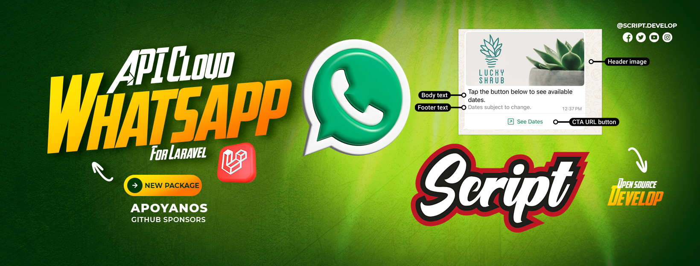

# WhatsApp Business API Manager for Laravel

### A complete solution to integrate WhatsApp Business API into your Laravel applications
### Una solución completa para integrar WhatsApp Business API en tus aplicaciones Laravel

---

### 🌐 Language / Idioma

**[🇺🇸 English](#-english) | [🇪🇸 Español](#-español)**

---

# 🇺🇸 English

## 📋 Table of Contents

- [Introduction](#introduction)
- [Key Features](#key-features)
- [Requirements](#requirements)
- [Documentation](#documentation)
- [Important Warnings](#important-warnings)
- [Contributing](#contributing)
- [Support the Project](#support-the-project)
- [License](#license)
- [Support and Contact](#support-and-contact)

---

## 📖 Introduction

**WhatsApp Business API Manager** is a robust and scalable package specifically designed for Laravel that simplifies integration with the official WhatsApp Business Cloud API. This package enables developers to implement advanced WhatsApp messaging functionalities efficiently, securely, and professionally.

With a modern and flexible architecture, the package provides an intuitive interface to manage all aspects of WhatsApp communication, from sending simple messages to implementing complex conversational flows with templates, webhooks, and real-time events.

### Why Choose This Package?

- ✅ **Native Laravel Integration** - Specifically designed for the Laravel ecosystem
- ✅ **Robust Architecture** - Well-structured code following Laravel best practices
- ✅ **Complete Documentation** - Detailed guides and practical examples
- ✅ **Active Support** - Constant updates and active community
- ✅ **Open Source** - 100% transparent under MIT license
- ✅ **Production Ready** - Prepared for high-performance environments

---

## 🚀 Key Features

### 💬 Complete Message Management

- **Text Messages** - Send and receive formatted text messages
- **Multimedia** - Full support for images, videos, audio, and documents
- **Locations** - Share and receive geographic coordinates
- **Contacts** - Exchange contact information
- **Interactive Messages** - Quick reply buttons and option lists
- **Reactions** - Support for emoji reactions to messages
- **Read Status** - Track message delivery and read status

### 📋 Template System

- **Template Creation** - Complete interface to manage templates
- **Pre-approved Templates** - Use Meta-verified templates
- **Dynamic Variables** - Personalize messages with dynamic data
- **Multimedia Components** - Templates with images, videos, and documents
- **Action Buttons** - Call-to-action, URL, and quick replies
- **Versioning** - Manage multiple template versions

### 🔔 Webhooks and Real-time Events

- **Integrated Webhooks** - Automatic reception of WhatsApp events
- **Laravel Events** - Native integration with Laravel's event system
- **Laravel Echo & Reverb** - Real-time notifications for your frontend
- **Security Validation** - Automatic webhook signature verification
- **Custom Events** - Create your own listeners for specific events

### 📊 Management and Monitoring

- **Multiple Numbers** - Manage multiple WhatsApp Business numbers
- **Conversation Metrics** - Track costs and usage
- **Logging System** - Detailed logging of all operations
- **Job Queue** - Background processing with Laravel Queue
- **Error Handling** - Robust error capture and management system
- **Rate Limiting** - Control sending limits

### 🔧 Customization and Extensibility

- **Customizable Models** - Extend models to your needs
- **Flexible Configuration** - Complete and documented configuration file
- **Custom Middleware** - Add your own processing logic
- **Service Providers** - Deep integration with Laravel's container
- **Facades** - Simple and elegant access to functionalities

---

## 📦 Requirements

Before installing the package, make sure you meet the following requirements:

### System Requirements

- **PHP** >= 8.2
- **Laravel** >= 12.0
- **Composer** >= 2.0
- **Database**: MySQL, PostgreSQL, SQLite, or SQL Server

### WhatsApp Business API Requirements

- **Meta Business Account** - [Create account](https://business.facebook.com/)
- **Meta Application** - Configured with WhatsApp Business API
- **Access Token** - Permanent access token from your application
- **Verified Phone Number** - Verified WhatsApp Business number
- **Webhook URL** - Publicly accessible URL to receive webhooks (HTTPS required)

### Recommended Knowledge

- Laravel fundamentals (Routing, Controllers, Models)
- Basic REST API concepts
- Knowledge of Webhooks and events
- WhatsApp Business API policies and limitations

---

## 📚 Documentation

### 🚀 Get Started with Full Documentation

---

### 📖 Complete Guides Available

<table>
<tr>
<td width="50%" valign="top">

#### 🚀 Getting Started
- **[Installation & Setup](https://laravelwhatsappmanager.com/docs/en/guide.installation)** - Get up and running in minutes
- **[API Configuration](https://laravelwhatsappmanager.com/docs/en/guide.api-configuration)** - Meta Business credentials setup
- **[Requirements](https://laravelwhatsappmanager.com/docs/en/guide.installation)** - System and API requirements

</td>
<td width="50%" valign="top">

#### 💬 Core Features
- **[Message Management](https://laravelwhatsappmanager.com/docs/en/guide.messages)** - Send & receive all message types
- **[Templates](https://laravelwhatsappmanager.com/docs/en/guide.templates)** - Create and manage templates
- **[Interactive Messages](https://laravelwhatsappmanager.com/docs/en/guide.messages.interactive)** - Buttons and lists

</td>
</tr>
<tr>
<td width="50%" valign="top">

#### 🔔 Advanced Topics
- **[Webhooks](https://laravelwhatsappmanager.com/docs/en/guide.webhook-full)** - Real-time event handling
- **[Events & Broadcasting](https://laravelwhatsappmanager.com/docs/en/guide.events)** - Laravel Echo integration
- **[Customization](https://laravelwhatsappmanager.com/docs/en/guide.advanced.custom-models)** - Extend the package

</td>
<td width="50%" valign="top">

#### 🎯 Practical Examples
- **[Notification Systems](https://laravelwhatsappmanager.com/docs/en/guide.introduction)** - Alert your users
- **[CRM Integration](https://laravelwhatsappmanager.com/docs/en/guide.introduction)** - Connect with your CRM

</td>
</tr>
</table>

### 💡 Everything You Need

The official documentation includes installation instructions, code examples, configuration guides, best practices, troubleshooting tips, and everything you need to integrate WhatsApp Business API into your Laravel application.

---

## ⚠️ Important Warnings

### 🚫 WhatsApp Policies

**IMPORTANT:** Using this package implies strict compliance with WhatsApp Business policies.

- ✅ **Read and comply** with [WhatsApp Business Policy](https://www.whatsapp.com/legal/business-policy/)
- ✅ **Get explicit consent** from users before sending messages
- ✅ **Respect opt-outs** - Users must be able to unsubscribe easily
- ✅ **Don't send SPAM** - Only relevant and requested messages
- ✅ **Protect privacy** - Comply with GDPR, LGPD, and other regulations
- ❌ **Avoid prohibited content** - No illegal, misleading, or abusive content

**Non-compliance may result in:**
- Temporary or permanent account suspension
- Message sending restrictions
- Legal action by Meta
- Loss of API access

### ⚠️ Project Status

- **Current Version:** Alpha
- **Status:** Active development
- **Stability:** Functional but subject to changes
- **Recommendation:** Use in development, be cautious in production
- **Next version:** Beta (coming soon)

**Considerations:**
- The API may change in future versions
- Report any bugs on [GitHub Issues](https://github.com/djdang3r/whatsapp-api-manager/issues)
- Contributions are welcome to improve stability

---

## 🤝 Contributing

Your collaboration is essential to grow this project. All contributions are welcome:

### Ways to Contribute

- 🐛 **Report Bugs** - [Open Issue](https://github.com/djdang3r/whatsapp-api-manager/issues)
- 💡 **Suggest Features** - Share your ideas
- 📖 **Improve Documentation** - Help other developers
- 🔧 **Submit Pull Requests** - Code, tests, improvements
- ⭐ **Give a Star** - Help give visibility to the project

### Contribution Process

1. **Fork** the repository
2. **Create a branch** for your feature: `git checkout -b feature/my-feature`
3. **Make your changes** following [Laravel's style guide](https://laravel.com/docs/contributions#coding-style)
4. **Write tests** if possible
5. **Commit** your changes: `git commit -m "feat: Add new feature"`
6. **Push** to your branch: `git push origin feature/my-feature`
7. **Open a Pull Request** describing your changes

### Contribution Guidelines

- Follow Laravel coding conventions
- Write clean and well-documented code
- Include tests for new features
- Update documentation if necessary
- Use descriptive commit messages

**Every contribution counts! 🙌**

---

## ❤️ Support the Project

If this project has been useful to you, consider supporting its development:

### Ways to Support

### Other Ways to Support

- ⭐ **Star** the repository on GitHub
- 🐦 **Share** the project on social media
- 📝 **Write** an article or tutorial about the package
- 💬 **Recommend** the package to other developers
- 🐛 **Report bugs** and help improve quality

**Your support motivates continuous development and keeps the project active. Thank you! 💙**

---

## 📄 License

This project is licensed under the **MIT License**. This means:

- ✅ Commercial use allowed
- ✅ Modification allowed
- ✅ Distribution allowed
- ✅ Private use allowed
- ℹ️ Must include license and copyright notice

See the [LICENSE](LICENSE) file for more details.

---

## 🚫 Disclaimer

**Important:** This package is an independent open-source project and **is NOT affiliated with, endorsed, sponsored, or officially supported by Meta Platforms, Inc., WhatsApp LLC, or any of their subsidiaries.**

- "WhatsApp", "Facebook", "Meta" and their logos are registered trademarks of Meta Platforms, Inc.
- This package uses the official public WhatsApp Business Cloud API
- Users are responsible for complying with all Meta and WhatsApp terms of service
- Use of this package is at your own risk
- The package developers are not responsible for misuse or policy violations

---

## 👨‍💻 Support and Contact

Need help? You have several options:

### 📬 Support Channels

- 📖 **Documentation:** [https://laravelwhatsappmanager.com/docs/en/guide.installation](https://laravelwhatsappmanager.com/docs/en/guide.installation)
- 🐛 **GitHub Issues:** [Report a problem](https://github.com/djdang3r/whatsapp-api-manager/issues)
- 📧 **Email:**
  - [wilfredoperilla@gmail.com](mailto:wilfredoperilla@gmail.com)
  - [support@scriptdevelop.com](mailto:support@scriptdevelop.com)
- 💬 **Discussions:** [GitHub Discussions](https://github.com/djdang3r/whatsapp-api-manager/discussions)

### Response Times

- GitHub Issues: 24-48 hours
- Email: 48-72 hours
- Priority support for sponsors

---

## 🚀 Developed with ❤️ by [ScriptDevelop](https://scriptdevelop.com)

### ✨ Powering your connection with WhatsApp Business API

**Development Team:**
- **[Wilfredo Perilla](https://github.com/djdang3r)** - Lead Developer
- **[@vientoquesurcalosmares](https://github.com/vientoquesurcalosmares)** - Contributor

---

### ⭐ If you find this project useful, consider giving it a star

---

**[⬆ Back to top](#-english)**

---
---
---

# WhatsApp Business API Manager for Laravel

### Una solución completa para integrar WhatsApp Business API en tus aplicaciones Laravel
### A complete solution to integrate WhatsApp Business API into your Laravel applications

---

### 🌐 Language / Idioma

**[🇺🇸 English](#-english) | [🇪🇸 Español](#-español)**

---

# 🇪🇸 Español

## 📋 Índice

- [Introducción](#introducción)
- [Características Principales](#características-principales)
- [Requisitos](#requisitos)
- [Documentación](#documentación)
- [Advertencias Importantes](#advertencias-importantes)
- [Contribuir](#contribuir)
- [Apoyo al Proyecto](#apoyo-al-proyecto)
- [Licencia](#licencia)
- [Soporte y Contacto](#soporte-y-contacto)

---

## 📖 Introducción

**WhatsApp Business API Manager** es un paquete robusto y escalable diseñado específicamente para Laravel que simplifica la integración con la API oficial de WhatsApp Business Cloud. Este paquete permite a los desarrolladores implementar funcionalidades avanzadas de mensajería WhatsApp de forma eficiente, segura y profesional.

Con una arquitectura moderna y flexible, el paquete proporciona una interfaz intuitiva para gestionar todos los aspectos de la comunicación por WhatsApp, desde el envío de mensajes simples hasta la implementación de flujos conversacionales complejos con plantillas, webhooks y eventos en tiempo real.

### ¿Por qué elegir este paquete?

- ✅ **Integración Nativa con Laravel** - Diseñado específicamente para el ecosistema Laravel
- ✅ **Arquitectura Robusta** - Código bien estructurado, siguiendo las mejores prácticas de Laravel
- ✅ **Documentación Completa** - Guías detalladas y ejemplos prácticos
- ✅ **Soporte Activo** - Actualizaciones constantes y comunidad activa
- ✅ **Código Abierto** - 100% transparente bajo licencia MIT
- ✅ **Producción Ready** - Preparado para entornos de alto rendimiento

---

## 🚀 Características Principales

### 💬 Gestión Completa de Mensajes

- **Mensajes de Texto** - Envío y recepción de mensajes de texto con formato
- **Multimedia** - Soporte completo para imágenes, videos, audio y documentos
- **Ubicaciones** - Compartir y recibir coordenadas geográficas
- **Contactos** - Intercambio de información de contacto
- **Mensajes Interactivos** - Botones de respuesta rápida y listas de opciones
- **Reacciones** - Soporte para emojis de reacción a mensajes
- **Estados de Lectura** - Seguimiento de entrega y lectura de mensajes

### 📋 Sistema de Plantillas (Templates)

- **Creación de Plantillas** - Interfaz completa para gestionar plantillas
- **Plantillas Pre-aprobadas** - Uso de plantillas verificadas por Meta
- **Variables Dinámicas** - Personalización de mensajes con datos dinámicos
- **Componentes Multimedia** - Plantillas con imágenes, videos y documentos
- **Botones de Acción** - Call-to-action, URL y respuestas rápidas
- **Versionado** - Gestión de múltiples versiones de plantillas

### 🔔 Webhooks y Eventos en Tiempo Real

- **Webhooks Integrados** - Recepción automática de eventos de WhatsApp
- **Laravel Events** - Integración nativa con el sistema de eventos de Laravel
- **Laravel Echo & Reverb** - Notificaciones en tiempo real para tu frontend
- **Validación de Seguridad** - Verificación automática de firma de webhooks
- **Eventos Personalizados** - Crea tus propios listeners para eventos específicos

### 📊 Gestión y Monitoreo

- **Múltiples Números** - Gestión de varios números de WhatsApp Business
- **Métricas de Conversación** - Seguimiento de costos y uso
- **Sistema de Logs** - Registro detallado de todas las operaciones
- **Cola de Trabajos** - Procesamiento en background con Laravel Queue
- **Manejo de Errores** - Sistema robusto de captura y gestión de errores
- **Rate Limiting** - Control de límites de envío

### 🔧 Personalización y Extensibilidad

- **Modelos Personalizables** - Extiende los modelos a tus necesidades
- **Configuración Flexible** - Archivo de configuración completo y documentado
- **Middleware Personalizado** - Agrega tu propia lógica de procesamiento
- **Service Providers** - Integración profunda con el contenedor de Laravel
- **Facades** - Acceso simple y elegante a las funcionalidades

---

## 📦 Requisitos

Antes de instalar el paquete, asegúrate de cumplir con los siguientes requisitos:

### Requisitos del Sistema

- **PHP** >= 8.2
- **Laravel** >= 12.0
- **Composer** >= 2.0
- **Base de Datos**: MySQL, PostgreSQL, SQLite o SQL Server

### Requisitos de WhatsApp Business API

- **Cuenta de Meta Business** - [Crear cuenta](https://business.facebook.com/)
- **Aplicación de Meta** - Configurada con WhatsApp Business API
- **Token de Acceso** - Token de acceso permanente de tu aplicación
- **Número de Teléfono Verificado** - Número de WhatsApp Business verificado
- **Webhook URL** - URL pública accesible para recibir webhooks (HTTPS requerido)

### Conocimientos Recomendados

- Fundamentos de Laravel (Routing, Controllers, Models)
- Conceptos básicos de APIs REST
- Conocimiento de Webhooks y eventos
- Políticas y limitaciones de WhatsApp Business API

---

## 📚 Documentación

### 🚀 Comienza con la Documentación Completa

---

### 📖 Guías Completas Disponibles

<table>
<tr>
<td width="50%" valign="top">

#### 🚀 Primeros Pasos
- **[Instalación y Configuración](https://laravelwhatsappmanager.com/docs/es/guide.installation)** - Listo en minutos
- **[Configuración de API](https://laravelwhatsappmanager.com/docs/es/guide.quick-start)** - Credenciales de Meta Business
- **[Requisitos](https://laravelwhatsappmanager.com/docs/es/guide.installation)** - Requisitos del sistema y API

</td>
<td width="50%" valign="top">

#### 💬 Funcionalidades Principales
- **[Gestión de Mensajes](https://laravelwhatsappmanager.com/docs/es/guide.messages)** - Enviar y recibir todo tipo de mensajes
- **[Plantillas](https://laravelwhatsappmanager.com/docs/es/guide.templates)** - Crear y gestionar plantillas
- **[Mensajes Interactivos](https://laravelwhatsappmanager.com/docs/es/guide.messages.interactive)** - Botones y listas

</td>
</tr>
<tr>
<td width="50%" valign="top">

#### 🔔 Temas Avanzados
- **[Webhooks](https://laravelwhatsappmanager.com/docs/es/guide.webhook-full)** - Manejo de eventos en tiempo real
- **[Eventos y Broadcasting](https://laravelwhatsappmanager.com/docs/es/guide.events)** - Integración con Laravel Echo
- **[Personalización](https://laravelwhatsappmanager.com/docs/es/guide.advanced.custom-models)** - Extiende el paquete

</td>
<td width="50%" valign="top">

#### 🎯 Ejemplos Prácticos
- **[Sistemas de Notificaciones](https://laravelwhatsappmanager.com/docs/es/guide.installation)** - Alerta a tus usuarios
- **[Integración con CRM](https://laravelwhatsappmanager.com/docs/es/guide.installation)** - Conecta con tu CRM

</td>
</tr>
</table>

### 💡 Todo lo que Necesitas

La documentación oficial incluye instrucciones de instalación, ejemplos de código, guías de configuración, mejores prácticas, consejos de solución de problemas y todo lo que necesitas para integrar WhatsApp Business API en tu aplicación Laravel.

---

## ⚠️ Advertencias Importantes

### 🚫 Políticas de WhatsApp

**IMPORTANTE:** El uso de este paquete implica el cumplimiento estricto de las políticas de WhatsApp Business.

- ✅ **Lee y cumple** las [Políticas Comerciales de WhatsApp](https://www.whatsapp.com/legal/business-policy/)
- ✅ **Obtén consentimiento** explícito de los usuarios antes de enviar mensajes
- ✅ **Respeta los opt-outs** - Los usuarios deben poder darse de baja fácilmente
- ✅ **No envíes SPAM** - Solo mensajes relevantes y solicitados
- ✅ **Protege la privacidad** - Cumple con GDPR, LGPD y otras regulaciones
- ❌ **Evita contenido prohibido** - Sin contenido ilegal, engañoso o abusivo

**El incumplimiento puede resultar en:**
- Suspensión temporal o permanente de tu cuenta
- Restricciones en el envío de mensajes
- Acciones legales por parte de Meta
- Pérdida de acceso a la API

### ⚠️ Estado del Proyecto

- **Versión Actual:** Alpha
- **Estado:** En desarrollo activo
- **Estabilidad:** Funcional pero sujeta a cambios
- **Recomendación:** Úsalo en desarrollo, ten precaución en producción
- **Próxima versión:** Beta (próximamente)

**Consideraciones:**
- La API puede cambiar en futuras versiones
- Reporta cualquier bug en [GitHub Issues](https://github.com/djdang3r/whatsapp-api-manager/issues)
- Las contribuciones son bienvenidas para mejorar la estabilidad

---

## 🤝 Contribuir

Tu colaboración es fundamental para hacer crecer este proyecto. Todas las contribuciones son bienvenidas:

### Formas de Contribuir

- 🐛 **Reportar Bugs** - [Abrir Issue](https://github.com/djdang3r/whatsapp-api-manager/issues)
- 💡 **Sugerir Funcionalidades** - Comparte tus ideas
- 📖 **Mejorar Documentación** - Ayuda a otros desarrolladores
- 🔧 **Enviar Pull Requests** - Código, tests, mejoras
- ⭐ **Dar una Estrella** - Ayuda a dar visibilidad al proyecto

### Proceso de Contribución

1. **Fork** el repositorio
2. **Crea una rama** para tu feature: `git checkout -b feature/mi-funcionalidad`
3. **Realiza tus cambios** siguiendo la [guía de estilo de Laravel](https://laravel.com/docs/contributions#coding-style)
4. **Escribe tests** si es posible
5. **Commit** tus cambios: `git commit -m "feat: Agrega nueva funcionalidad"`
6. **Push** a tu rama: `git push origin feature/mi-funcionalidad`
7. **Abre un Pull Request** describiendo tus cambios

### Pautas de Contribución

- Sigue las convenciones de código de Laravel
- Escribe código limpio y bien documentado
- Incluye tests para nuevas funcionalidades
- Actualiza la documentación si es necesario
- Usa mensajes de commit descriptivos

**¡Cada contribución cuenta! 🙌**

---

## ❤️ Apoyo al Proyecto

Si este proyecto te ha sido útil, considera apoyar su desarrollo:

### Formas de Apoyar

### Otras Formas de Apoyar

- ⭐ **Dale una estrella** al repositorio en GitHub
- 🐦 **Comparte** el proyecto en redes sociales
- 📝 **Escribe** un artículo o tutorial sobre el paquete
- 💬 **Recomienda** el paquete a otros desarrolladores
- 🐛 **Reporta bugs** y ayuda a mejorar la calidad

**Tu apoyo motiva el desarrollo continuo y mantiene el proyecto activo. ¡Gracias! 💙**

---

## 📄 Licencia

Este proyecto está bajo la licencia **MIT**. Esto significa que:

- ✅ Uso comercial permitido
- ✅ Modificación permitida
- ✅ Distribución permitida
- ✅ Uso privado permitido
- ℹ️ Debe incluir el aviso de licencia y copyright

Consulta el archivo [LICENSE](LICENSE) para más detalles.

---

## 🚫 Descargo de Responsabilidad

**Importante:** Este paquete es un proyecto independiente de código abierto y **NO está afiliado, respaldado, patrocinado ni soportado oficialmente por Meta Platforms, Inc., WhatsApp LLC, ni ninguna de sus subsidiarias.**

- "WhatsApp", "Facebook", "Meta" y sus logos son marcas registradas de Meta Platforms, Inc.
- Este paquete utiliza la API oficial pública de WhatsApp Business Cloud
- Los usuarios son responsables de cumplir con todos los términos de servicio de Meta y WhatsApp
- El uso de este paquete está bajo tu propia responsabilidad
- Los desarrolladores del paquete no son responsables del mal uso o violaciones de políticas

---

## 👨‍💻 Soporte y Contacto

¿Necesitas ayuda? Tienes varias opciones:

### 📬 Canales de Soporte

- 📖 **Documentación:** [https://laravelwhatsappmanager.com/docs/es/guide.installation](https://laravelwhatsappmanager.com/docs/es/guide.installation)
- 🐛 **Issues de GitHub:** [Reportar un problema](https://github.com/djdang3r/whatsapp-api-manager/issues)
- 📧 **Email:**
  - [wilfredoperilla@gmail.com](mailto:wilfredoperilla@gmail.com)
  - [soporte@scriptdevelop.com](mailto:soporte@scriptdevelop.com)
- 💬 **Discusiones:** [GitHub Discussions](https://github.com/djdang3r/whatsapp-api-manager/discussions)

### Tiempos de Respuesta

- Issues de GitHub: 24-48 horas
- Email: 48-72 horas
- Soporte prioritario para sponsors

---

## 🚀 Desarrollado con ❤️ por [ScriptDevelop](https://scriptdevelop.com)

### ✨ Potenciando tu conexión con WhatsApp Business API

**Equipo de Desarrollo:**
- **[Wilfredo Perilla](https://github.com/djdang3r)** - Lead Developer
- **[@vientoquesurcalosmares](https://github.com/vientoquesurcalosmares)** - Contributor

---

### ⭐ Si este proyecto te resulta útil, considera darle una estrella

---

**[⬆ Volver arriba](#-español)**

---

**Made with ❤️ for the Laravel community**

