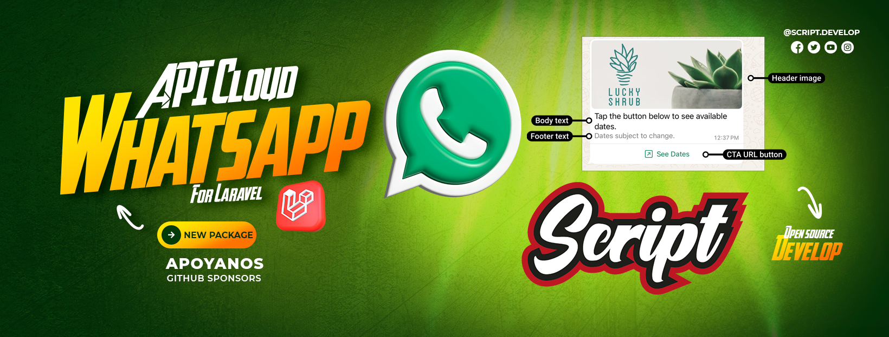

[](https://deepwiki.com/djdang3r/whatsapp-api-manager)

<div align="center">
  
</div>

---

<div align="center">
  <h2>🔥 🚀 ¡NUEVA ACTUALIZACIÓN / NEW UPDATE! 🚀 🔥</h2>
  <h3>💯 <b>Soporte Oficial para Laravel 12 y Laravel 13</b> 💯</h3>
  <p><i>Fully compatible and optimized for Laravel 12 & Laravel 13</i></p>
</div>

---

<p align="center">
<a href="https://packagist.org/packages/scriptdevelop/whatsapp-manager"></a>
<a href="https://php.net/"></a>
<a href="https://laravel.com/"></a>
<a href="https://packagist.org/packages/scriptdevelop/whatsapp-manager"></a>
<a href="https://packagist.org/packages/scriptdevelop/whatsapp-manager"></a>
</p>

# WhatsApp Business API Manager for Laravel

## 📌 Important Notice / Aviso Importante

> ### 🇬🇧 English
> 
> **Online Documentation Discontinued**
> 
> We regret to inform you that our online documentation website has been discontinued due to lack of organizational support and budget constraints. As a result, we have migrated all documentation into this repository to ensure continuity and accessibility.
>
> You can find the complete documentation in the `/documentation` folder, available in both English and Spanish. We appreciate your understanding and remain committed to providing quality support through this repository.

---

> ### 🇪🇸 Español
> 
> **Documentación en Línea Desactivada**
> 
> Lamentamos informarle que nuestro sitio web de documentación en línea ha sido desactivado debido a limitaciones de apoyo organizativo y presupuestario. Como resultado, hemos migrado toda la documentación a este repositorio para garantizar la continuidad y la accesibilidad.
>
> Puede encontrar la documentación completa en la carpeta `/documentation`, disponible en inglés y español. Agradecemos su comprensión y nos comprometemos a continuar brindando soporte de calidad a través de este repositorio.

---

### 🌐 Language / Idioma

<a href="documentation/en/01-install.md"> 🇺🇸 English</a> | <a href="documentation/es/01-instalacion.md" title="Sección siguiente">🇪🇸 Español</a>

#### 🇪🇸 Español

---

# scriptdevelop/whatsapp-api-manager

## Introducción

`@djdang3r/whatsapp-api-manager` es un paquete diseñado para facilitar la integración y gestión de la API de WhatsApp en tus proyectos. Su objetivo es simplificar la comunicación, el envío y la recepción de mensajes, así como la administración de sesiones y contactos a través de una interfaz intuitiva y fácil de usar.

## Descripción

Con este paquete podrás:

- Conectarte fácilmente a la API de WhatsApp.
- Enviar y recibir mensajes de texto, multimedia y archivos.
- Gestionar múltiples sesiones de WhatsApp simultáneamente.
- Administrar contactos, plantillas y mensajes.
- Integrar tu aplicación o servicio con flujos automatizados de mensajes.
- Recibir eventos en tiempo real para reaccionar ante mensajes, cambios de estado y notificaciones.

`@djdang3r/whatsapp-api-manager` está pensado para desarrolladores que buscan una solución robusta y flexible para interactuar con WhatsApp de manera eficiente, segura y escalable.

> ## 📢 Políticas de WhatsApp
>
> 🚫 **Importante:** 🚫
> - Asegúrate de cumplir siempre con las [Políticas de WhatsApp](https://www.whatsapp.com/legal/business-policy/) y sus términos de uso al utilizar este paquete.  
> - El uso indebido puede resultar en la suspensión de tu cuenta o acciones legales por parte de WhatsApp.
> - Revisa periódicamente las actualizaciones de las políticas para evitar inconvenientes.


> ## ⚠️ **Advertencia:** ⚠️
> - Este paquete se encuentra actualmente en versión **alpha**. Esto significa que está en desarrollo activo, puede contener errores y su API está sujeta a cambios importantes.  
> - Próximamente se lanzará la versión **beta**. Se recomienda no usarlo en entornos de producción por el momento.

---

## Documentación

## 📚 Tabla de Contenidos
<a href="documentation/es/01-instalacion.md" title="Documentación en Español">
1. 🚀 Instalación
</a>

   - Requisitos previos
   - Configuración inicial
   - Migraciones

<a href="documentation/es/02-config-api.md" title="Documentación en Español">
2. 🧩 Configuración de API
</a>

   - Credenciales de Meta
   - Configuración de webhooks
   - Gestión de números telefónicos

<a href="documentation/es/03-mensajes.md" title="Documentación en Español">
3. 💬 Gestión de Mensajes
</a>

   - Envío de mensajes (texto, multimedia, ubicación)
   - Mensajes interactivos (botones, listas)
   - Plantillas de mensajes
   - Recepción de mensajes

<a href="documentation/es/04-plantillas.md" title="Documentación en Español">
4. 📋 Gestión de Plantillas
</a>

   - Creación de plantillas
   - Envío de plantillas
   - Administración de versiones

<a href="documentation/es/05-eventos.md" title="Documentación en Español">
5. 📡 Eventos en Tiempo Real
</a>

   - Configuración de Laravel Echo
   - Webhooks integrados
   - Tipos de eventos soportados

<a href="documentation/es/06-webhook.md" title="Documentación en Español">
6. 🧪 Webhook
</a>

   - Configuracion del Webhook
   - Estructura de eventos
   - Tipos de mensajes soportados

---

>## 🚀 Características Principales
>
>- **Envía mensajes** de texto, multimedia, interactivos y de plantilla.
>- **Gestion de Templates** para Crear, Listar, Eliminar y Probar plantillas.
>- **Webhooks integrados** para recibir mensajes y actualizaciones.
>- **Gestión de conversaciones** con métricas de cobro.
>- **Sincronización automática** de números telefónicos y perfiles.
>- 100% compatible con **Laravel Echo y Reverb** para notificaciones en tiempo real.
> 

---

## ❤️ Apoyo

Si este proyecto te resulta útil, considera apoyar su desarrollo:

[](https://github.com/sponsors/djdang3r)
[](https://mpago.li/2qe5G7E)

---
>
># 🤝 ¡Contribuye con el Proyecto!
>
>¿Te gustaría mejorar este paquete? ¡Tu colaboración es fundamental para seguir creciendo!
>
---

## 🚀 ¿Cómo contribuir?

1. **Haz un Fork**
    - Haz clic en el botón `Fork` en la parte superior derecha de este repositorio para crear tu propia copia.

2. **Crea una Rama para tu Funcionalidad**
    ```bash
    git checkout -b feature/mi-nueva-funcionalidad
    ```

3. **Realiza tus Cambios y Haz Commit**
    ```bash
    git commit -m "Agrega mi nueva funcionalidad"
    ```

4. **Haz Push a tu Rama**
    ```bash
    git push origin feature/mi-nueva-funcionalidad
    ```

5. **Abre un Pull Request**
    - Ve a la pestaña `Pull Requests` y haz clic en `New Pull Request`.
    - Describe brevemente tu aporte y por qué es útil.

---
>
>## 💡 Sugerencias para contribuir
>
>- Sigue la [guía de estilo de código de Laravel](https://laravel.com/docs/contributions#coding-style).
>- Escribe comentarios claros y útiles.
>- Incluye pruebas si es posible.
>- Si encuentras un bug, abre un [Issue](https://github.com/djdang3r/whatsapp-api-manager/issues) antes de enviar el PR.
>
---

## 🙌 ¡Gracias por tu apoyo!

Cada contribución, por pequeña que sea, ayuda a mejorar el proyecto y a la comunidad.  
¡No dudes en participar, proponer ideas o reportar problemas!


---

## Descargo de responsabilidad

Este paquete es un proyecto independiente y **no está afiliado, respaldado ni soportado por Meta Platforms, Inc.** Todas las marcas registradas, marcas de servicio y logotipos utilizados en esta documentación, incluidos "WhatsApp" y "Facebook", son propiedad de Meta Platforms, Inc.

---

## 📄 Licencia

Este proyecto está bajo la licencia **MIT**. Consulta el archivo [LICENSE](LICENSE) para más detalles.

---

# 👨‍💻 Soporte y Contacto

¿Tienes dudas, problemas o sugerencias?  
¡Estamos aquí para ayudarte!

- 📧 **Email:** [wilfredoperilla@gmail.com](mailto:wilfredoperilla@gmail.com)  
    [soporte@scriptdevelop.com](mailto:soporte@scriptdevelop.com)

- 🐞 **Reporta un Issue:** [Abrir un Issue en GitHub](https://github.com/djdang3r/whatsapp-api-manager/issues)

- 💬 **¿Ideas o mejoras?** ¡Tus comentarios y sugerencias son bienvenidos para seguir mejorando este proyecto!

---

<div align="center">

# 🚀 Desarrollado con ❤️ por [ScriptDevelop](https://scriptdevelop.com)

## ✨ Potenciando tu conexión con WhatsApp Business API

---

### 🔥 Con el apoyo de:

**[@vientoquesurcalosmares](https://github.com/vientoquesurcalosmares)**

</div>

---

## ❤️Apóyanos con una donación en GitHub Sponsors

Me puedes apoyar como desarrollador open source en GitHub Sponsors:
- Si este proyecto te ha sido útil, puedes apoyarlo con una donación a través de
[](https://github.com/sponsors/djdang3r)

- O tambien por Mercadopago Colombia.
[](https://mpago.li/2qe5G7E)
Gracias por tu apoyo 💙

<br><br><br>

#### 🇺🇸 English

---

# scriptdevelop/whatsapp-api-manager

## Introduction

`@djdang3r/whatsapp-api-manager` is a package designed to simplify the integration and management of the WhatsApp API in your projects. Its goal is to streamline communication, message sending and receiving, as well as session and contact management through an intuitive and easy-to-use interface.

## Description

With this package you can:

- Easily connect to the WhatsApp API
- Send and receive text, media, and file messages
- Manage multiple WhatsApp sessions simultaneously
- Manage contacts, templates, and messages
- Integrate your application or service with automated messaging flows
- Receive real-time events to react to messages, status changes, and notifications

`@djdang3r/whatsapp-api-manager` is designed for developers looking for a robust and flexible solution to interact with WhatsApp efficiently, securely, and scalably.

> ## 📢 WhatsApp Policies
>
> 🚫 **Important:** 🚫
> - Always ensure compliance with [WhatsApp's Policies](https://www.whatsapp.com/legal/business-policy/) and terms of use when using this package.
> - Misuse may result in account suspension or legal action by WhatsApp.
> - Regularly review policy updates to avoid issues.

> ## ⚠️ **Warning:** ⚠️
> - This package is currently in **alpha** version. This means it's under active development, may contain bugs, and its API is subject to significant changes.
> - The **beta** version will be released soon. It's not recommended for production environments at this time.

---

## Documentation

## 📚 Table of Contents
<a href="documentation/en/01-installation.md" title="English Documentation">
1. 🚀 Installation
</a>

   - Prerequisites
   - Initial setup
   - Migrations

<a href="documentation/en/02-config-api.md" title="English Documentation">
2. 🧩 API Configuration
</a>

   - Meta credentials
   - Webhook setup
   - Phone number management

<a href="documentation/en/03-messages.md" title="English Documentation">
3. 💬 Message Management
</a>

   - Sending messages (text, media, location)
   - Interactive messages (buttons, lists)
   - Message templates
   - Receiving messages

<a href="documentation/en/04-templates.md" title="English Documentation">
4. 📋 Template Management
</a>

   - Template creation
   - Sending templates
   - Version management

<a href="documentation/en/05-events.md" title="English Documentation">
5. 📡 Real-time Events
</a>

   - Laravel Echo setup
   - Integrated webhooks
   - Supported event types

<a href="documentation/en/06-webhook.md" title="English Documentation">
6. 🧪 Webhook
</a>

   - Webhook configuration
   - Event structure
   - Supported message types

---

>## 🚀 Key Features
>
>- **Send messages** - text, media, interactive, and templates
>- **Template Management** - Create, List, Delete, and Test templates
>- **Integrated webhooks** for receiving messages and updates
>- **Conversation management** with billing metrics
>- **Automatic synchronization** of phone numbers and profiles
>- 100% compatible with **Laravel Echo and Reverb** for real-time notifications
> 

---

## ❤️ Support

If you find this project useful, consider supporting its development:

[](https://github.com/sponsors/djdang3r)
[](https://mpago.li/2qe5G7E)

---
>
># 🤝 Contribute to the Project!
>
>Would you like to improve this package? Your collaboration is essential to keep growing!
>
---

## 🚀 How to contribute?

1. **Fork the Repository**
    - Click the `Fork` button in the top right of this repository to create your own copy.

2. **Create a Feature Branch**
    ```bash
    git checkout -b feature/my-new-feature
    ```

3. **Make Changes and Commit**
    ```bash
    git commit -m "Add my new feature"
    ```

4. **Push to Your Branch**
    ```bash
    git push origin feature/my-new-feature
    ```

5. **Open a Pull Request**
    - Go to the `Pull Requests` tab and click `New Pull Request`
    - Briefly describe your contribution and why it's useful

---
>
>## 💡 Contribution Guidelines
>
>- Follow [Laravel's coding style guide](https://laravel.com/docs/contributions#coding-style)
>- Write clear and helpful comments
>- Include tests where possible
>- If you find a bug, open an [Issue](https://github.com/djdang3r/whatsapp-api-manager/issues) before submitting a PR
>
---

## 🙌 Thank you for your support!

Every contribution, no matter how small, helps improve the project and the community.  
Don't hesitate to participate, propose ideas, or report issues!

---

## Disclaimer

This package is an independent project and **is not affiliated with, endorsed, or sponsored by Meta Platforms, Inc.** All trademarks, service marks, and logos used in this documentation, including "WhatsApp" and "Facebook", are property of Meta Platforms, Inc.

---

## 📄 License

This project is licensed under the **MIT License**. See the [LICENSE](LICENSE) file for details.

---

# 👨‍💻 Support and Contact

Do you have questions, problems, or suggestions?  
We're here to help!

- 📧 **Email:** [wilfredoperilla@gmail.com](mailto:wilfredoperilla@gmail.com)  
    [support@scriptdevelop.com](mailto:support@scriptdevelop.com)

- 🐞 **Report an Issue:** [Open a GitHub Issue](https://github.com/djdang3r/whatsapp-api-manager/issues)

- 💬 **Ideas or Improvements?** Your feedback and suggestions are welcome to keep improving this project!

---

<div align="center">

# 🚀 Developed with ❤️ by [ScriptDevelop](https://scriptdevelop.com)

## ✨ Powering your connection with WhatsApp Business API

---

### 🔥 With support from:

**[@vientoquesurcalosmares](https://github.com/vientoquesurcalosmares)**

</div>

---

## ❤️ Support us with a GitHub Sponsors donation

You can support me as an open source developer on GitHub Sponsors:
- If this project has been useful to you, you can support it with a donation through
[](https://github.com/sponsors/djdang3r)

- Or via Mercadopago Colombia:
[](https://mpago.li/2qe5G7E)

Thank you for your support 💙