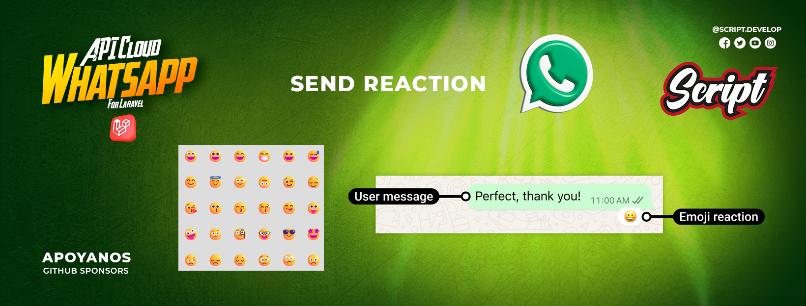
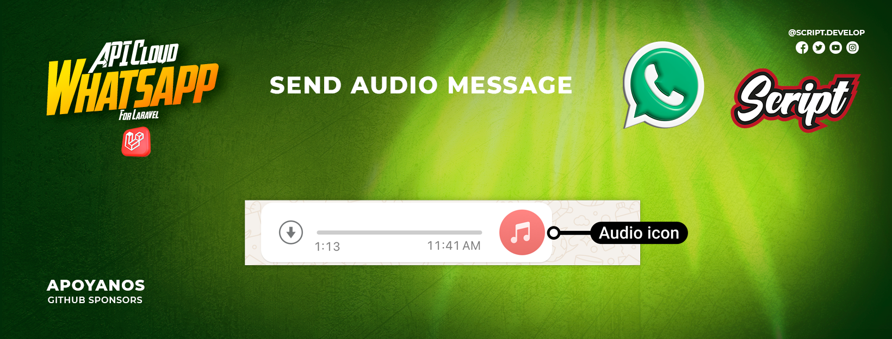
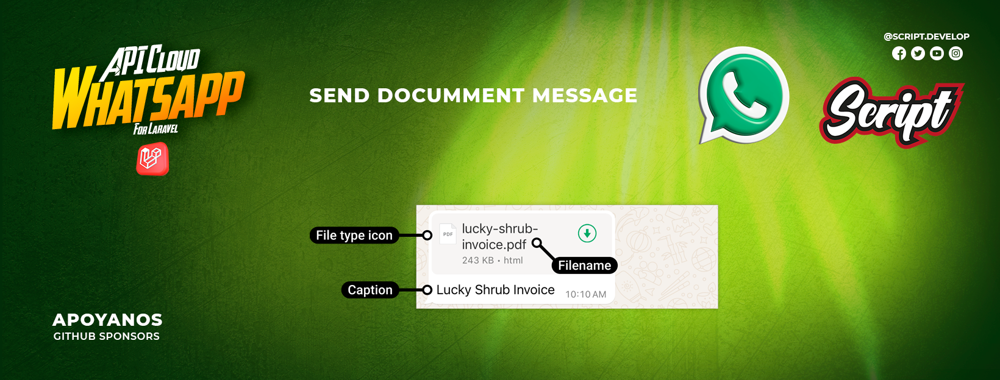
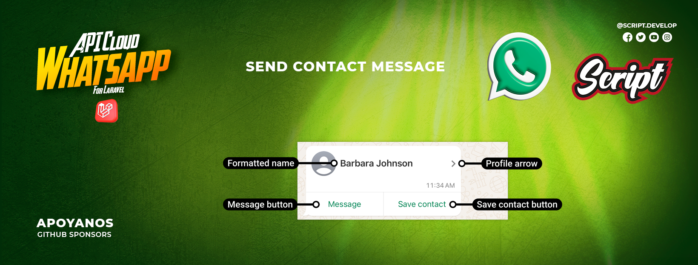
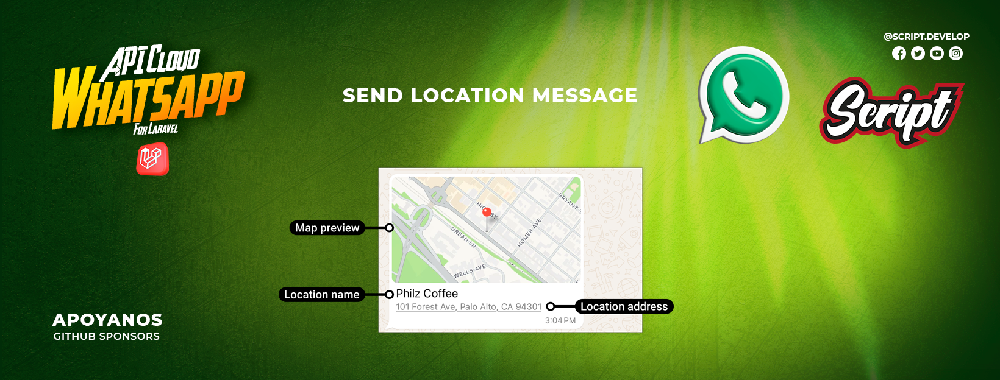
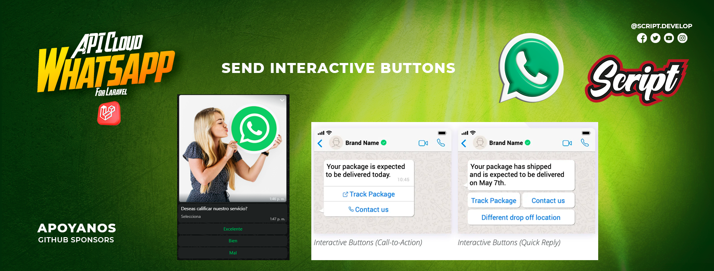
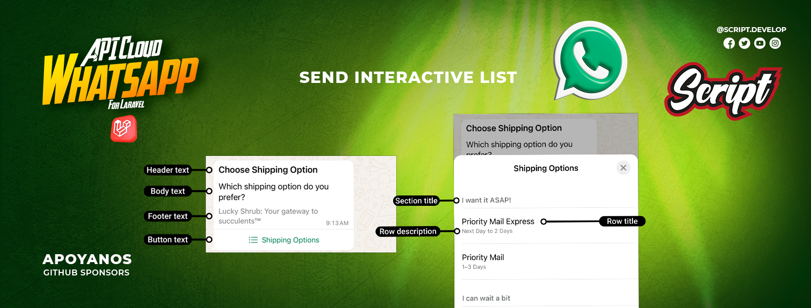
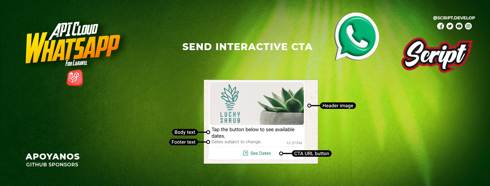
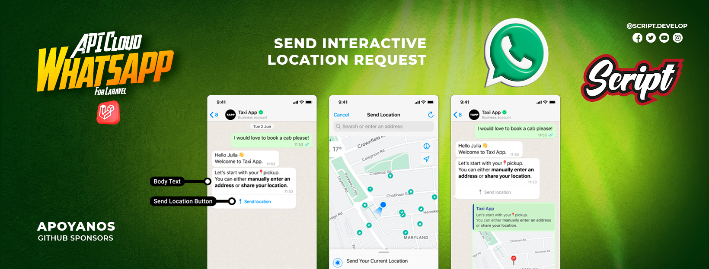
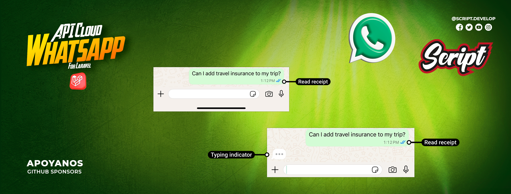

---

<div align="center">
<table>
  <tr>
    <td align="left">
      <a href="02-config-api.md" title="Previous section: Configuration">◄◄ Configure API</a>
    </td>
    <td align="center">
      <a href="00-content.md" title="Table of contents">▲ Table of contents</a>
    </td>
    <td align="right">
      <a href="04-templates.md" title="Next section">Templates ►►</a>
    </td>
  </tr>
</table>
</div>

<div align="center">
<sub>WhatsApp Manager Webhook Documentation | 
<a href="https://github.com/djdang3r/whatsapp-api-manager">View on GitHub</a></sub>
</div>

---

## 💬 Message Management

### Introduction to the Messages API
The messages module provides a comprehensive interface to send all types of content through WhatsApp Business API. From simple text messages to complex interactive messages with products, this module covers all necessary functionalities for effective business communication.

Key features:
- Support for all WhatsApp message types
- Sending via local files or URLs
- Contextual messages (replies, reactions)
- Interactive components (buttons, lists)
- Product catalog integration
- Message status management

### 📚 Table of Contents
1. Basic Messages
    - Simple text
    - Text with links
    - Message replies
    - Reactions

2. Media Messages
    - Images
    - Stickers
    - Audio
    - Documents

3. Location Messages
    - Location messages

4. Interactive Messages
    - Buttons
    - Dropdown lists

5. Product Messages
    - Single product
    - Multiple products
    - Full catalog

6. Message Management
    - Mark as read


## 1. Send Messages
- **Send simple text messages**

    ```php
    use ScriptDevelop\WhatsappManager\Facades\Whatsapp;
    use ScriptDevelop\WhatsappManager\Models\WhatsappBusinessAccount;
    use ScriptDevelop\WhatsappManager\Models\WhatsappPhoneNumber;

    $account = WhatsappBusinessAccount::first();
    $phone = $account->phoneNumbers->first();

    $message = Whatsapp::message()->sendTextMessage(
        $phone->phone_number_id, // Phone number ID
        '57',                    // Country code
        '3237121901',            // Phone number
        'Hello, this is a test message.' // Message content
    );
    ```

- **Send Text Messages with Links**
    Send simple text messages with links.

    ```php
    use ScriptDevelop\WhatsappManager\Facades\Whatsapp;
    use ScriptDevelop\WhatsappManager\Models\WhatsappBusinessAccount;
    use ScriptDevelop\WhatsappManager\Models\WhatsappPhoneNumber;

    $account = WhatsappBusinessAccount::first();
    $phone = $account->phoneNumbers->first();

    $message = Whatsapp::message()->sendTextMessage(
        $phone->phone_number_id, // Phone number ID
        '57',                    // Country code
        '3237121901',            // Phone number
        'Visit us on YouTube: http://youtube.com', // Link
        true // Enable link preview
    );
    ```

- **Reply to Messages**
    Reply to an existing message.

    ```php
    use ScriptDevelop\WhatsappManager\Facades\Whatsapp;
    use ScriptDevelop\WhatsappManager\Models\WhatsappBusinessAccount;
    use ScriptDevelop\WhatsappManager\Models\WhatsappPhoneNumber;

    $account = WhatsappBusinessAccount::first();
    $phone = $account->phoneNumbers->first();

    $message = Whatsapp::message()->sendReplyTextMessage(
        $phone->phone_number_id, // Phone number ID
        '57',                    // Country code
        '3237121901',            // Phone number
        'wamid.HBgMNTczMTM3MTgxOTA4FQIAEhggNzVCNUQzRDMxRjhEMUJEM0JERjAzNkZCNDk5RDcyQjQA', // Context message ID
        'This is a reply to your previous message.' // Message
    );
    ```



- **Send Message Reactions**
    Send a reaction to an existing message.

    **Unicode syntax required** 
    - Use \u{hex_code} encoding for emojis:

    ```php
    use ScriptDevelop\WhatsappManager\Facades\Whatsapp;
    use ScriptDevelop\WhatsappManager\Models\WhatsappBusinessAccount;
    use ScriptDevelop\WhatsappManager\Models\WhatsappPhoneNumber;

    $account = WhatsappBusinessAccount::first();
    $phone = $account->phoneNumbers->first();

    // Reaction with red heart ❤️
    $message = Whatsapp::message()->sendReplyReactionMessage(
        $phone->phone_number_id, // Phone number ID
        '57',                    // Country code
        '3237121901',            // Phone number
        'wamid.HBgMNTczMTM3MTgxOTA4FQIAEhggNzZENDMzMEI0MDRFQzg0OUUwRTI1M0JBQjEzMUZFRUYA', // Context message ID
        "\u{2764}\u{FE0F}" // Reaction emoji
    );


    "\u{1F44D}" // 👍 (Like)
    "\u{1F44E}" // 👎 (Dislike)
    "\u{1F525}" // 🔥 
    "\u{1F60D}" // 😍
    "\u{1F622}" // 😢
    "\u{1F389}" // 🎉
    "\u{1F680}" // 🚀
    "\u{2705}" // ✅
    "\u{274C}" // ❌
    ```


## 2. Send Media Messages
- **Send Media Messages**
    Send messages with images

    > ⚠️ **Warning:** Ensure your image meets WhatsApp requirements:  
    > - Supported formats: JPEG, PNG  
    > - Recommended max size: 5 MB  
    > - Recommended dimensions: at least 640x640 px  
    > If the image doesn't meet these requirements, sending may fail.

    ```php
    use ScriptDevelop\WhatsappManager\Facades\Whatsapp;
    use ScriptDevelop\WhatsappManager\Models\WhatsappBusinessAccount;
    use ScriptDevelop\WhatsappManager\Models\WhatsappPhoneNumber;

    $account = WhatsappBusinessAccount::first();
    $phone = $account->phoneNumbers->first();

    $filePath = storage_path('app/public/laravel-whatsapp-manager.png');
    $file = new \SplFileInfo($filePath);

    $message = Whatsapp::message()->sendImageMessage(
        $phone->phone_number_id, // Phone number ID
        '57',                    // Country code
        '3237121901',            // Phone number
        $file                    // Image file
    );
    ```

- **Send Images via URL**
    Send messages with image URL.

    ```php
    use ScriptDevelop\WhatsappManager\Facades\Whatsapp;
    use ScriptDevelop\WhatsappManager\Models\WhatsappBusinessAccount;
    use ScriptDevelop\WhatsappManager\Models\WhatsappPhoneNumber;

    $account = WhatsappBusinessAccount::first();
    $phone = $account->phoneNumbers->first();

    $message = Whatsapp::message()->sendImageMessageByUrl(
        $phone->phone_number_id, // Phone number ID
        '57',                    // Country code
        '3237121901',            // Phone number
        'https://example.com/image.png' // Image link
    );
    ```


- **Send Stickers**
    Send messages with stickers.

    > ⚠️ **Warning:** Ensure your sticker meets WhatsApp requirements:  
    > - Supported format: WEBP  
    > - Recommended max size: 100 KB  
    > If the sticker doesn't meet these requirements, sending may fail.

    ```php
    use ScriptDevelop\WhatsappManager\Facades\Whatsapp;
    use ScriptDevelop\WhatsappManager\Models\WhatsappBusinessAccount;
    use ScriptDevelop\WhatsappManager\Models\WhatsappPhoneNumber;

    $account = WhatsappBusinessAccount::first();
    $phone = $account->phoneNumbers->first();

    $filePath = storage_path('app/public/laravel-whatsapp-manager.png');
    $file = new \SplFileInfo($filePath);

    $message = Whatsapp::message()->sendStickerMessage(
        $phone->phone_number_id, // Phone number ID
        '57',                    // Country code
        '3237121901',            // Phone number
        $file                    // Sticker file
    );
    ```



- **Send Audio**
    Send messages with audio files.

    > ⚠️ **Warning:** Ensure your audio file meets WhatsApp requirements:  
    > - Supported formats: AAC, MP4, MPEG, AMR, OGG.  
    > - Recommended max size: 16 MB  
    > If the audio file doesn't meet these requirements, sending may fail.
    
    ```php
    use ScriptDevelop\WhatsappManager\Facades\Whatsapp;
    use ScriptDevelop\WhatsappManager\Models\WhatsappBusinessAccount;
    use ScriptDevelop\WhatsappManager\Models\WhatsappPhoneNumber;

    $account = WhatsappBusinessAccount::first();
    $phone = $account->phoneNumbers->first();

    $filePath = storage_path('app/public/audio.ogg');
    $file = new \SplFileInfo($filePath);

    $message = Whatsapp::message()->sendAudioMessage(
        $phone->phone_number_id, // Phone number ID
        '57',                    // Country code
        '3237121901',            // Phone number
        $file                    // Audio file
    );
    ```

- **Send Audio via URL**
    Send messages with audio links

    ```php
    use ScriptDevelop\WhatsappManager\Facades\Whatsapp;
    use ScriptDevelop\WhatsappManager\Models\WhatsappBusinessAccount;
    use ScriptDevelop\WhatsappManager\Models\WhatsappPhoneNumber;

    $account = WhatsappBusinessAccount::first();
    $phone = $account->phoneNumbers->first();

    $message = Whatsapp::message()->sendAudioMessageByUrl(
        $phone->phone_number_id, // Phone number ID
        '57',                    // Country code
        '3237121901',            // Phone number
        'https://example.com/audio.ogg' // URL or link
    );
    ```



- **Send Documents**
    Send messages with documents

    > ⚠️ **Warning:** Ensure your document file meets WhatsApp requirements:  
    > - Supported formats: PDF, DOC, DOCX, XLS, XLSX, PPT, PPTX, TXT, CSV, ZIP, RAR, etc.  
    > - Recommended max size: 100 MB  
    > If the file doesn't meet these requirements, sending may fail.

    ```php
    use ScriptDevelop\WhatsappManager\Facades\Whatsapp;
    use ScriptDevelop\WhatsappManager\Models\WhatsappBusinessAccount;
    use ScriptDevelop\WhatsappManager\Models\WhatsappPhoneNumber;

    $account = WhatsappBusinessAccount::first();
    $phone = $account->phoneNumbers->first();

    $filePath = storage_path('app/public/document.pdf');
    $file = new \SplFileInfo($filePath);

    $message = Whatsapp::message()->sendDocumentMessage(
        $phone->phone_number_id, // Phone number ID
        '57',                    // Country code
        '3237121901',            // Phone number
        $file                    // Document file
    );
    ```

- **Send Documents via URL**
    Send messages with document links

    ```php
    use ScriptDevelop\WhatsappManager\Facades\Whatsapp;
    use ScriptDevelop\WhatsappManager\Models\WhatsappBusinessAccount;
    use ScriptDevelop\WhatsappManager\Models\WhatsappPhoneNumber;

    $account = WhatsappBusinessAccount::first();
    $phone = $account->phoneNumbers->first();

    $message = Whatsapp::message()->sendDocumentMessageByUrl(
        $phone->phone_number_id, // Phone number ID
        '57',                    // Country code
        '3237121901',            // Phone number
        'https://example.com/document.pdf' // URL or document link
    );
    ```


## Send Video Messages
- **Send Video Messages**
    ```php
    use ScriptDevelop\WhatsappManager\Facades\Whatsapp;
    use ScriptDevelop\WhatsappManager\Models\WhatsappBusinessAccount;
    use ScriptDevelop\WhatsappManager\Models\WhatsappPhoneNumber;

    // Get account and phone
    $account = WhatsappBusinessAccount::first();
    $phone = $account->phoneNumbers->first();

    // 1. Video from local file with caption
    $video = new \SplFileInfo(storage_path('app/public/videos/presentation.mp4'));

    Whatsapp::message()->sendVideoMessage(
        $phone->phone_number_id,
        '57',
        '3237121901',
        $video,
        'Watch this video' // Caption
    );
    ```



## Send Contact Messages
- **Send Contact Messages**
    ```php
    use ScriptDevelop\WhatsappManager\Facades\Whatsapp;
    use ScriptDevelop\WhatsappManager\Models\WhatsappBusinessAccount;
    use ScriptDevelop\WhatsappManager\Models\WhatsappPhoneNumber;

    // Get account and phone
    $account = WhatsappBusinessAccount::first();
    $phone = $account->phoneNumbers->first();

    $contactId = 456; // Contact ID in your DB

    Whatsapp::message()->sendContactMessage(
        $phone->phone_number_id,
        '57',
        '3237121901',
        $contactId
    );
    ```



## 3. Send Location Messages
- **Send Location Messages**
    Send a message with location coordinates.

    ```php
    use ScriptDevelop\WhatsappManager\Facades\Whatsapp;
    use ScriptDevelop\WhatsappManager\Models\WhatsappBusinessAccount;
    use ScriptDevelop\WhatsappManager\Models\WhatsappPhoneNumber;

    $account = WhatsappBusinessAccount::first();
    $phone = $account->phoneNumbers->first();

    // Example 1
    $message = Whatsapp::message()->sendLocationMessage(
        $phone->phone_number_id, // Phone number ID
        '57',                    // Country code
        '3237121901',            // Phone number
        4.7110,                 // Latitude
        -74.0721,               // Longitude
        'Bogotá',                // Place name
        'Colombia'               // Address
    );

    // Example 2
    $message = Whatsapp::message()->sendLocationMessage(
        phoneNumberId: $phone->phone_number_id,
        countryCode: '57',           // Country code
        phoneNumber: '3137183308',   // Phone number
        latitude: 19.4326077,        // Latitude
        longitude: -99.133208,       // Longitude
        name: 'Mexico City',         // Place name
        address: 'Constitution Square' // Address
    );
    ```



## 4. Send Interactive Messages
- **Interactive Button Messages**
    Send messages with interactive buttons:

    ```php
    use ScriptDevelop\WhatsappManager\Facades\Whatsapp;
    use ScriptDevelop\WhatsappManager\Models\WhatsappBusinessAccount;
    use ScriptDevelop\WhatsappManager\Models\WhatsappPhoneNumber;

    $account = WhatsappBusinessAccount::first();
    $phone = $account->phoneNumbers->first();

    // EXAMPLE 1
    $buttonResponse = Whatsapp::sendButtonMessage($phone->phone_number_id)
        ->to('57', '31371235638')
        ->withBody('Do you confirm your appointment for tomorrow at 3 PM?')
        ->addButton('confirm', '✅ Confirm')
        ->addButton('reschedule', '🔄 Reschedule')
        ->withFooter('Please select an option')
        ->send();
    
    // EXAMPLE 2
    $buttonResponse = Whatsapp::sendButtonMessage($phone->phone_number_id)
        ->to('57', '31371235638')
        ->withBody('How would you rate our service?')
        ->addButton('excellent', '⭐️⭐️⭐️⭐️⭐️ Excellent')
        ->addButton('good', '⭐️⭐️⭐️⭐️ Good')
        ->addButton('regular', '⭐️⭐️⭐️ Regular')
        ->withFooter('Your feedback helps us improve')
        ->send();

    // EXAMPLE 3
    // Get ID of a previous message (must be real)
    $contextMessage = \ScriptDevelop\WhatsappManager\Models\Message::first();
    $contextId = $contextMessage->wa_id;

    $buttonResponse = Whatsapp::sendButtonMessage($phone->phone_number_id)
        ->to('57', '31371235638')
        ->withBody('Select the type of support you need:')
        ->addButton('technical-support', '🛠️ Technical Support')
        ->addButton('billing', '🧾 Billing')
        ->addButton('complaints', '📣 Complaints')
        ->withFooter('Support hours: Mon-Fri 8am-6pm')
        ->inReplyTo($contextId)  // Specify message to reply to
        ->send();

    // EXAMPLES WITH TEXT HEADER
    $buttonResponse = Whatsapp::sendButtonMessage($phone->phone_number_id)
        ->to('57', '313714R3534')
        ->withHeader('Digital Catalog')
        ->withBody('Do you confirm your appointment for tomorrow at 3 PM?')
        ->addButton('confirm', '✅ Confirm')
        ->addButton('reschedule', '🔄 Reschedule')
        ->withFooter('Please select an option')
        ->send();

    // EXAMPLES WITH IMAGE HEADER
    $file = new \SplFileInfo(storage_path('app/public/laravel-whatsapp-manager.png'));

    $buttonResponse = Whatsapp::sendButtonMessage($phone->phone_number_id)
        ->to('57', '313714R3534')
        ->withHeader($file)
        ->withBody('Do you confirm your appointment for tomorrow at 3 PM?')
        ->addButton('confirm', '✅ Confirm')
        ->addButton('reschedule', '🔄 Reschedule')
        ->withFooter('Please select an option')
        ->send();
    ```



- **Interactive Dropdown Lists**
    Send messages with interactive dropdown lists:

    ```php
    use ScriptDevelop\WhatsappManager\Facades\Whatsapp;
    use ScriptDevelop\WhatsappManager\Models\WhatsappBusinessAccount;
    use ScriptDevelop\WhatsappManager\Models\WhatsappPhoneNumber;

    $account = WhatsappBusinessAccount::first();
    $phone = $account->phoneNumbers->first();

    // EXAMPLE 1 - WITHOUT CHAINING
    $listBuilder = Whatsapp::sendListMessage($phone->phone_number_id)
        ->to('57', '31371235638')
        ->withButtonText('View Products')
        ->withBody('Our featured products:')
        ->withHeader('Digital Catalog')
        ->withFooter('Swipe to see more options');

    $listBuilder->startSection('Laptops')
        ->addRow('laptop-pro', 'MacBook Pro', '16" - 32GB RAM - 1TB SSD')
        ->addRow('laptop-air', 'MacBook Air', '13" - M2 Chip - 8GB RAM')
        ->endSection();

    $listBuilder->startSection('Smartphones')
        ->addRow('iphone-15', 'iPhone 15 Pro', '48MP Camera - 5G')
        ->addRow('samsung-s23', 'Samsung S23', '120Hz AMOLED Display')
        ->endSection();

    $response = $listBuilder->send();

    // EXAMPLE 2 - CHAINED
    $listBuilder = Whatsapp::sendListMessage($phone->phone_number_id)
        ->to('57', '31371235638')
        ->withButtonText('View Services')
        ->withBody('Select the service you want to schedule:')
        ->withFooter('Swipe to see all options')
        ->startSection('Haircuts')
            ->addRow('womens-cut', "Women's Cut", 'Professional style')
            ->addRow('mens-cut', "Men's Cut", 'Modern techniques')
            ->addRow('kids-cut', "Kids' Cut", 'Children designs')
        ->endSection()
        ->startSection('Treatments')
            ->addRow('keratin', 'Keratin', 'Repair treatment')
            ->addRow('coloring', 'Coloring', 'Professional dyes')
            ->addRow('mask', 'Mask', 'Deep hydration')
        ->endSection();

    $response = $listBuilder->send();

    // EXAMPLE 3 - REPLY TO MESSAGE
    // Get ID of a previous message (must be real)
    $contextMessage = \ScriptDevelop\WhatsappManager\Models\Message::first();
    $contextId = $contextMessage->wa_id;

    $listBuilder = Whatsapp::sendListMessage($phone->phone_number_id)
        ->to('57', '31371235638')
        ->withButtonText('Select Service')
        ->withBody('For the appointment type you mentioned, we have these options:')
        ->inReplyTo($contextId); // Specify message to reply to

    $listBuilder->startSection('Consultations')
        ->addRow('general-consult', 'General Consultation', '30 min - $50.000')
        ->addRow('special-consult', 'Specialized Consultation', '60 min - $90.000')
        ->endSection();

    $listBuilder->startSection('Treatments')
        ->addRow('basic-treatment', 'Basic Treatment', 'Single session')
        ->addRow('premium-treatment', 'Premium Treatment', 'Includes follow-up')
        ->endSection();

    $response = $listBuilder->send();

    // EXAMPLE WITH TEXT HEADER
    $listBuilder = Whatsapp::sendListMessage($phone->phone_number_id)
        ->to('57', '313714R3534')
        ->withButtonText('View Products')
        ->withHeader('Digital Catalog') // TEXT HEADER
        ->withBody('Our featured products:')
        ->withFooter('Swipe to see more options')
        ->startSection('Laptops')
            ->addRow('laptop-pro', 'MacBook Pro', '16" - 32GB RAM - 1TB SSD')
            ->addRow('laptop-air', 'MacBook Air', '13" - M2 Chip - 8GB RAM')
        ->endSection()
        ->startSection('Smartphones')
            ->addRow('iphone-15', 'iPhone 15 Pro', '48MP Camera - 5G')
            ->addRow('samsung-s23', 'Samsung S23', '120Hz AMOLED Display')
        ->endSection()
        ->send();
    ```



- **Interactive CTA URL Messages**
    Send interactive call-to-action URL messages:

    ```php
    use ScriptDevelop\WhatsappManager\Facades\Whatsapp;
    use ScriptDevelop\WhatsappManager\Models\WhatsappPhoneNumber;
    $phone = WhatsappPhoneNumber::first();

    // Basic example
    Whatsapp::sendCtaUrlMessage($phone->phone_number_id)
        ->to('57', '31371235638')
        ->withBody('Visit our new online store!')
        ->withButton('View Store', 'https://store.example.com')
        ->send();

    // Example with header and footer
    Whatsapp::sendCtaUrlMessage($phone->phone_number_id)
        ->to('57', '31371235638')
        ->withHeader('Special Offer')
        ->withBody('20% discount on all products')
        ->withButton('View Offer', 'https://store.example.com/offers')
        ->withFooter('Valid until end of month')
        ->send();

    // Example with media header "Must use a public image link for Image, Video, Document"
    $imageUrl = 'https://play-lh.googleusercontent.com/1-hPxafOxdYpYZEOKzNIkSP43HXCNftVJVttoo4ucl7rsMASXW3Xr6GlXURCubE1tA=w3840-h2160-rw';

    Whatsapp::sendCtaUrlMessage($phone->phone_number_id)
        ->to('57', '31371235638')
        ->withHeader($imageUrl)
        ->withBody('New collection available!')
        ->withButton('View Collection', 'https://store.example.com/new-collection')
        ->send();

    // Example as reply to another message
    $contextMessage = \ScriptDevelop\WhatsappManager\Models\Message::first();
    $contextId = $contextMessage->wa_id;

    Whatsapp::sendCtaUrlMessage($phone->phone_number_id)
        ->to('57', '31371235638')
        ->withBody('Here is the link you requested:')
        ->withButton('Download Document', 'https://example.com/document.pdf')
        ->inReplyTo($contextId)
        ->send();
    ```



- **Interactive Location Request Messages**
    Send messages with location request button:

    ```php
    Whatsapp::sendLocationRequestMessage($phone->phone_number_id)
        ->to('57', '31371235638')
        ->withBody('Please share your location to assist you better')
        ->send();
    ```

## 5. Send Product Messages
- **Single Product Message**
    Send simple product message.

    ```php
    use ScriptDevelop\WhatsappManager\Facades\Whatsapp;
    use ScriptDevelop\WhatsappManager\Models\WhatsappBusinessAccount;
    use ScriptDevelop\WhatsappManager\Models\WhatsappPhoneNumber;

    $account = WhatsappBusinessAccount::first();
    $phone = $account->phoneNumbers->first();

    $productId = 'PROD-12345'; // Product ID in your catalog

    // Send single product with descriptive text
    WhatsappManager::message()->sendSingleProductMessage(
        $phone->phone_number_id,
        '52',         // Country code (Mexico)
        '5512345678', // Destination number
        $productId,
        'Check out this amazing product we have for you!'
    );
    ```

- **Multiple Products Message**
    Send multiple products message.

    ```php
    use ScriptDevelop\WhatsappManager\Facades\Whatsapp;
    use ScriptDevelop\WhatsappManager\Models\WhatsappBusinessAccount;
    use ScriptDevelop\WhatsappManager\Models\WhatsappPhoneNumber;
    use ScriptDevelop\WhatsappManager\Services\CatalogProductBuilder;

    $account = WhatsappBusinessAccount::first();
    $phone = $account->phoneNumbers->first();

    $builder = new CatalogProductBuilder(
        WhatsappManager::getDispatcher(), 
        $phone->phone_number_id,
    );

    $builder->to('52', '5512345678')
        ->withBody('Recommended products for you:')
        ->withHeader('Special Offers')
        ->withFooter('Valid until June 30')
        
        // Section 1
        ->startSection('Featured Products')
            ->addProduct('PROD-12345')
            ->addProduct('PROD-67890')
        ->endSection()
        
        // Section 2
        ->startSection('New Releases')
            ->addProduct('PROD-54321')
            ->addProduct('PROD-09876')
        ->endSection()
        
        ->send();
    ```

- **Full Catalog Message**
    Send full catalog message.

    ```php
    use ScriptDevelop\WhatsappManager\Facades\Whatsapp;
    use ScriptDevelop\WhatsappManager\Models\WhatsappBusinessAccount;
    use ScriptDevelop\WhatsappManager\Models\WhatsappPhoneNumber;
    use ScriptDevelop\WhatsappManager\Services\CatalogProductBuilder;

    $account = WhatsappBusinessAccount::first();
    $phone = $account->phoneNumbers->first();

    WhatsappManager::message()->sendFullCatalogMessage(
        $phone->phone_number_id,
        '52',
        '5512345678',
        'View Catalog',      // Button text
        'Explore our full product catalog',
        'Message us for more information!' // Footer
    );
    ```

- **Product Message as Reply**
    Send product message with context or reply.

    ```php
    use ScriptDevelop\WhatsappManager\Facades\Whatsapp;
    use ScriptDevelop\WhatsappManager\Models\WhatsappBusinessAccount;
    use ScriptDevelop\WhatsappManager\Models\WhatsappPhoneNumber;
    use ScriptDevelop\WhatsappManager\Services\CatalogProductBuilder;

    $account = WhatsappBusinessAccount::first();
    $phone = $account->phoneNumbers->first();

    // Reply to a specific message with a product
    $contextMessageId = 'wamid.XXXXXX'; // Original message ID

    WhatsappManager::message()->sendSingleProductMessage(
        $phone->phone_number_id,
        '52',
        '5512345678',
        'PROD-12345',
        'This is the product you mentioned:',
        $contextMessageId
    );
    ```

- **Interactive Product Messages (Advanced)**
    Send advanced interactive product messages with context or reply.

    ```php
    use ScriptDevelop\WhatsappManager\Facades\Whatsapp;
    use ScriptDevelop\WhatsappManager\Models\WhatsappBusinessAccount;
    use ScriptDevelop\WhatsappManager\Models\WhatsappPhoneNumber;
    use ScriptDevelop\WhatsappManager\Services\CatalogProductBuilder;

    $account = WhatsappBusinessAccount::first();
    $phone = $account->phoneNumbers->first();

    WhatsappManager::message()->sendMultiProductMessage(
        $phone->phone_number_id,
        '52',
        '5512345678',
        [
            [
                'title' => 'Offers',
                'product_items' => [
                    ['product_retailer_id' => 'PROD-123'],
                    ['product_retailer_id' => 'PROD-456']
                ]
            ],
            [
                'title' => 'New',
                'product_items' => [
                    ['product_retailer_id' => 'PROD-789']
                ]
            ]
        ],
        'These products might interest you!',
        'Special Discounts', // Header
        null, // Footer
        $contextMessageId // Reply to message
    );
    ```



## 6. Message Management
### Mark message as read
  - Marks received messages as read (with blue double check)

    ```php
    // To mark as read (traditional way)
    $message = Whatsapp::message()->markMessageAsRead('01JYYVWV7P6JX9MDBPGBW6P8ZG');

    // To send text typing indicator
    $message = Whatsapp::message()->sendTypingIndicator('01JYYVWV7P6JX9MDBPGBW6P8ZG');

    // To send audio recording indicator
    $message = Whatsapp::message()->sendTypingIndicator('01JYYVWV7P6JX9MDBPGBW6P8ZG', 'audio');

    // To stop indicator
    $message = Whatsapp::message()->stopTypingIndicator('01JYYVWV7P6JX9MDBPGBW6P8ZG');
    ```

---

<div align="center">
<table>
  <tr>
    <td align="left">
      <a href="02-config-api.md" title="Previous section: Configuration">◄◄ Configure API</a>
    </td>
    <td align="center">
      <a href="00-content.md" title="Table of contents">▲ Table of contents</a>
    </td>
    <td align="right">
      <a href="04-templates.md" title="Next section">Templates ►►</a>
    </td>
  </tr>
</table>
</div>

<div align="center">
<sub>WhatsApp Manager Webhook Documentation | 
<a href="https://github.com/djdang3r/whatsapp-api-manager">View on GitHub</a></sub>
</div>

---

## ❤️ Support

If you find this project useful, consider supporting its development:

[](https://github.com/sponsors/djdang3r)
[](https://mpago.li/2qe5G7E)

## 📄 License

MIT License - See [LICENSE](LICENSE) for more details