---

<div align="center">
<table>
  <tr>
    <td align="left">
      <a href="02-config-api.md" title="Sección anterior: Configuración">◄◄ Configurar API</a>
    </td>
    <td align="center">
      <a href="00-tabla-de-contenido.md" title="Tabla de contenido">▲ Tabla de contenido</a>
    </td>
    <td align="right">
      <a href="04-plantillas.md" title="Sección siguiente">Plantillas ►►</a>
    </td>
  </tr>
</table>
</div>

<div align="center">
<sub>Documentación del Webhook de WhatsApp Manager | 
<a href="https://github.com/djdang3r/whatsapp-api-manager">Ver en GitHub</a></sub>
</div>

---

## 💬 Gestión de Mensajes

### Introducción a la API de Mensajes
El módulo de mensajes proporciona una interfaz completa para enviar todo tipo de contenido a través de WhatsApp Business API. Desde simples mensajes de texto hasta complejos mensajes interactivos con productos, este módulo cubre todas las funcionalidades necesarias para una comunicación empresarial efectiva.

Características principales:
- Soporte para todos los tipos de mensajes de WhatsApp
- Envío mediante archivos locales o URLs
- Mensajes contextuales (respuestas, reacciones)
- Componentes interactivos (botones, listas)
- Integración con catálogos de productos
- Gestión de estado de mensajes

### 📚 Tabla de Contenidos
1. Mensajes Básicos
    - Texto simple
    - Texto con enlaces
    - Respuestas a mensajes "Reply"
    - Reacciones

2. Mensajes Multimedia
    - Imágenes
    - Stickers
    - Audio
    - Documentos

3. Mensajes de Ubicación
    - Mensajes de ubicación

4. Mensajes Interactivos
    - Botones
    - Listas desplegables

5. Mensajes de Productos
    - Producto individual
    - Múltiples productos
    - Catálogo completo

6. Gestión de Mensajes
    - Marcar como leído

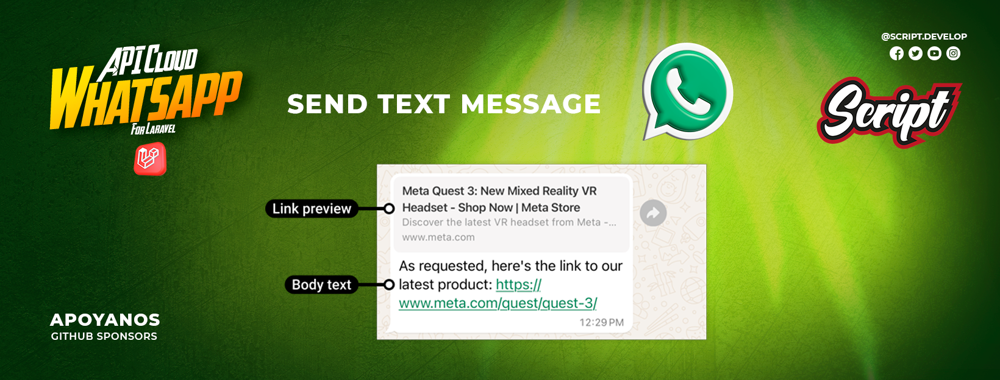

## 1. Enviar Mensajes.
- **Envía mensajes de texto simples.**

    ```php
    use ScriptDevelop\WhatsappManager\Facades\Whatsapp;
    use ScriptDevelop\WhatsappManager\Models\WhatsappBusinessAccount;
    use ScriptDevelop\WhatsappManager\Models\WhatsappPhoneNumber;

    $account = WhatsappBusinessAccount::first();
    $phone = $account->phoneNumbers->first();

    $message = Whatsapp::message()->sendTextMessage(
        $phone->phone_number_id, // ID del número de teléfono
        '57',                        // Código de país
        '3237121901',                // Número de teléfono
        'Hola, este es un mensaje de prueba.' // Contenido del mensaje
    );
    ```

- **Enviar Mensajes de Texto con Enlaces**
    Envía mensajes de texto simples con link o enlace.

    ```php
    use ScriptDevelop\WhatsappManager\Facades\Whatsapp;
    use ScriptDevelop\WhatsappManager\Models\WhatsappBusinessAccount;
    use ScriptDevelop\WhatsappManager\Models\WhatsappPhoneNumber;

    $account = WhatsappBusinessAccount::first();
    $phone = $account->phoneNumbers->first();

    $message = Whatsapp::message()->sendTextMessage(
        $phone->phone_number_id, // ID del número de teléfono
        '57',                        // Código de país
        '3237121901',                // Número de teléfono
        'Visítanos en YouTube: http://youtube.com', // Enlace
        true // Habilitar vista previa de enlaces
    );
    ```


- **Enviar Respuestas a Mensajes**
    Responde a un mensaje existente.

    ```php
    use ScriptDevelop\WhatsappManager\Facades\Whatsapp;
    use ScriptDevelop\WhatsappManager\Models\WhatsappBusinessAccount;
    use ScriptDevelop\WhatsappManager\Models\WhatsappPhoneNumber;

    $account = WhatsappBusinessAccount::first();
    $phone = $account->phoneNumbers->first();

    $message = Whatsapp::message()->sendReplyTextMessage(
        $phone->phone_number_id, // ID del número de teléfono
        '57',                        // Código de país
        '3237121901',                // Número de teléfono
        'wamid.HBgMNTczMTM3MTgxOTA4FQIAEhggNzVCNUQzRDMxRjhEMUJEM0JERjAzNkZCNDk5RDcyQjQA', // ID del mensaje de contexto
        'Esta es una respuesta al mensaje anterior.' // Mensaje
    );
    ```


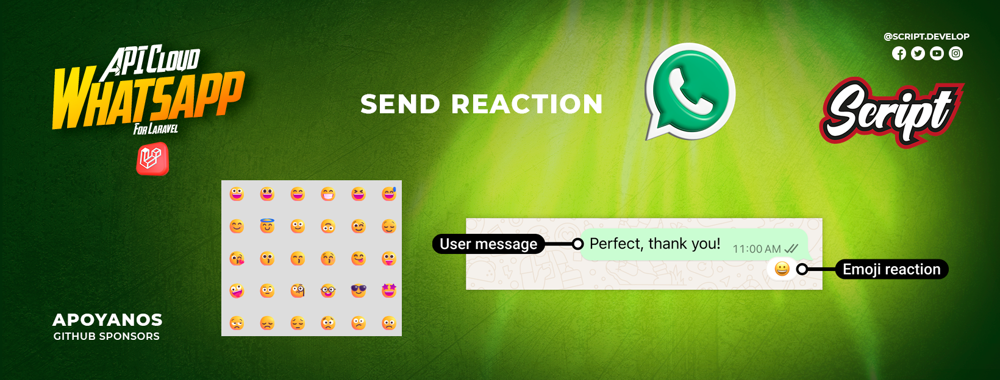

- **Enviar Reacciones a Mensajes**
    Envía una reacción a un mensaje existente.

    **Sintaxis Unicode requerida** 
    - Usa la codificación \u{código_hex} para emojis:

    ```php
    use ScriptDevelop\WhatsappManager\Facades\Whatsapp;
    use ScriptDevelop\WhatsappManager\Models\WhatsappBusinessAccount;
    use ScriptDevelop\WhatsappManager\Models\WhatsappPhoneNumber;

    $account = WhatsappBusinessAccount::first();
    $phone = $account->phoneNumbers->first();

    // Reacción con corazón rojo ❤️
    $message = Whatsapp::message()->sendReplyReactionMessage(
        $phone->phone_number_id, // ID del número de teléfono
        '57',                        // Código de país
        '3237121901',                // Número de teléfono
        'wamid.HBgMNTczMTM3MTgxOTA4FQIAEhggNzZENDMzMEI0MDRFQzg0OUUwRTI1M0JBQjEzMUZFRUYA', // ID del mensaje de contexto
        "\u{2764}\u{FE0F}" // Emoji de reacción
    );


    "\u{1F44D}" // 👍 (Me gusta)
    "\u{1F44E}" // 👎 (No me gusta)
    "\u{1F525}" // 🔥 
    "\u{1F60D}" // 😍
    "\u{1F622}" // 😢
    "\u{1F389}" // 🎉
    "\u{1F680}" // 🚀
    "\u{2705}" // ✅
    "\u{274C}" // ❌
    ```


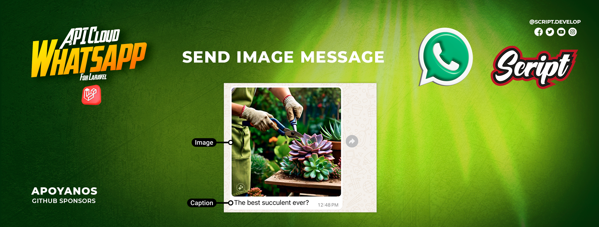

## 2. Enviar Mensajes Multimedia.
- **Enviar Mensajes Multimedia**
    Enviar mensajes con Imágenes

    > ⚠️ **Advertencia:** Asegúrate de que la imagen que envíes cumpla con los requisitos de WhatsApp:  
    > - Formato soportado: JPEG, PNG  
    > - Tamaño máximo recomendado: 5 MB  
    > - Dimensiones recomendadas: al menos 640x640 px  
    > Si la imagen no cumple con estos requisitos, el envío puede fallar.

    ```php
    use ScriptDevelop\WhatsappManager\Facades\Whatsapp;
    use ScriptDevelop\WhatsappManager\Models\WhatsappBusinessAccount;
    use ScriptDevelop\WhatsappManager\Models\WhatsappPhoneNumber;

    $account = WhatsappBusinessAccount::first();
    $phone = $account->phoneNumbers->first();

    $filePath = storage_path('app/public/laravel-whatsapp-manager.png');
    $file = new \SplFileInfo($filePath);

    $message = Whatsapp::message()->sendImageMessage(
        $phone->phone_number_id, // ID del número de teléfono
        '57',                        // Código de país
        '3237121901',                // Número de teléfono
        $file                       // Archivo de imagen.
    );
    ```

- **Enviar Imágenes por URL**
    Enviar mensaaje con url de imagen.

    ```php
    use ScriptDevelop\WhatsappManager\Facades\Whatsapp;
    use ScriptDevelop\WhatsappManager\Models\WhatsappBusinessAccount;
    use ScriptDevelop\WhatsappManager\Models\WhatsappPhoneNumber;

    $account = WhatsappBusinessAccount::first();
    $phone = $account->phoneNumbers->first();

    $message = Whatsapp::message()->sendImageMessageByUrl(
        $phone->phone_number_id, // ID del número de teléfono
        '57',                        // Código de país
        '3237121901',                // Número de teléfono
        'https://example.com/image.png' // Enlace de imagen
    );
    ```

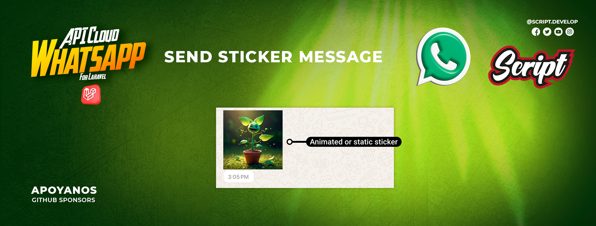

- **Enviar Sticker**
    Enviar mensajes con sticker.

    > ⚠️ **Advertencia:** Asegúrate de que el sticker que envíes cumpla con los requisitos de WhatsApp:  
    > - Formato soportado: WEBP  
    > - Tamaño máximo recomendado: 100 KB  
    > Si el sticker no cumple con estos requisitos, el envío puede fallar.

    ```php
    use ScriptDevelop\WhatsappManager\Facades\Whatsapp;
    use ScriptDevelop\WhatsappManager\Models\WhatsappBusinessAccount;
    use ScriptDevelop\WhatsappManager\Models\WhatsappPhoneNumber;

    $account = WhatsappBusinessAccount::first();
    $phone = $account->phoneNumbers->first();

    $filePath = storage_path('app/public/laravel-whatsapp-manager.png');
    $file = new \SplFileInfo($filePath);

    $message = Whatsapp::message()->sendStickerMessage(
        $phone->phone_number_id, // ID del número de teléfono
        '57',                        // Código de país
        '3237121901',                // Número de teléfono
        $file                       // Archivo de stiker
    );
    ```

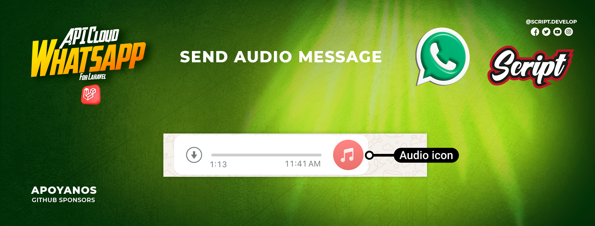

- **Enviar Audio**
    Enviar mensajes con archivo de audio.

    > ⚠️ **Advertencia:** Asegúrate de que el archivo de audio que envíes cumpla con los requisitos de WhatsApp:  
    > - Formato soportado: AAC, MP4, MPEG, AMR, OGG.  
    > - Tamaño máximo recomendado: 16 MB  
    > Si el archivo de audio no cumple con estos requisitos, el envío puede fallar.
    
    ```php
    use ScriptDevelop\WhatsappManager\Facades\Whatsapp;
    use ScriptDevelop\WhatsappManager\Models\WhatsappBusinessAccount;
    use ScriptDevelop\WhatsappManager\Models\WhatsappPhoneNumber;

    $account = WhatsappBusinessAccount::first();
    $phone = $account->phoneNumbers->first();

    $filePath = storage_path('app/public/audio.ogg');
    $file = new \SplFileInfo($filePath);

    $message = Whatsapp::message()->sendAudioMessage(
        $phone->phone_number_id, // ID del número de teléfono
        '57',                        // Código de país
        '3237121901',                // Número de teléfono
        $file                       // Archivo de Audio
    );
    ```

- **Enviar Audio por URL**
    Enviar mensaje con Enlace de audio

    ```php
    use ScriptDevelop\WhatsappManager\Facades\Whatsapp;
    use ScriptDevelop\WhatsappManager\Models\WhatsappBusinessAccount;
    use ScriptDevelop\WhatsappManager\Models\WhatsappPhoneNumber;

    $account = WhatsappBusinessAccount::first();
    $phone = $account->phoneNumbers->first();

    $message = Whatsapp::message()->sendAudioMessageByUrl(
        $phone->phone_number_id, // ID del número de teléfono
        '57',                        // Código de país
        '3237121901',                // Número de teléfono
        'https://example.com/audio.ogg' // URL o Enlace
    );
    ```
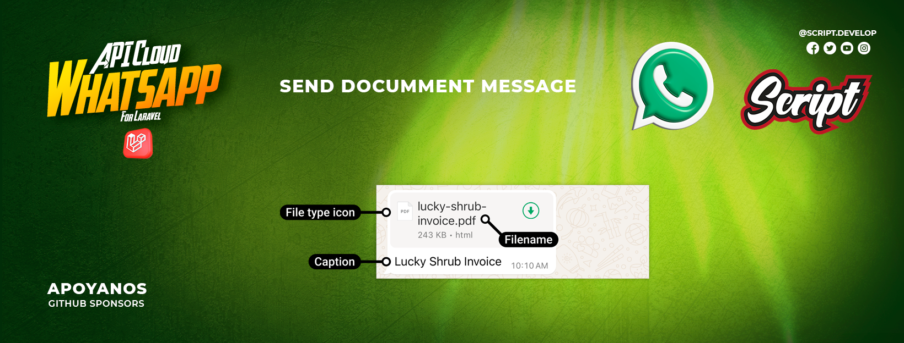

- **Enviar Documentos**
    Enviar mensaje con Documento

    > ⚠️ **Advertencia:** Asegúrate de que el archivo de documento que envíes cumpla con los requisitos de WhatsApp:  
    > - Formatos soportados: PDF, DOC, DOCX, XLS, XLSX, PPT, PPTX, TXT, CSV, ZIP, RAR, entre otros.  
    > - Tamaño máximo recomendado: 100 MB  
    > Si el archivo no cumple con estos requisitos, el envío puede fallar.

    ```php
    use ScriptDevelop\WhatsappManager\Facades\Whatsapp;
    use ScriptDevelop\WhatsappManager\Models\WhatsappBusinessAccount;
    use ScriptDevelop\WhatsappManager\Models\WhatsappPhoneNumber;

    $account = WhatsappBusinessAccount::first();
    $phone = $account->phoneNumbers->first();

    $filePath = storage_path('app/public/document.pdf');
    $file = new \SplFileInfo($filePath);

    $message = Whatsapp::message()->sendDocumentMessage(
        $phone->phone_number_id, // ID del número de teléfono
        '57',                        // Código de país
        '3237121901',                // Número de teléfono
        $file                       // Archivo del documento
    );
    ```

- **Enviar Documentos por URL**
    Enviar mensaje de enlace de documento.

    ```php
    use ScriptDevelop\WhatsappManager\Facades\Whatsapp;
    use ScriptDevelop\WhatsappManager\Models\WhatsappBusinessAccount;
    use ScriptDevelop\WhatsappManager\Models\WhatsappPhoneNumber;

    $account = WhatsappBusinessAccount::first();
    $phone = $account->phoneNumbers->first();

    $message = Whatsapp::message()->sendDocumentMessageByUrl(
        $phone->phone_number_id, // ID del número de teléfono
        '57',                        // Código de país
        '3237121901',                // Número de teléfono
        'https://example.com/document.pdf' // URL o Enlace de documento
    );
    ```
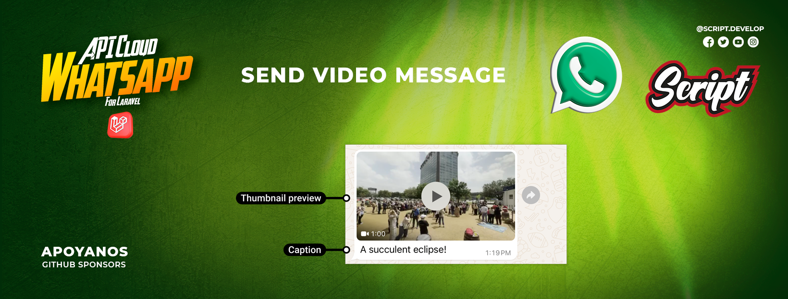

## Enviar Mensajes de video.
- **Enviar Mensajes de video**
    ```php
    use ScriptDevelop\WhatsappManager\Facades\Whatsapp;
    use ScriptDevelop\WhatsappManager\Models\WhatsappBusinessAccount;
    use ScriptDevelop\WhatsappManager\Models\WhatsappPhoneNumber;

    // Obtener cuenta y teléfono
    $account = WhatsappBusinessAccount::first();
    $phone = $account->phoneNumbers->first();

    // 1. Video desde archivo local con caption
    $video = new \SplFileInfo(storage_path('app/public/videos/presentacion.mp4'));

    Whatsapp::message()->sendVideoMessage(
        $phone->phone_number_id,
        '57',
        '3237121901',
        $video,
        'Mira este video' // Caption
    );
    ```

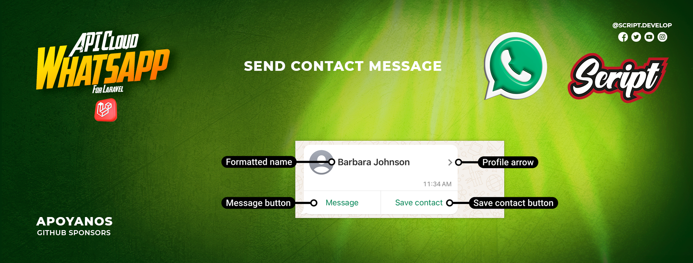

## Enviar Mensajes de Contacto.
- **Enviar Mensajes de contacto**
    ```php
    use ScriptDevelop\WhatsappManager\Facades\Whatsapp;
    use ScriptDevelop\WhatsappManager\Models\WhatsappBusinessAccount;
    use ScriptDevelop\WhatsappManager\Models\WhatsappPhoneNumber;

    // Obtener cuenta y teléfono
    $account = WhatsappBusinessAccount::first();
    $phone = $account->phoneNumbers->first();

    $contactId = 456; // ID del contacto en tu DB

    Whatsapp::message()->sendContactMessage(
        $phone->phone_number_id,
        '57',
        '3237121901',
        $contactId
    );
    ```

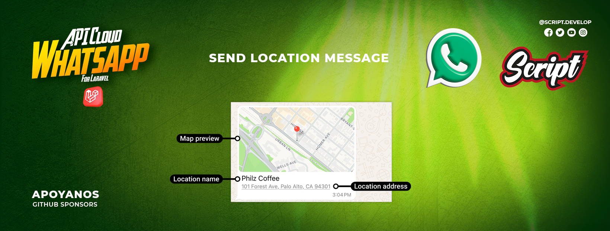

## 3. Enviar Mensajes de Ubicación.
- **Enviar Mensajes de Ubicación**
    Envía un mensaje con coordenadas de ubicación.

    ```php
    use ScriptDevelop\WhatsappManager\Facades\Whatsapp;
    use ScriptDevelop\WhatsappManager\Models\WhatsappBusinessAccount;
    use ScriptDevelop\WhatsappManager\Models\WhatsappPhoneNumber;

    $account = WhatsappBusinessAccount::first();
    $phone = $account->phoneNumbers->first();

    // Ejemplo 1
    $message = Whatsapp::message()->sendLocationMessage(
        $phone->phone_number_id, // ID del número de teléfono
        '57',                        // Código de país
        '3237121901',                // Número de teléfono
        4.7110,                     // Latitud
        -74.0721,                   // Longitud
        'Bogotá',                   // Nombre del lugar
        'Colombia'                  // Dirección
    );

    // Ejemplo 2
    $message = Whatsapp::message()->sendLocationMessage(
        phoneNumberId: $phone->phone_number_id,
        countryCode: '57',                  // Código de país
        phoneNumber: '3137183308',          // Número de teléfono
        latitude: 19.4326077,               // Latitud
        longitude: -99.133208,              // Longitud
        name: 'Ciudad de México',           // Nombre del lugar
        address: 'Plaza de la Constitución' // Dirección
    );
    ```

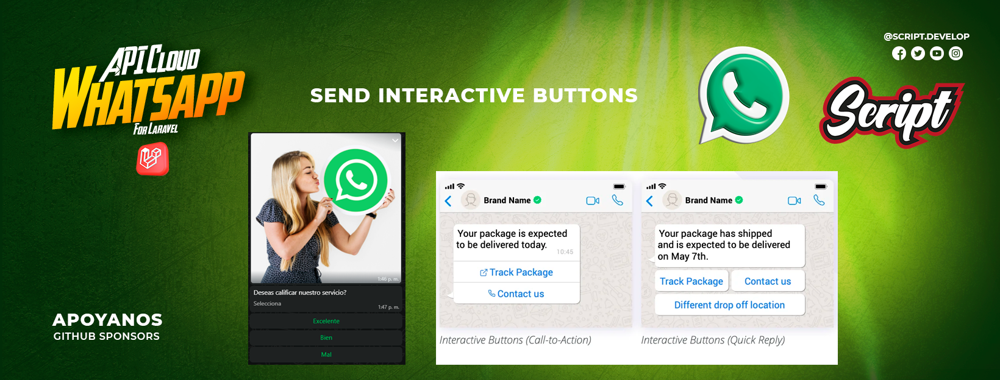

## 4. Enviar Mensajes Interactivos.
- **Mensajes con Botones Interactivos**
    Enviar mensajes con botones interactivos:

    ```php
    use ScriptDevelop\WhatsappManager\Facades\Whatsapp;
    use ScriptDevelop\WhatsappManager\Models\WhatsappBusinessAccount;
    use ScriptDevelop\WhatsappManager\Models\WhatsappPhoneNumber;

    $account = WhatsappBusinessAccount::first();
    $phone = $account->phoneNumbers->first();

    //EJEMPLO 1
    $buttonResponse = Whatsapp::sendButtonMessage($phone->phone_number_id)
        ->to('57', '31371235638')
        ->withBody('¿Confirmas tu cita para mañana a las 3 PM?')
        ->addButton('confirmar', '✅ Confirmar')
        ->addButton('reagendar', '🔄 Reagendar')
        ->withFooter('Por favor selecciona una opción')
        ->send();
    
    //EJEMPLO 2
    $buttonResponse = Whatsapp::sendButtonMessage($phone->phone_number_id)
        ->to('57', '31371235638')
        ->withBody('¿Cómo calificarías nuestro servicio?')
        ->addButton('excelente', '⭐️⭐️⭐️⭐️⭐️ Excelente')
        ->addButton('bueno', '⭐️⭐️⭐️⭐️ Bueno')
        ->addButton('regular', '⭐️⭐️⭐️ Regular')
        ->withFooter('Tu opinión nos ayuda a mejorar')
        ->send();

    //EJEMPLO 3
    // Obtener ID de un mensaje anterior (debes tener uno real)
    $contextMessage = \ScriptDevelop\WhatsappManager\Models\Message::first();
    $contextId = $contextMessage->wa_id;

    $buttonResponse = Whatsapp::sendButtonMessage($phone->phone_number_id)
        ->to('57', '31371235638')
        ->withBody('Selecciona el tipo de soporte que necesitas:')
        ->addButton('soporte-tecnico', '🛠️ Soporte Técnico')
        ->addButton('facturacion', '🧾 Facturación')
        ->addButton('quejas', '📣 Quejas y Reclamos')
        ->withFooter('Horario de atención: L-V 8am-6pm')
        ->inReplyTo($contextId)  // Aquí especificas el mensaje al que respondes
        ->send();

    // EJEMPLOS CON HEADER texto
    $buttonResponse = Whatsapp::sendButtonMessage($phone->phone_number_id)
        ->to('57', '313714R3534')
        ->withHeader('Catálogo Digital')
        ->withBody('¿Confirmas tu cita para mañana a las 3 PM?')
        ->addButton('confirmar', '✅ Confirmar')
        ->addButton('reagendar', '🔄 Reagendar')
        ->withFooter('Por favor selecciona una opción')
        ->send();

    // EJEMPLOS CON HEADER imagen
    $file = new \SplFileInfo(storage_path('app/public/laravel-whatsapp-manager.png'));

    $buttonResponse = Whatsapp::sendButtonMessage($phone->phone_number_id)
        ->to('57', '313714R3534')
        ->withHeader($file)
        ->withBody('¿Confirmas tu cita para mañana a las 3 PM?')
        ->addButton('confirmar', '✅ Confirmar')
        ->addButton('reagendar', '🔄 Reagendar')
        ->withFooter('Por favor selecciona una opción')
        ->send();
    ```
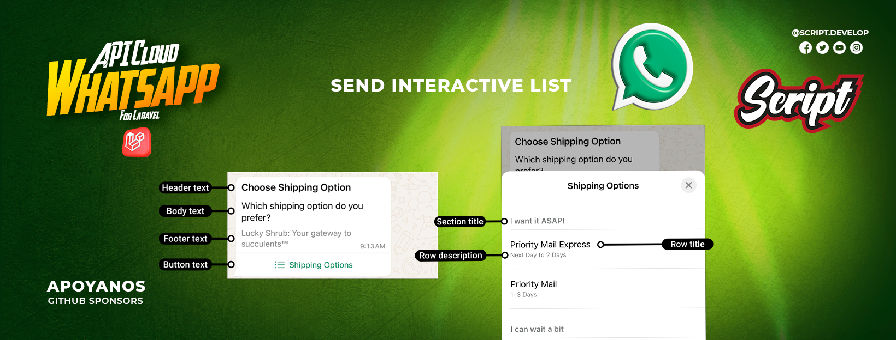
- **Listas Desplegables Interactivas**
    Enviar mensajes con Listas desplegables interactivas:

    ```php
    use ScriptDevelop\WhatsappManager\Facades\Whatsapp;
    use ScriptDevelop\WhatsappManager\Models\WhatsappBusinessAccount;
    use ScriptDevelop\WhatsappManager\Models\WhatsappPhoneNumber;

    $account = WhatsappBusinessAccount::first();
    $phone = $account->phoneNumbers->first();

    // EJEMLPO 1 - SIN ENCADENAR
    $listBuilder = Whatsapp::sendListMessage($phone->phone_number_id)
        ->to('57', '31371235638')
        ->withButtonText('Ver Productos')
        ->withBody('Nuestros productos destacados:')
        ->withHeader('Catálogo Digital')
        ->withFooter('Desliza para ver más opciones');

    $listBuilder->startSection('Laptops')
        ->addRow('laptop-pro', 'MacBook Pro', '16" - 32GB RAM - 1TB SSD')
        ->addRow('laptop-air', 'MacBook Air', '13" - M2 Chip - 8GB RAM')
        ->endSection();

    $listBuilder->startSection('Smartphones')
        ->addRow('iphone-15', 'iPhone 15 Pro', 'Cámara 48MP - 5G')
        ->addRow('samsung-s23', 'Samsung S23', 'Pantalla AMOLED 120Hz')
        ->endSection();

    $response = $listBuilder->send();

    // EJEMLPO 2 - ENCADENADO
    $listBuilder = Whatsapp::sendListMessage($phone->phone_number_id)
        ->to('57', '31371235638')
        ->withButtonText('Ver Servicios')
        ->withBody('Selecciona el servicio que deseas agendar:')
        ->withFooter('Desliza para ver todas las opciones')
        ->startSection('Cortes de Cabello')
            ->addRow('corte-mujer', 'Corte Mujer', 'Estilo profesional')
            ->addRow('corte-hombre', 'Corte Hombre', 'Técnicas modernas')
            ->addRow('corte-niños', 'Corte Niños', 'Diseños infantiles')
        ->endSection()
        ->startSection('Tratamientos')
            ->addRow('keratina', 'Keratina', 'Tratamiento reparador')
            ->addRow('coloracion', 'Coloración', 'Tintes profesionales')
            ->addRow('mascarilla', 'Mascarilla', 'Hidratación profunda')
        ->endSection();

    $response = $listBuilder->send();


    // EJEMLPO 3 - respuesta a mensajes o reply
    // Obtener ID de un mensaje anterior (debes tener uno real)
    $contextMessage = \ScriptDevelop\WhatsappManager\Models\Message::first();
    $contextId = $contextMessage->wa_id;

    $listBuilder = Whatsapp::sendListMessage($phone->phone_number_id)
        ->to('57', '31371235638')
        ->withButtonText('Seleccionar Servicio')
        ->withBody('Para el tipo de cita que mencionaste, tenemos estas opciones:')
        ->inReplyTo($contextId); // Aquí especificas el mensaje al que respondes

    $listBuilder->startSection('Consultas')
        ->addRow('consulta-general', 'Consulta General', '30 min - $50.000')
        ->addRow('consulta-especial', 'Consulta Especializada', '60 min - $90.000')
        ->endSection();

    $listBuilder->startSection('Tratamientos')
        ->addRow('tratamiento-basico', 'Tratamiento Básico', 'Sesión individual')
        ->addRow('tratamiento-premium', 'Tratamiento Premium', 'Incluye seguimiento')
        ->endSection();

    $response = $listBuilder->send();

    // EJEMPLO CON HEADER texto
    $listBuilder = Whatsapp::sendListMessage($phone->phone_number_id)
        ->to('57', '313714R3534')
        ->withButtonText('Ver Productos')
        ->withHeader('Catálogo Digital') // HEADER DE TECTO
        ->withBody('Nuestros productos destacados:')
        ->withFooter('Desliza para ver más opciones')
        ->startSection('Laptops')
            ->addRow('laptop-pro', 'MacBook Pro', '16" - 32GB RAM - 1TB SSD')
            ->addRow('laptop-air', 'MacBook Air', '13" - M2 Chip - 8GB RAM')
        ->endSection()
        ->startSection('Smartphones')
            ->addRow('iphone-15', 'iPhone 15 Pro', 'Cámara 48MP - 5G')
            ->addRow('samsung-s23', 'Samsung S23', 'Pantalla AMOLED 120Hz')
        ->endSection()
        ->send();
    ```
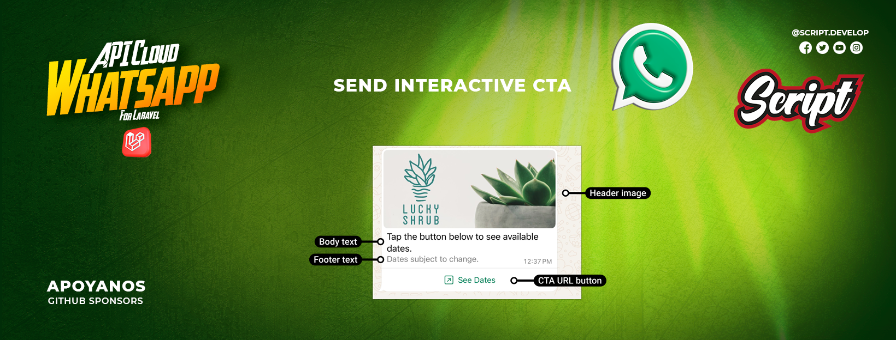

- **Mensajes de botones URL de llamada a la acción interactivos**
    Enviar Mensajes de botones URL de llamada a la acción interactivos:

    ```php
    use ScriptDevelop\WhatsappManager\Facades\Whatsapp;
    use ScriptDevelop\WhatsappManager\Models\WhatsappPhoneNumber;
    $phone = WhatsappPhoneNumber::first();

    // Ejemplo básico
    Whatsapp::sendCtaUrlMessage($phone->phone_number_id)
        ->to('57', '31371235638')
        ->withBody('¡Visita nuestra nueva tienda online!')
        ->withButton('Ver Tienda', 'https://tienda.example.com')
        ->send();

    // Ejemplo con header y footer
    Whatsapp::sendCtaUrlMessage($phone->phone_number_id)
        ->to('57', '31371235638')
        ->withHeader('Oferta Especial')
        ->withBody('Descuento del 20% en todos los productos')
        ->withButton('Ver Oferta', 'https://tienda.example.com/ofertas')
        ->withFooter('Válido hasta fin de mes')
        ->send();

    // Ejemplo con header multimedia "Se debe usar un link de imagen publica para Image, Video, Documento"
    $imageUrl = 'https://play-lh.googleusercontent.com/1-hPxafOxdYpYZEOKzNIkSP43HXCNftVJVttoo4ucl7rsMASXW3Xr6GlXURCubE1tA=w3840-h2160-rw';

    Whatsapp::sendCtaUrlMessage($phone->phone_number_id)
        ->to('57', '31371235638')
        ->withHeader($imageUrl)
        ->withBody('¡Nueva colección disponible!')
        ->withButton('Ver Colección', 'https://tienda.example.com/nueva-coleccion')
        ->send();

    // Ejemplo como respuesta a otro mensaje
    $contextMessage = \ScriptDevelop\WhatsappManager\Models\Message::first();
    $contextId = $contextMessage->wa_id;

    Whatsapp::sendCtaUrlMessage($phone->phone_number_id)
        ->to('57', '31371235638')
        ->withBody('Aquí tienes el enlace que solicitaste:')
        ->withButton('Descargar Documento', 'https://example.com/documento.pdf')
        ->inReplyTo($contextId)
        ->send();
    ```
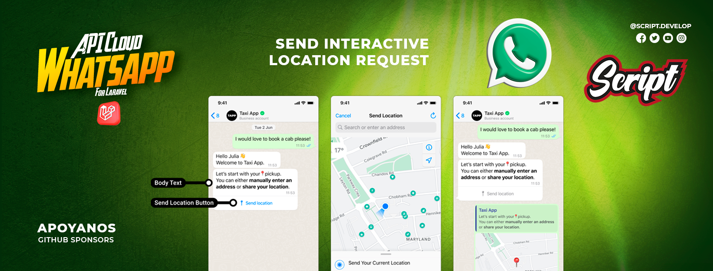

- **Mensajes de botones Interactivo de solicitud de ubicacion**
    Enviar Mensajes con boton de solicitud de ubicacion:

    ```php
    Whatsapp::sendLocationRequestMessage($phone->phone_number_id)
        ->to('57', '31371235638')
        ->withBody('Por favor comparte tu ubicación para ayudarte mejor')
        ->send();
    ```


## 5. Enviar Mensajes de Producto.
- **Mensaje de Producto Individual**
    Enviar mensaje de Producto Simple.

    ```php
    use ScriptDevelop\WhatsappManager\Facades\Whatsapp;
    use ScriptDevelop\WhatsappManager\Models\WhatsappBusinessAccount;
    use ScriptDevelop\WhatsappManager\Models\WhatsappPhoneNumber;

    $account = WhatsappBusinessAccount::first();
    $phone = $account->phoneNumbers->first();

    $productId = 'PROD-12345'; // ID del producto en tu catálogo

    // Enviar un solo producto con texto descriptivo
    WhatsappManager::message()->sendSingleProductMessage(
        $phone->phone_number_id,
        '52',         // Código de país (México)
        '5512345678', // Número de destino
        $productId,
        '¡Mira este increíble producto que tenemos para ti!'
    );
    ```

- **Mensaje con Múltiples Productos**
    Enviar mensaje de Multiples Productos.

    ```php
    use ScriptDevelop\WhatsappManager\Facades\Whatsapp;
    use ScriptDevelop\WhatsappManager\Models\WhatsappBusinessAccount;
    use ScriptDevelop\WhatsappManager\Models\WhatsappPhoneNumber;
    use ScriptDevelop\WhatsappManager\Services\CatalogProductBuilder;

    $account = WhatsappBusinessAccount::first();
    $phone = $account->phoneNumbers->first();

    $builder = new CatalogProductBuilder(
        WhatsappManager::getDispatcher(), 
        $phone->phone_number_id,
    );

    $builder->to('52', '5512345678')
        ->withBody('Productos recomendados para ti:')
        ->withHeader('Ofertas Especiales')
        ->withFooter('Válido hasta el 30 de Junio')
        
        // Sección 1
        ->startSection('Productos Destacados')
            ->addProduct('PROD-12345')
            ->addProduct('PROD-67890')
        ->endSection()
        
        // Sección 2
        ->startSection('Nuevos Lanzamientos')
            ->addProduct('PROD-54321')
            ->addProduct('PROD-09876')
        ->endSection()
        
        ->send();
    ```

- **Mensaje de Catálogo Completo**
    Enviar mensaje de Catalogo completo.

    ```php
    use ScriptDevelop\WhatsappManager\Facades\Whatsapp;
    use ScriptDevelop\WhatsappManager\Models\WhatsappBusinessAccount;
    use ScriptDevelop\WhatsappManager\Models\WhatsappPhoneNumber;
    use ScriptDevelop\WhatsappManager\Services\CatalogProductBuilder;

    $account = WhatsappBusinessAccount::first();
    $phone = $account->phoneNumbers->first();

    WhatsappManager::message()->sendFullCatalogMessage(
        $phone->phone_number_id,
        '52',
        '5512345678',
        'Ver Catálogo',      // Texto del botón
        'Explora nuestro catálogo completo de productos',
        '¡Envíanos un mensaje para más información!' // Footer
    );
    ```

- **Mensaje de Producto como Respuesta o Replica**
    Enviar mensaje de Producto simple con replica o contecto.

    ```php
    use ScriptDevelop\WhatsappManager\Facades\Whatsapp;
    use ScriptDevelop\WhatsappManager\Models\WhatsappBusinessAccount;
    use ScriptDevelop\WhatsappManager\Models\WhatsappPhoneNumber;
    use ScriptDevelop\WhatsappManager\Services\CatalogProductBuilder;

    $account = WhatsappBusinessAccount::first();
    $phone = $account->phoneNumbers->first();

    // Responder a un mensaje específico con un producto
    $contextMessageId = 'wamid.XXXXXX'; // ID del mensaje original

    WhatsappManager::message()->sendSingleProductMessage(
        $phone->phone_number_id,
        '52',
        '5512345678',
        'PROD-12345',
        'Este es el producto que mencionaste:',
        $contextMessageId
    );
    ```

- **Mensaje Interactivo con Productos (Avanzado)**
    Enviar mensaje de Productos Interactivos Avanzados y con Replica o contexto.

    ```php
    use ScriptDevelop\WhatsappManager\Facades\Whatsapp;
    use ScriptDevelop\WhatsappManager\Models\WhatsappBusinessAccount;
    use ScriptDevelop\WhatsappManager\Models\WhatsappPhoneNumber;
    use ScriptDevelop\WhatsappManager\Services\CatalogProductBuilder;

    $account = WhatsappBusinessAccount::first();
    $phone = $account->phoneNumbers->first();

    WhatsappManager::message()->sendMultiProductMessage(
        $phone->phone_number_id,
        '52',
        '5512345678',
        [
            [
                'title' => 'Ofertas',
                'product_items' => [
                    ['product_retailer_id' => 'PROD-123'],
                    ['product_retailer_id' => 'PROD-456']
                ]
            ],
            [
                'title' => 'Nuevos',
                'product_items' => [
                    ['product_retailer_id' => 'PROD-789']
                ]
            ]
        ],
        '¡Estos productos podrían interesarte!',
        'Descuentos Especiales', // Header
        null, // Footer
        $contextMessageId // Respuesta a mensaje
    );
    ```
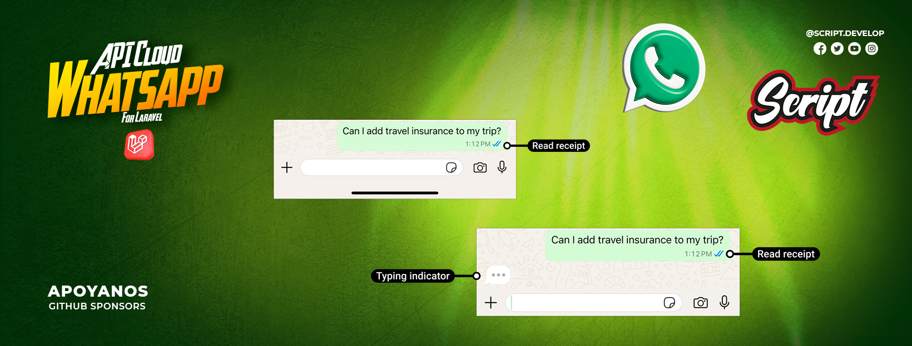

## 6. Getion de mensajes.
### Marcar mensaje como leido
  - Se encarga de marcar el mensaje recibido como leido, con los dos checks azules.

    ```php
    // Para marcar como leído (forma tradicional)
    $message = Whatsapp::message()->markMessageAsRead('01JYYVWV7P6JX9MDBPGBW6P8ZG');

    // Para enviar indicador de escritura de texto
    $message = Whatsapp::message()->sendTypingIndicator('01JYYVWV7P6JX9MDBPGBW6P8ZG');

    // Para enviar indicador de grabación de audio
    $message = Whatsapp::message()->sendTypingIndicator('01JYYVWV7P6JX9MDBPGBW6P8ZG', 'audio');

    // Para detener indicador
    $message = Whatsapp::message()->stopTypingIndicator('01JYYVWV7P6JX9MDBPGBW6P8ZG');
    ```


---

## 7. BSUID (Business-Scoped User ID)

> A partir del 31 de marzo de 2026, WhatsApp introduce el **BSUID**: un identificador único por usuario y portfolio de negocio, con formato `CC.XXXXXXXXXX` (ej: `US.13491208655302741918`).
> Cuando un usuario activa la función de nombre de usuario, su número de teléfono deja de estar disponible en los webhooks. El BSUID es el único identificador estable en ese caso.

### Acceder al BSUID de un contacto

Los contactos recibidos vía webhook almacenan automáticamente su BSUID. Podés consultarlo así:

```php
use ScriptDevelop\WhatsappManager\Models\WhatsappPhoneNumber;

$phone = WhatsappPhoneNumber::find('tu-phone-number-id');

// Buscar contacto por BSUID
$contact = $phone->contacts()->where('bsuid', 'US.13491208655302741918')->first();

// Obtener el identificador disponible (BSUID si existe, wa_id si no)
$identifier = $contact->getBsuidOrWaId();
```

### Envío de mensajes por BSUID *(pendiente — mayo 2026)*

WhatsApp habilitará el envío por BSUID en mayo de 2026 (campo `recipient` en lugar de `to`).
La infraestructura interna ya está preparada. Los métodos públicos de envío (`sendTextMessage`, etc.) se actualizarán cuando WhatsApp active esta funcionalidad.

Mientras tanto, los usuarios con BSUID que aún tengan número de teléfono registrado en la base de datos pueden seguir siendo contactados normalmente por `wa_id`.

### Bloquear y desbloquear por BSUID

`BlockService` detecta automáticamente si el identificador es un BSUID o un teléfono y construye el payload correcto:

```php
$phone = WhatsappPhoneNumber::find('tu-phone-number-id');

// Funciona con teléfonos y BSUIDs mezclados en el mismo array
Whatsapp::block()->blockUsers($phone->phone_number_id, [
    '573237121901',            // número de teléfono → payload: { "user": "..." }
    'US.13491208655302741918', // BSUID             → payload: { "user_id": "..." }
]);

// Desbloquear
Whatsapp::block()->unblockUsers($phone->phone_number_id, [
    'US.13491208655302741918',
]);
```

---

<div align="center">
<table>
  <tr>
    <td align="left">
      <a href="02-config-api.md" title="Sección anterior: Configuración">◄◄ Configurar API</a>
    </td>
    <td align="center">
      <a href="00-tabla-de-contenido.md" title="Tabla de contenido">▲ Tabla de contenido</a>
    </td>
    <td align="right">
      <a href="04-plantillas.md" title="Sección siguiente">Plantillas ►►</a>
    </td>
  </tr>
</table>
</div>

<div align="center">
<sub>Documentación del Webhook de WhatsApp Manager | 
<a href="https://github.com/djdang3r/whatsapp-api-manager">Ver en GitHub</a></sub>
</div>

---

## ❤️ Apoyo

Si este proyecto te resulta útil, considera apoyar su desarrollo:

[](https://github.com/sponsors/djdang3r)
[](https://mpago.li/2qe5G7E)

## 📄 Licencia

MIT License - Ver [LICENSE](LICENSE) para más detalles