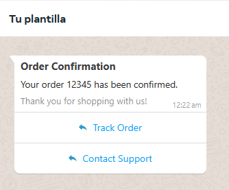
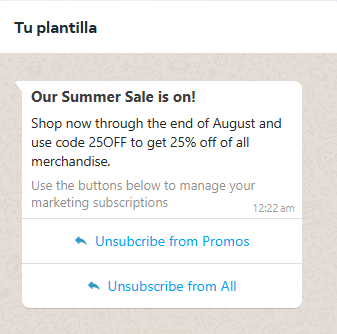
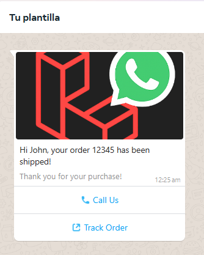
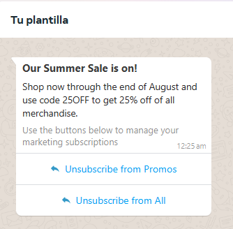

---

<div align="center">
<table>
  <tr>
    <td align="left">
      <a href="03-mensajes.md" title="Sección anterior">◄◄ Gestion de Mensajes</a>
    </td>
    <td align="center">
      <a href="00-tabla-de-contenido.md" title="Tabla de contenido">▲ Tabla de contenido</a>
    </td>
    <td align="right">
      <a href="05-eventos.md" title="Sección siguiente">Eventos ►►</a>
    </td>
  </tr>
</table>
</div>

<div align="center">
<sub>Documentación del Webhook de WhatsApp Manager | 
<a href="https://github.com/djdang3r/whatsapp-api-manager">Ver en GitHub</a></sub>
</div>

---

## 📋 Gestión de Plantillas

### Introducción
El módulo de plantillas proporciona herramientas completas para crear, administrar y enviar mensajes basados en plantillas aprobadas por WhatsApp. Las plantillas son esenciales para comunicaciones automatizadas como notificaciones, promociones y mensajes transaccionales, permitiéndote mantener consistencia en tu comunicación mientras cumples con las políticas de WhatsApp.


**Características principales:**
- Creación de plantillas para diferentes categorías (utilidad, marketing)
- Gestión de versiones y componentes (cabeceras, cuerpos, pies de página, botones)
- Sincronización con la API de WhatsApp
- Envío masivo de mensajes basados en plantillas
- Edición avanzada con validación en tiempo real


### 📚 Tabla de Contenidos
1. Administracion de Plantillas
    - Obtener odas las plantillas
    - Obtener Por nombre
    - Obtener Por ID
    - Eliminar Plantillas
    - Soft delete
    - Hard delete

1. Editar Plantillas
    - Gestión de componentes
    - Validaciones
    - Manejo de errores

2. Crear Plantillas
    - Plantillas de utilidad
    - Plantillas de marketing
    - Con imágenes
    - Con botones
    - Variaciones

3. Enviar Mensajes con Plantillas


## Administracion de Plantillas

- **Obtener todas las plantillas de una cuenta de whatsapp**
    Se obtienen todas las plantillas de una cuenta de whatsapp y se almacenan en la base de datos.
    Se hace la peticion a la API de whatsapp para obtener todas las plantillas que estan asociadas a la cuenta de whatsapp.

    ```php
    use ScriptDevelop\WhatsappManager\Facades\Whatsapp;
    use ScriptDevelop\WhatsappManager\Models\WhatsappBusinessAccount;

    // Obtener una instancia de WhatsApp Business Account
    $account = WhatsappBusinessAccount::find($accountId);

    // Obtener todas las plantillas de la cuenta
    Whatsapp::template()->getTemplates($account);
    ```

- **Obtener una plantilla por el nombre.**
    Se hace la peticion a la API de whatsapp para obtener una plantilla por el nombre y se almacena en la base de datos.

    ```php
    use ScriptDevelop\WhatsappManager\Facades\Whatsapp;
    use ScriptDevelop\WhatsappManager\Models\WhatsappBusinessAccount;

    // Obtener una instancia de WhatsApp Business Account
    $account = WhatsappBusinessAccount::find($accountId);

    // Obtener plantilla por su nombre
    $template = Whatsapp::template()->getTemplateByName($account, 'order_confirmation');
    ```


- **Obtener una plantilla por el ID.**
    Se hace la peticion a la API de whatsapp para obtener una plantilla por el ID y se almacena en la base de datos.

    ```php
    use ScriptDevelop\WhatsappManager\Facades\Whatsapp;
    use ScriptDevelop\WhatsappManager\Models\WhatsappBusinessAccount;

    // Obtener una instancia de WhatsApp Business Account
    $account = WhatsappBusinessAccount::find($accountId);

    // Obtener plantilla por su ID
    $template = Whatsapp::template()->getTemplateById($account, '559947779843204');
    ```

- **Eliminar plantilla de la API y de la base de datos al mismo tiempo.**
    Se hace la peticion a la API de whatsapp para obtener una plantilla por el ID y se elimina la plantilla seleccionada, Existen dos maneras de eliminar Soft Delete y Hard Delete.

    ```php
    use ScriptDevelop\WhatsappManager\Facades\Whatsapp;
    use ScriptDevelop\WhatsappManager\Models\WhatsappBusinessAccount;

    // Obtener una instancia de WhatsApp Business Account
    $account = WhatsappBusinessAccount::find($accountId);

    // Soft delete
    // Eliminar plantilla por su ID
    $template = Whatsapp::template()->gdeleteTemplateById($account, $templateId);

    // Eliminar plantilla por su Nombre
    $template = Whatsapp::template()->deleteTemplateByName($account, 'order_confirmation');


    // Hard delete
    // Eliminar plantilla por su ID
    $template = Whatsapp::template()->gdeleteTemplateById($account, $templateId, true);

    // Eliminar plantilla por su Nombre
    $template = Whatsapp::template()->deleteTemplateByName($account, 'order_confirmation', true);
    ```


- **Editar plantilla de la API y de la base de datos al mismo tiempo.**
    Se hace la peticion a la API de whatsapp para editar la plantilla seleccionada.

    ```php
    use ScriptDevelop\WhatsappManager\Models\Template;
    use ScriptDevelop\WhatsappManager\Exceptions\TemplateComponentException;
    use ScriptDevelop\WhatsappManager\Exceptions\TemplateUpdateException;

    $template = Template::find('template-id');

    try {
        $updatedTemplate = $template->edit()
            ->setName('nuevo-nombre-plantilla')
            ->changeBody('Nuevo contenido del cuerpo {{1}}', [['Ejemplo nuevo']])
            ->removeHeader()
            ->addFooter('Nuevo texto de pie de página')
            ->removeAllButtons()
            ->addButton('URL', 'Visitar sitio', 'https://mpago.li/2qe5G7E')
            ->addButton('QUICK_REPLY', 'Confirmar')
            ->update();
        
        return response()->json($updatedTemplate);
        
    } catch (TemplateComponentException $e) {
        // Manejar error de componente
        return response()->json(['error' => $e->getMessage()], 400);
        
    } catch (TemplateUpdateException $e) {
        // Manejar error de actualización
        return response()->json(['error' => $e->getMessage()], 500);
    }
    ```

    **Agregar componentes a plantillas que no lo tenian:**

    ```php
    $template->edit()
        ->addHeader('TEXT', 'Encabezado agregado')
        ->addFooter('Pie de página nuevo')
        ->addButton('PHONE_NUMBER', 'Llamar', '+1234567890')
        ->update();
    ```

    **Eliminar componentes existentes:**
    
    ```php
    $template->edit()
        ->removeFooter()
        ->removeAllButtons()
        ->update();
    ```

    **Trabajar con componentes específicos:**
    
    ```php
    $editor = $template->edit();

    // Verificar y modificar header
    if ($editor->hasHeader()) {
        $headerData = $editor->getHeader();
        if ($headerData['format'] === 'TEXT') {
            $editor->changeHeader('TEXT', 'Encabezado actualizado');
        }
    } else {
        $editor->addHeader('TEXT', 'Nuevo encabezado');
    }

    // Modificar botones
    $buttons = $editor->getButtons();
    foreach ($buttons as $index => $button) {
        if ($button['type'] === 'URL' && str_contains($button['url'], 'old-domain.com')) {
            $newUrl = str_replace('old-domain.com', 'new-domain.com', $button['url']);
            $editor->removeButtonAt($index);
            $editor->addButton('URL', $button['text'], $newUrl);
        }
    }

    $editor->update();
    ```

## Características Clave del Edit Template

    1.- Gestión completa de componentes:
        - Métodos add, change, remove para cada tipo de componente
        - Métodos has para verificar existencia
        - Métodos get para obtener datos

    2.- Validaciones robustas:
        - Unicidad de componentes (solo un HEADER, BODY, etc.)
        - Componentes obligatorios (BODY siempre requerido)
        - Límites de botones (máximo 10)
        - Restricciones de modificación (no cambiar categoría, no modificar aprobadas)

    3.- Operaciones atómicas:
        - removeButtonAt: Elimina un botón específico
        - removeAllButtons: Elimina todos los botones
        - getButtons: Obtiene todos los botones actuales

    4.- Manejo de errores:
        - Excepciones específicas para problemas de componentes
        - Excepciones para fallos en la actualización
        - Mensajes de error claros y descriptivos

    5.- Flujo intuitivo:
        - $template->edit() inicia la edición
        - Encadenamiento de métodos para modificaciones
        - update() aplica los cambios

## ❤️Apóyanos con una donación en GitHub Sponsors

Me puedes apoyar como desarrollador open source en GitHub Sponsors:
- Si este proyecto te ha sido útil, puedes apoyarlo con una donación a través de
[](https://github.com/sponsors/djdang3r)

- O tambien por Mercadopago Colombia.
[](https://mpago.li/2qe5G7E)
Gracias por tu apoyo 💙
---

## Crear las plantillas en una cuenta de whatsapp
- ### Crear Plantillas de Utilidad

    Las plantillas transaccionales son ideales para notificaciones como confirmaciones de pedidos, actualizaciones de envío, etc.

    

    ```php
    use ScriptDevelop\WhatsappManager\Facades\Whatsapp;
    use ScriptDevelop\WhatsappManager\Models\WhatsappBusinessAccount;

    // Obtener la cuenta empresarial
    $account = WhatsappBusinessAccount::first();

    // Crear una plantilla transaccional
    $template = Whatsapp::template()
        ->createUtilityTemplate($account)
        ->setName('order_confirmation_3')
        ->setLanguage('en_US')
        ->addHeader('TEXT', 'Order Confirmation')
        ->addBody('Your order {{1}} has been confirmed.', ['12345'])
        ->addFooter('Thank you for shopping with us!')
        ->addButton('QUICK_REPLY', 'Track Order')
        ->addButton('QUICK_REPLY', 'Contact Support')
        ->save();
    ```
---

  - ### Crear Plantillas de Marketing

    Las plantillas de marketing son útiles para promociones, descuentos y campañas masivas.

    

    ```php
    use ScriptDevelop\WhatsappManager\Facades\Whatsapp;
    use ScriptDevelop\WhatsappManager\Models\WhatsappBusinessAccount;

    // Obtener la cuenta empresarial
    $account = WhatsappBusinessAccount::first();

    // Crear una plantilla de marketing con texto
    $template = Whatsapp::template()
        ->createMarketingTemplate($account)
        ->setName('personal_promotion_text_only')
        ->setLanguage('en')
        ->addHeader('TEXT', 'Our {{1}} is on!', ['Summer Sale'])
        ->addBody(
            'Shop now through {{1}} and use code {{2}} to get {{3}} off of all merchandise.',
            ['the end of August', '25OFF', '25%']
        )
        ->addFooter('Use the buttons below to manage your marketing subscriptions')
        ->addButton('QUICK_REPLY', 'Unsubscribe from Promos')
        ->addButton('QUICK_REPLY', 'Unsubscribe from All')
        ->save();
    ```

---

  - ### Crear Plantillas de Marketing con Imágenes

    Las plantillas de marketing también pueden incluir imágenes en el encabezado para hacerlas más atractivas.

    

    ```php
    use ScriptDevelop\WhatsappManager\Facades\Whatsapp;
    use ScriptDevelop\WhatsappManager\Models\WhatsappBusinessAccount;

    // Obtener la cuenta empresarial
    $account = WhatsappBusinessAccount::first();

    // Ruta de la imagen
    $imagePath = storage_path('app/public/laravel-whatsapp-manager.png');

    // Crear una plantilla de marketing con imagen
    $template = Whatsapp::template()
        ->createMarketingTemplate($account)
        ->setName('image_template_test')
        ->setLanguage('en_US')
        ->setCategory('MARKETING')
        ->addHeader('IMAGE', $imagePath)
        ->addBody('Hi {{1}}, your order {{2}} has been shipped!', ['John', '12345'])
        ->addFooter('Thank you for your purchase!')
        ->save();
    ```

---

- ### Crear Plantillas de Marketing con Botones de URL

    Puedes agregar botones de URL personalizados para redirigir a los usuarios a páginas específicas.

    

    ```php
    use ScriptDevelop\WhatsappManager\Facades\Whatsapp;
    use ScriptDevelop\WhatsappManager\Models\WhatsappBusinessAccount;

    // Obtener la cuenta empresarial
    $account = WhatsappBusinessAccount::first();

    // Ruta de la imagen
    $imagePath = storage_path('app/public/laravel-whatsapp-manager.png');

    // Crear una plantilla de marketing con imagen y botones de URL
    $template = Whatsapp::template()->createMarketingTemplate($account)
        ->setName('image_template_test_2')
        ->setLanguage('en_US')
        ->setCategory('MARKETING')
        ->addHeader('IMAGE', $imagePath)
        ->addBody('Hi {{1}}, your order {{2}} has been shipped!', ['John', '12345'])
        ->addFooter('Thank you for your purchase!')
        ->addButton('PHONE_NUMBER', 'Call Us', '+573234255686')
        ->addButton('URL', 'Track Order', 'https://mpago.li/{{1}}', ['2qe5G7E'])
        ->save();
    ```
---

- ### Crear Variaciones de Plantillas de Marketing

    Puedes crear múltiples variaciones de plantillas para diferentes propósitos.

    

    ```php
        use ScriptDevelop\WhatsappManager\Facades\Whatsapp;
        use ScriptDevelop\WhatsappManager\Models\WhatsappBusinessAccount;

        // Obtener la cuenta empresarial
        $account = WhatsappBusinessAccount::first();

        // Crear una variación de plantilla de marketing
        $template = Whatsapp::template()
            ->createMarketingTemplate($account)
            ->setName('personal_promotion_text_only_22')
            ->setLanguage('en')
            ->addHeader('TEXT', 'Our {{1}} is on!', ['Summer Sale'])
            ->addBody(
                'Shop now through {{1}} and use code {{2}} to get {{3}} off of all merchandise.',
                ['the end of August', '25OFF', '25%']
            )
            ->addFooter('Use the buttons below to manage your marketing subscriptions')
            ->addButton('QUICK_REPLY', 'Unsubscribe from Promos')
            ->addButton('QUICK_REPLY', 'Unsubscribe from All')
            ->save();
    ```

---

- ### Crear Plantillas Atadas a WhatsApp Flows

    Los botones de tipo FLOW permiten abrir un formulario interactivo de WhatsApp Flows directamente desde una plantilla.

    #### ⚠️ Pre-requisito: el flujo debe estar publicado

    Meta **no permite usar un flujo en `draft`** dentro de una plantilla. Si el flujo no está publicado, primero debés publicarlo:

    ```php
    use ScriptDevelop\WhatsappManager\Support\WhatsappModelResolver;
    use ScriptDevelop\WhatsappManager\Services\FlowService;

    // Buscar el flujo localmente
    $flow = WhatsappModelResolver::flow()
        ->where('name', 'Nombre exacto del flujo')
        ->first();

    echo $flow->status;    // Debe ser 'published' para poder ser usado en plantillas
    echo $flow->wa_flow_id; // ID numérico de Meta (necesario para addFlowButton)

    // Si está en 'draft', publicalo primero:
    app(FlowService::class)->publish($flow);
    ```

    ---

    #### Opción 1: `addFlowButton()` — por `wa_flow_id` (recomendado)

    Usá este método cuando conocés el ID numérico del flujo en Meta (`wa_flow_id`).
    Es el más explícito y seguro, ya que no depende de búsquedas por nombre.

    ```php
    use ScriptDevelop\WhatsappManager\Facades\Whatsapp;
    use ScriptDevelop\WhatsappManager\Models\WhatsappBusinessAccount;

    $account = WhatsappBusinessAccount::find($accountId);

    $template = Whatsapp::template()
        ->createMarketingTemplate($account)
        ->setName('agendar_cita_flow')
        ->setLanguage('es')
        ->addBody('Para agendar tu cita presiona el botón:')
        // wa_flow_id de Meta + ID de pantalla inicial del flujo
        ->addFlowButton('Agendar Cita', '682867531285187', 'PRODUCT_SELECTION')
        ->save();
    ```

    **Parámetros:**

    | Parámetro | Tipo | Descripción |
    |-----------|------|-------------|
    | `$text` | `string` | Texto del botón (máx. 25 caracteres) |
    | `$flowId` | `string` | `wa_flow_id` del flujo en Meta |
    | `$navigateScreen` | `string\|null` | ID de la pantalla inicial del flujo (ej: `'PRODUCT_SELECTION'`). Requerido cuando `$flowAction` es `NAVIGATE` |
    | `$flowAction` | `string` | `'NAVIGATE'` (default) o `'DATA_EXCHANGE'` |

    ---

    #### Opción 2: `addFlowButtonByName()` — por nombre exacto

    Buscá el flujo localmente por nombre exacto (case-sensitive). Si hay más de un flujo con
    el mismo nombre, el método falla con un mensaje que lista los `wa_flow_id` disponibles
    para que uses `addFlowButton()` directamente.

    ```php
    $template = Whatsapp::template()
        ->createMarketingTemplate($account)
        ->setName('lead_generation_flow')
        ->setLanguage('es')
        ->addBody('Llena este registro')
        // Nombre exacto del flujo + pantalla inicial
        ->addFlowButtonByName('Completar Formulario', 'Flujo de Registro de Usuario', 'PRODUCT_SELECTION')
        ->save();
    ```

    > **Importante:** El flujo se busca en la base de datos local. Si hay nombres duplicados,
    > se lanza un `InvalidArgumentException` indicando los `wa_flow_id` disponibles.

    ---

    #### Opción 3: `addFlowButtonByJson()` — por JSON embebido

    Permite embeber el JSON del flujo directamente en la plantilla. Útil para pruebas
    o flujos que todavía no están publicados en Meta.

    ```php
    $flowJson = file_get_contents(resource_path('flows/registro.json'));

    $template = Whatsapp::template()
        ->createMarketingTemplate($account)
        ->setName('registro_flow_json')
        ->setLanguage('es')
        ->addBody('Mirá nuestro formulario')
        ->addFlowButtonByJson('Abrir Formulario', $flowJson, 'PANTALLA_INICIAL')
        ->save();
    ```

    ---

    #### Posibles errores

    | Error | Causa | Solución |
    |-------|-------|----------|
    | `InvalidArgumentException: No se encontró ningún flujo...` | El nombre no existe en la BD local | Sincronizá los flujos con Meta o corregí el nombre |
    | `InvalidArgumentException: Hay X flujos con el nombre...` | Nombres duplicados en BD | Usá `addFlowButton()` con el `wa_flow_id` directamente |
    | `Exception: El flujo está en status "draft"...` | El flujo no está publicado | Publicá el flujo con `app(FlowService::class)->publish($flow)` |
    | `InvalidArgumentException: El flujo con ID... no existe` | `wa_flow_id` incorrecto o flujo sin sincronizar | Verificá el ID con `$flow->wa_flow_id` |


---
## ❤️Apóyanos con una donación en GitHub Sponsors

Me puedes apoyar como desarrollador open source en GitHub Sponsors:
- Si este proyecto te ha sido útil, puedes apoyarlo con una donación a través de
[](https://github.com/sponsors/djdang3r)

- O tambien por Mercadopago Colombia.
[](https://mpago.li/2qe5G7E)
Gracias por tu apoyo 💙
---

## Enviar Mensajes a partir de Plantilla creada.
  - ### Enviar mensajes de plantillas

    Puedes enviar diferentes mensajes de plantillas segun la estructura de la plantilla.

    ```php
    use ScriptDevelop\WhatsappManager\Facades\Whatsapp;
    use ScriptDevelop\WhatsappManager\Models\WhatsappBusinessAccount;
    use ScriptDevelop\WhatsappManager\Models\WhatsappPhoneNumber;

    // Obtener la cuenta empresarial
    $account = WhatsappBusinessAccount::first();
    $phone = WhatsappPhoneNumber::first();

    // Enviar plantilla 1: plantilla sin botones o sin necesidad de proporcionar parámetros para botones
    $message = Whatsapp::template()
        ->sendTemplateMessage($phone)
        ->to('57', '3137555908')
        ->usingTemplate('order_confirmation_4')
        ->addBody(['12345'])
        ->send();

    // Enviar plantilla 2: plantilla con botón URL que no requiere parámetros (URL estática)
    $message = Whatsapp::template()
        ->sendTemplateMessage($phone)
        ->to('57', '3135666627')
        ->usingTemplate('link_de_pago')
        ->addHeader('TEXT', '123456')
        ->addBody(['20000'])
        ->addButton('Pagar', []) // Si el botón en la plantilla es estático, no necesita parámetros
        ->send();


    // Enviar plantilla 3: plantilla con botón URL que requiere parámetros (URL dinámica)
    $message = Whatsapp::template()
        ->sendTemplateMessage($phone)
        ->to('57', '3135666627')
        ->usingTemplate('link_de_pago_dinamico')
        ->addHeader('TEXT', '123456')
        ->addBody(['20000'])
        ->addButton('Pagar', ['1QFwRV']) // Si el botón en la plantilla tiene un placeholder, se pasa el valor para ese placeholder
        ->send();

    // EJEMPLO 4: Plantilla con múltiples botones
    $message = Whatsapp::template()
        ->sendTemplateMessage($phone)
        ->to('57', '3135666627')
        ->usingTemplate('menu_opciones')
        ->addBody(['Juan Pérez'])
        ->addButton('Ver Catálogo', [])       // Quick Reply estático
        ->addButton('Contactar', [])          // Quick Reply estático  
        ->addButton('Comprar', ['PROD123'])   // URL dinámico con parámetro
        ->send();

    // EJEMPLO 5: Plantilla con botón de teléfono
    $message = Whatsapp::template()
        ->sendTemplateMessage($phone)
        ->to('57', '3135666627')
        ->usingTemplate('soporte_telefonico')
        ->addBody(['Ticket #456'])
        // Botón PHONE_NUMBER No se debe pasar en el codigo se envia por defecto
        ->send();


    $message = Whatsapp::template()
        ->sendTemplateMessage($phone)
        ->to('57', '3135666627')
        ->usingTemplate('esta_es_una_prueba_variables_nueva')
        ->addHeader('TEXT', 'Prueba_uno')
        ->addBody(['Prueba_uno'])
        ->send();

    // EJEMPLO 6: Plantilla con IMAGEN en el header
    // Suponiendo que tienes una plantilla llamada 'promo_con_imagen' que incluye:
    // - Header tipo IMAGE
    // - Body con variables: "Hola {{1}}, aprovecha nuestra oferta del {{2}}%"
    
    $imageUrl = 'https://example.com/images/promo.jpg'; // URL pública de la imagen
    
    $message = Whatsapp::template()
        ->sendTemplateMessage($phone)
        ->to('57', '3135666627')
        ->usingTemplate('promo_con_imagen')
        ->addHeader('IMAGE', $imageUrl)
        ->addBody(['Juan', '30'])
        ->send();

    // EJEMPLO 7: Plantilla con IMAGEN y BOTONES diversos
    // Suponiendo que tienes una plantilla llamada 'producto_destacado' que incluye:
    // - Header tipo IMAGE
    // - Body con variables: "{{1}}, te presentamos {{2}}"
    // - Footer: "Válido hasta fin de mes"
    // - Botones: 
    //   * Quick Reply: "Más información"
    //   * URL dinámico: "Ver producto" -> https://mitienda.com/producto/{{1}}
    //   * Teléfono: "Llamar ahora" este boton No se debe pasar en el codigo se envia por defecto
    
    $productImageUrl = 'https://example.com/images/producto-destacado.jpg';
    
    $message = Whatsapp::template()
        ->sendTemplateMessage($phone)
        ->to('57', '3135666627')
        ->usingTemplate('producto_destacado')
        ->addHeader('IMAGE', $productImageUrl)
        ->addBody(['María', 'nuestro nuevo producto premium'])
        ->addButton('Más información', [])     // Quick Reply (sin parámetros)
        ->addButton('Ver producto', ['PROD-789']) // URL dinámico (con parámetro)
        // Phone Number (sin parámetros) No se debe pasar en el codigo se envia por defecto
        ->send();

    // EJEMPLO 8: Plantilla con VIDEO y BOTONES
    // Suponiendo que tienes una plantilla llamada 'tutorial_video' que incluye:
    // - Header tipo VIDEO
    // - Body con variables: "Hola {{1}}, mira este tutorial sobre {{2}}"
    // - Botones: 
    //   * URL estático: "Suscríbete" -> https://youtube.com/channel/123
    //   * Quick Reply: "Siguiente tutorial"
    
    $videoUrl = 'https://example.com/videos/tutorial.mp4';
    
    $message = Whatsapp::template()
        ->sendTemplateMessage($phone)
        ->to('57', '3135666627')
        ->usingTemplate('tutorial_video')
        ->addHeader('VIDEO', $videoUrl)
        ->addBody(['Carlos', 'ventas digitales'])
        ->addButton('Suscríbete', [])
        ->addButton('Siguiente tutorial', [])
        ->send();

    // EJEMPLO 9: Plantilla con DOCUMENTO e información
    // Suponiendo que tienes una plantilla llamada 'envio_factura' que incluye:
    // - Header tipo DOCUMENT
    // - Body con variables: "{{1}}, adjuntamos tu factura N° {{2}}"
    // - Botón URL: "Descargar PDF" -> https://facturas.com/{{1}}
    
    $documentUrl = 'https://example.com/docs/factura-2024.pdf';
    
    $message = Whatsapp::template()
        ->sendTemplateMessage($phone)
        ->to('57', '3135666627')
        ->usingTemplate('envio_factura')
        ->addHeader('DOCUMENT', $documentUrl)
        ->addBody(['Estimado cliente', '2024-001'])
        ->addButton('Descargar PDF', ['2024-001'])
        ->send();

    // EJEMPLO 10: Plantilla de marketing completa con imagen y múltiples botones
    // Suponiendo que tienes una plantilla llamada 'super_promo' que incluye:
    // - Header tipo IMAGE
    // - Body: "¡{{1}}! Descuento del {{2}}% en {{3}}"
    // - Footer: "Usa el código {{1}} al finalizar tu compra"
    // - Botones:
    //   * URL dinámico: "Comprar ahora" -> https://tienda.com/promo/{{1}}
    //   * Phone Number: "Contactar asesor"
    //   * Quick Reply: "No, gracias"
    
    $promoImageUrl = 'https://example.com/images/super-promo-navidad.jpg';
    
    $message = Whatsapp::template()
        ->sendTemplateMessage($phone)
        ->to('57', '3135666627')
        ->usingTemplate('super_promo')
        ->addHeader('IMAGE', $promoImageUrl)
        ->addBody(['¡ÚLTIMA OPORTUNIDAD!', '50', 'toda la tienda'])
        ->addButton('Comprar ahora', ['NAVIDAD50'])
        ->addButton('Contactar asesor', [])
        ->addButton('No, gracias', [])
        ->send();

    // EJEMPLO 11: Plantilla con parámetros NOMBRADOS usando un Arreglo Asociativo (Recomendado)
    // Suponiendo que tienes una plantilla llamada 'confirmacion_orden_nombrada' que espera {{primer_nombre}} y {{numero_orden}}
    // El orden no importa cuando se utilizan arreglos asociativos
    $message = Whatsapp::template()
        ->sendTemplateMessage($phone)
        ->to('57', '3137555908')
        ->usingTemplate('confirmacion_orden_nombrada')
        ->addBody([
            'numero_orden' => 'SKBUP2-4CPIG9', 
            'primer_nombre' => 'Jessica'
        ])
        ->send();

    // EJEMPLO 12: Plantilla con parámetros NOMBRADOS usando un Arreglo Secuencial
    // Suponiendo la misma plantilla 'confirmacion_orden_nombrada'. Si usas un arreglo secuencial/lineal, 
    // los valores DEBEN ser proporcionados en el orden exacto en que los placeholders aparecen en el texto de la plantilla.
    $message = Whatsapp::template()
        ->sendTemplateMessage($phone)
        ->to('57', '3137555908')
        ->usingTemplate('confirmacion_orden_nombrada')
        ->addBody(['Jessica', 'SKBUP2-4CPIG9']) // Jessica -> primer_nombre, SKBUP2.. -> numero_orden
        ->send();
    ```

### Notas Importantes sobre Plantillas con Multimedia

- **URLs públicas:** Las imágenes, videos y documentos deben estar alojados en URLs públicas accesibles por la API de WhatsApp.
- **Formatos soportados:**
  - **IMAGE:** JPG, PNG (máx. 5MB)
  - **VIDEO:** MP4, 3GP (máx. 16MB)
  - **DOCUMENT:** PDF, DOC, DOCX, PPT, XLS, etc. (máx. 100MB)
- **Nombres de botones:** Deben coincidir exactamente con el texto definido al crear la plantilla.
- **Parámetros dinámicos:** Solo los botones de tipo URL con placeholders `{{1}}` requieren parámetros.
- **Orden de componentes:** Siempre debes agregar los componentes en el mismo orden que fueron definidos en la plantilla: Header → Body → Botones.

---

## Plantillas de WhatsApp Commerce Avanzadas

Meta ha introducido funciones robustas para E-Commerce, permitiendo una inmersión total sin salir de WhatsApp. El paquete ahora soporta el anidamiento avanzado de estos componentes interactivos (Carousels, MPM, SPM, Ofertas Limitadas) directamente mediante `Closures` limpios.

### 1. Mensajes Multi-Producto (MPM) y Catálogos

Puedes enviar catálogos enteros o agrupar productos específicos en colecciones y mostrarlos como un interactivo (hasta 30 ítems distribuidos en 10 secciones).

```php
use ScriptDevelop\WhatsappManager\Facades\Whatsapp;

// Envío de Catálogo General (CATALOG)
Whatsapp::message()->viaTemplate()
    ->to('57', '3001234567')
    ->usingTemplate('seasonal_catalog_template')
    ->addBody(['John'])
    ->addCatalogButton('Ver Catálogo', 'sku_miniatura_destacada')
    ->send();

// Envío de Multi-Product Message Secuencial (MPM)
Whatsapp::message()->viaTemplate()
    ->to('57', '3001234567')
    ->usingTemplate('ofertas_navidad_mpm')
    ->addBody(['María', 'Navidad'])
    ->addMpmButton('Ver Ofertas', 'sku_miniatura_destacada', function($sections) {
        $sections->addSection('Combos más llevados', ['COMB01', 'COMB02']);
        $sections->addSection('Tecnología', ['LAP01', 'MOU02', 'KEY03']);
    })
    ->send();
```

### 2. Tarjetas de Un Solo Producto (SPM)

Un Single-Product Message envía una tarjeta visual gigante de tu catálogo en lugar de la bolsa de compras. Meta exige que el dato del producto viaje en el **HEADER**, por lo que existe un helper exclusivo.

```php
Whatsapp::message()->viaTemplate()
    ->to('57', '3001234567')
    ->usingTemplate('mi_producto_spm')
    // El producto se monta sobre el header
    ->addHeaderProduct('SKU_DEL_PRODUCTO', 'TU_CATALOG_ID_DE_BUSINESS_MANAGER')
    ->addBody(['Llegó lo que esperabas'])
    ->send();
```

### 3. Carruseles (Carousels)

Los Carruseles permiten desplazamiento horizontal de hasta 10 tarjetas interactivas complejas (cada tarjeta tiene su propio header multimedia, body y hasta 2 botones). Funciona inyectando los parámetros por índice dinámicamente mediante Closures.

```php
Whatsapp::message()->viaTemplate()
    ->to('57', '3001234567')
    ->usingTemplate('nuestros_destinos_carrusel')
    ->addCarouselCards(function($carousel) {
        
        // Tarjeta interactiva en la posición 0
        $carousel->addCard(function($card) {
            $card->addHeader('image', ['link' => 'https://img.com/cartagena.jpg'])
                 ->addBody(['Cartagena', 'Playa Azul'])
                 ->addButton('url', 0, ['1A']); // Reserva ruta 1A (El índice del boton es 0)
        });
        
        // Tarjeta interactiva en la posición 1
        $carousel->addCard(function($card) {
            $card->addHeader('image', ['link' => 'https://img.com/medellin.jpg'])
                 ->addBody(['Medellín', 'Pueblito Paisa'])
                 ->addButton('url', 0, ['2B']);
        });
        
    })
    ->send();
```

### 4. Ofertas por Tiempo Limitado (Limited-Time Offers) y Códigos

Envía banners visuales comerciales con cuenta regresiva.

```php
Whatsapp::message()->viaTemplate()
    ->to('57', '3001234567')
    ->usingTemplate('black_friday_lto')
    // El timestamp debe ir imperativamente en milisegundos (ms)
    ->addLimitedTimeOfferExpiration(1735689600000) 
    ->addBody(['John'])
    ->addCouponButton('Copiar Código', 'BLACK50') // Botón nativo oculto especial para Copiar al Portapapeles
    ->send();
```

> **Pro Tip Constructores:** Si quieres CREAR una plantilla que tenga estas características de forma dinámica en WhatsApp Manager, el objeto `$template->edit()` o el `Whatsapp::template()->create...` ahora también admiten closures abstractos (`addCarousel()`, `addLimitedTimeOffer()`, `addCatalogButton()`).

---

## Sobreescribir Botones Dinámicos de Enlace (Tap Target Configuration)

Si tu plantilla fue configurada como un Interactive Message con un formato genérico que debe comportarse como botón URL (anulación de componente visual principal), puedes sobrescribirlo al vuelo **justo antes de presionar Enviar**, sin necesidad de esperar aprobación de Meta.

```php
use ScriptDevelop\WhatsappManager\Facades\Whatsapp;

Whatsapp::message()->viaTemplate()
    ->usingTemplate('august_promotion', 'EN')
    ->to('57', '3001234567')
    ->addBody(['John'])
    // Esto se incrusta en el payload y sobrescribe el call to action
    ->addTapTargetConfiguration('https://www.luckyshrubs.com/offer-1', 'Offer Details!')
    ->send();
```

---

## Monitorear Calidad de la Plantilla (Quality Score)

Cada plantilla posee un ranking de salud basado en la interacción de tus usuarios y tasas de lectura (`GREEN`, `YELLOW`, `RED`, `UNKNOWN`). Es vital revisarlo para tomar decisiones antes de que Meta aplique pausas automáticas a la plantilla de baja calidad.

Puedes consultarlo en tiempo real a Meta con el siguiente método:

```php
use ScriptDevelop\WhatsappManager\Facades\Whatsapp;

$account = Whatsapp::account()->getBusinessAccount('TU_BUSINESS_ID');
$templateId = '918237198237129';

$qualityData = Whatsapp::template()->getQualityScore($account, $templateId);

if ($qualityData) {
    echo "Score actual: " . $qualityData['score']; // GREEN, YELLOW, RED, UNKNOWN
    
    // Si deseas convertir el Timestamp de Meta a Fecha Carbon
    $fechaCalificacion = \Carbon\Carbon::createFromTimestamp($qualityData['date']);
    echo " (Actualizado el: " . $fechaCalificacion->toDateTimeString() . ")";
}
```

---

## Despausar Plantillas (Unpause)

Si una plantilla baja su calificación de calidad (score RED), Meta la pausará automáticamente por 3h, 6h, etc., para proteger tu número API y rechazar envíos a esa campaña.

Puedes reactivar (despausar) manual o programáticamente tu plantilla una vez corregida la lógica comercial usando su ID real de Meta:

```php
use ScriptDevelop\WhatsappManager\Facades\Whatsapp;

// Obtienes tu cuenta WABA activa
$account = Whatsapp::account()->getBusinessAccount('TU_BUSINESS_ID');

$templateId = '918237198237129'; // ID de Meta (wa_template_id)
$reactivada = Whatsapp::template()->unpauseTemplate($account, $templateId);

if ($reactivada) {
    echo "¡La plantilla ahora está Activa para envíos nuevamente!";
}
```

---

<div align="center">
<table>
  <tr>
    <td align="left">
      <a href="03-mensajes.md" title="Sección anterior">◄◄ Gestion de Mensajes</a>
    </td>
    <td align="center">
      <a href="00-tabla-de-contenido.md" title="Tabla de contenido">▲ Tabla de contenido</a>
    </td>
    <td align="right">
      <a href="05-eventos.md" title="Sección siguiente">Eventos ►►</a>
    </td>
  </tr>
</table>
</div>

<div align="center">
<sub>Documentación del Webhook de WhatsApp Manager | 
<a href="https://github.com/djdang3r/whatsapp-api-manager">Ver en GitHub</a></sub>
</div>

---


## ❤️ Apoyo

Si este proyecto te resulta útil, considera apoyar su desarrollo:

[](https://github.com/sponsors/djdang3r)
[](https://mpago.li/2qe5G7E)

## 📄 Licencia

MIT License - Ver [LICENSE](LICENSE) para más detalles
